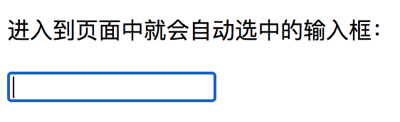

# 自定义指令

## 一. 概述
1. vue2 的自定义指令介绍
2. element-ui 中的自定义指令 clickoutside

## 二. 自定义指令介绍
### 2.1 自定义指令的作用
Vue 提供了许多内置指令，例如：v-model，v-show 等。  

除了这些内置指令之外，也可以去自定义指令。自定义指令应用在需要对普通 DOM 元素进行底层操作时。  

例如：自定义指令实现一个打开页面之后输入框就自动聚焦的功能。  

在组件中注册一个局部指令：  
```javaScript
directives: {
  focus: {
    // 指令的定义
    inserted: function (el) {
      el.focus()
    }
  }
}
```
在模板元素中的应用：
```HTML
<input v-focus>
```
实现效果：  

### 2.2 全局指令与局部指令
+ 全局指令：使用 Vue.directive  
```javaScript
// 注册一个全局自定义指令 `v-focus`
Vue.directive('focus', {
  // 当被绑定的元素插入到 DOM 中时……
  inserted: function (el) {
    // 聚焦元素
    el.focus()
  }
})
```
+ 局部指令：组件内部的 directives 选项
```javaScript
directives: {
  focus: {
    // 指令的定义
    inserted: function (el) {
      el.focus()
    }
  }
}
```
### 2.3 钩子函数
Vue2 中的自定义指令共有5个钩子函数：
(1) bind：只调用一次，指令第一次绑定到元素时调用。
(2) inserted：被绑定元素插入父节点时调用。
(3) update：被绑定元素所在的模板更新时调用。
(4) componentUpdated：被绑定元素所在模板完成一次更新周期时调用。
(5) unbind：只调用一次，指令与元素解绑时调用。  

#### 2.3.1 钩子函数的执行顺序
用 v-color 例子来说明：
template 部分：
```HTML
<template>
  <div class="box">
    <button class="toggle" @click="toggleShow()">切换显示/隐藏</button>
    <button class="toggle" @click="toggleText()">切换文字</button>
    <div v-if="isShow" v-color>{{text}}</div>
  </div>
</template>
```
```javaScript
data() {
  return {
    text: '是',
    isShow: true
  }
},
directives: {
  color: {
    bind: function (el, bindings) {
      console.log('bind')
      el.style.color = 'blue';
    },
    inserted: function (el, bindings) {
      console.log('inserted')
    },
    update: function (el, bindings) {
      console.log('update')
      console.log(el.innerHTML);
    },
    componentUpdated: function (el, bindings) {
      console.log('componentUpdated')
      console.log(el.innerHTML);
    },
    unbind: function(el, bindings) {
      console.log('unbind')
    }
  }
},
methods: {
  toggleShow() {
    this.isShow = !this.isShow;
  },
  toggleText() {
    this.text = this.text === '是' ? '否' : '是';
  }
}
```
这个例子是：指令第一次绑定到元素上时，将元素的颜色改为蓝色。
+ 初始进入页面时，先执行 bind，然后执行 inserted。  
+ 切换 text 变量时先执行 update，此时 innerHTML 还是改变之前的；然后执行 componentUpdated，此时 innerHTML 已经变成了改变之后的。
+ 将 v-if 切换为 false 时，执行 unbind。

#### 2.3.2 钩子函数的参数
+ el：指令所绑定的元素，可以用来直接操作 DOM。
+ binding：一个对象，包含以下 property：
  + name：指令名，不包括 v- 前缀。
  + value：指令的绑定值，例如：v-my-directive="1 + 1" 中，绑定值为 2。
  + oldValue：指令绑定的前一个值，仅在 update 和 componentUpdated 钩子中可用。无论值是否改变都可用。
  + expression：字符串形式的指令表达式。例如 v-my-directive="1 + 1" 中，表达式为 "1 + 1"。
  + arg：传给指令的参数，可选。例如 v-my-directive:foo 中，参数为 "foo"。
  + modifiers：一个包含修饰符的对象。例如：v-my-directive.foo.bar 中，修饰符对象为 { foo: true, bar: true }。
+ vnode：Vue 编译生成的虚拟节点。
+ oldVnode：上一个虚拟节点，仅在 update 和 componentUpdated 钩子中可用。

## 三. element-ui 的 clickoutside 自定义指令
通过 element-ui 组件库的 clickoutside 指令来具体讲述一下：
### 3.1 自定义指令 clickoutside 的作用
clickoutside 是点击被绑定元素之外会触发事件。  
### 3.2 代码详解
代码位置：在 element-ui 源代码的 src/utils/clickoutside.js 文件中。
#### 3.2.1 clickoutside 指令的实现思路
（1）设定 nodeList 数组来存放绑定指令的元素。
（2）在指令第一次绑定到元素上时（bind钩子），给被绑定元素设置 @@clickoutsideContext 属性，并且在该属性下存放id、点击时判断是否在元素外部的方法、字符串形式的指令表达式、绑定的方法。
（3）在模板更新时，更新被绑定元素 @@clickoutsideContext 属性下的绑定的方法、字符串形式的指令表达式、绑定的值。
（4）在执行 unbind 钩子时，根据 id的对应将 nodeList 上面对应的id的元素从数组 nodeList 中删除。
### 3.2.2 点击时判断是否在元素外部的方法说明
（1）监听页面的点击事件。
（2）在 mousedown 事件时用变量 startClick 记录 event 对象。
（3）在 mouseup 事件时遍历 nodeList 数组，依次判断点击的位置是否在被绑定元素的外部，如果在被绑定元素的外部，则执行绑定的方法。
  
#### 3.2.3 clickoutside 代码解析
```javaScript
// 引入 vue
import Vue from 'vue';

// Vue.prototype.$isServer 去获取是否是服务端渲染，如果是服务端渲染，则不执行点击事件
const isServer = Vue.prototype.$isServer;

// 定义 nodeList 变量为数组，存放所有绑定 clickoutside 指令的元素
const nodeList = [];

// 应用 el[ctx]，给被绑定元素定义 @@clickoutsideContext 属性，将绑定的事件等信息挂载在 el[ctx] 上面
const ctx = '@@clickoutsideContext';

// startClick 变量记录开始点击的事件对象
let startClick;
// seed 变量创建唯一的 ID
let seed = 0;

// 封装监听事件（处理IE浏览器兼容性问题）
const on = (function() {
  if (!isServer && document.addEventListener) {
    // 判断 document.addEventListener 是否存在，
    return function(element, event, handler) {
      if (element && event && handler) {
        element.addEventListener(event, handler, false);
      }
    };
  } else {
    // 不存在，使用 attachEvent 兼容IE浏览器
    return function(element, event, handler) {
      if (element && event && handler) {
        element.attachEvent('on' + event, handler);
      }
    };
  }
})();

// 鼠标按下时，将事件对象赋值给 startClick 变量
!isServer && on(document, 'mousedown', e => (startClick = e));

// 鼠标抬起时，遍历 nodeList，调用每个 node 的 documentHandler 方法，并且将鼠标抬起的事件对象和开始点击的事件对象传入
!isServer && on(document, 'mouseup', e => {
  nodeList.forEach(node => node[ctx].documentHandler(e, startClick));
});

// 判断是否点击在绑定元素之外，如果点击发生在元素之外，则执行绑定的方法
function createDocumentHandler(el, binding, vnode) {
  return function(mouseup = {}, mousedown = {}) {
    // 判断vnode和vnode.context是否存在
    // 判断鼠标的按下以及抬起时的元素是否存在
    // 判断鼠标的按下或者鼠标的抬起元素是否包含在被绑定元素的内部
    // 判断抬起鼠标的元素与被绑定的元素是否是同一元素
    // 如果有一处符合的话则 return 掉，不继续执行
    if (!vnode ||
      !vnode.context ||
      !mouseup.target ||
      !mousedown.target ||
      el.contains(mouseup.target) ||
      el.contains(mousedown.target) ||
      el === mouseup.target) return;
    
    // 如果全部都不符合，则证明点击的是被绑定元素的外部，执行绑定的方法
    if (binding.expression &&
      el[ctx].methodName &&
      vnode.context[el[ctx].methodName]) {
      vnode.context[el[ctx].methodName]();
    } else {
      el[ctx].bindingFn && el[ctx].bindingFn();
    }
  };
}

/**
 * v-clickoutside
 * @desc 点击元素外面才会触发的事件
 * @example
 * ```vue
 * <div v-element-clickoutside="handleClose">
 * ```
 */
export default {
  // 指令第一次绑定到元素时
  bind(el, binding, vnode) {
    // 将被绑定的元素 push 到 nodeList 数组中
    nodeList.push(el);
    // 创建一个唯一的 ID
    const id = seed++;
    // 被绑定元素挂载 @@clickoutsideContext 属性。将id，元素事件，字符串形式的指令表达式，绑定的值挂载到 @@clickoutsideContext 属性中。
    el[ctx] = {
      id,
      documentHandler: createDocumentHandler(el, binding, vnode),
      methodName: binding.expression,
      bindingFn: binding.value
    };
  },
  // 被绑定元素所在的模板更新时
  update(el, binding, vnode) {
    // 更新除了ID外的其他属性，也就是绑定的方法等
    el[ctx].documentHandler = createDocumentHandler(el, binding, vnode);
    el[ctx].methodName = binding.expression;
    el[ctx].bindingFn = binding.value;
  },
  // 指令与元素解绑时调用
  unbind(el) {
    let len = nodeList.length;
    // 遍历 nodeList 数组，如果 nodeList 数组中元素的 ID 与 解绑的元素的 ID 相同，则将该元素从 nodeList 数组中移除
    for (let i = 0; i < len; i++) {
      if (nodeList[i][ctx].id === el[ctx].id) {
        nodeList.splice(i, 1);
        break;
      }
    }
    delete el[ctx];
  }
};
```
