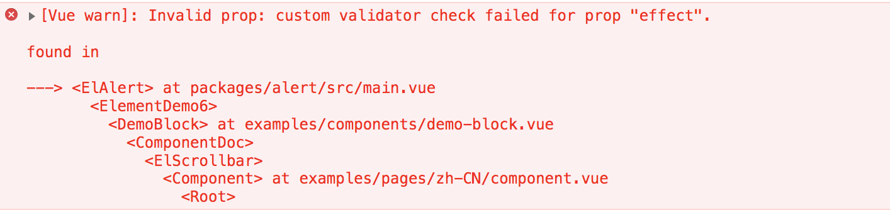

# props 中的 validator

## 一. 概述
以 element-ui 中 props 的 validator 为例，讲解一下 props 中的 validator 验证功能。

## 二. props 中的 validator 介绍
props 用于组件间的传值。  
validator 用于 props 的验证，如果传值没有满足验证，则控制台会有警告。 

## 三. 在 element-ui 中的一些实际应用
例如：Alert 组件中的 effect 属性
组件验证部分：
```JavaScript
export default {
    props: {
        effect: {
            type: String,
            default: 'light',
            validator: function(value) {
                return ['light', 'dark'].indexOf(value) !== -1;
            }
        }
    }
}
```
使用组件部分，验证传入的 effect 属性是否符合规定，如果传入了不符合规定的 effect 的值，控制台会给出警告：
```HTML
<!-- 将 effect 属性传成 test -->
<el-alert
    title="错误提示的文案"
    type="error"
    description="文字说明文字说明文字说明文字说明文字说明文字说明"
    effect="test"
    show-icon>
</el-alert>
```
控制台会报验证 effect 传值不通过的警告：
