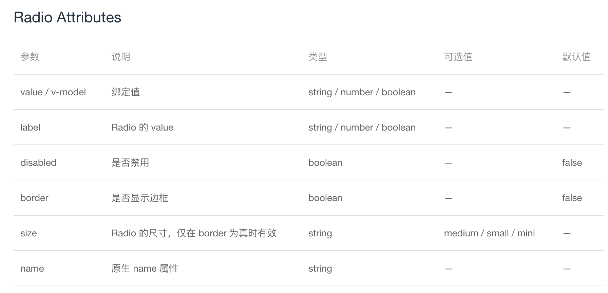
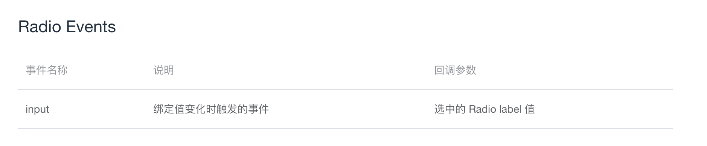
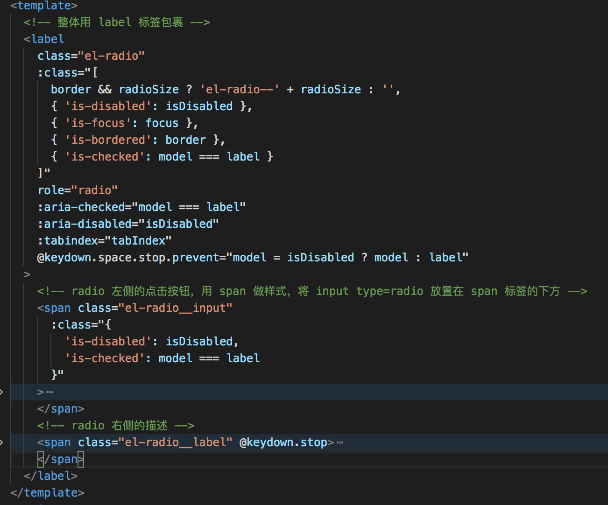

# Radio 组件

## 一. 概述
+ 按照顺序：Radio → Radio-group → Radio-button 来讲解  
+ 讲解的内容包含：  
  + 组件的基本用法
  + 提供的属性和方法
  + 代码知识点提取
  + 代码分析
  + 完成组件代码及代码详解
  
## 二. Radio
### 2.1 Radio 组件的基本用法
Radio 组件用于在一组备选项中进行单选，这一组备选项不宜过多。

### 2.2 Radio 组件提供的属性和事件

#### 2.2.1 属性


#### 2.2.2 事件


### 2.3 代码知识点提取
提取 Radio 组件源代码中的相关知识点：

#### 2.3.1 html 中的知识点
（1）role 属性以及 aria- 开头的属性  

源代码中有一个 label 标签，被设置了 role="radio" 属性。  

role="radio" 是告诉辅助设备（如屏幕阅读器）这个元素扮演的角色，为了增强语义性。  

aria 开头的属性，可以为元素提供一些信息，以便屏幕阅读器可以正确的解读，使残障人士更容易访问Web内容或Web应用程序的方法。  

- aria-checked 属性：表示是否已经被选中。
- aria-disabled 属性：表示是否处于禁用状态。
- aria-hidden 属性：表示把这个元素和其子元素从无障碍树上删除（配合屏幕阅读器的阅读）。  

（2）tabindex 属性  

tabindex 属性是为了网页的无障碍访问，表示根据 tab 键控制的元素焦点的次序。  

tabindex 为负整数，通常设置为-1，此时元素不能通过 tab 键聚焦，可以通过 js 聚焦。  

tabindex 为 0，元素可以聚焦，聚焦的顺序是按照元素所处的 DOM 结构决定的。  

tabindex 大于 0，元素可以聚焦，可以控制元素的聚焦次序，但是一般用页面布局去控制聚焦次序。  

#### 2.3.2 vue 中的知识点
（1）computed 中的 getter 和 setter  
- computed 预设的只有 getter，没有 setter，getter 是在计算属性依赖的属性发生变化时会被执行。  
- computed 的 setter 是当 computed 定义的计算属性发生变化时会触发 setter。  

（2）`$slots.default`
`$slots` 用来访问被插槽分发的内容，`$slots.default` 包含了所有没有被包含在具名插槽下的节点。  

### 2.4 代码分析

#### 2.4.1 template 部分
  

#### 2.4.2 script 部分
（1）将传入的属性应用到组件上：监听 props 变化，设置属性的值、尺寸、是否禁用等属性。
（2）提供事件处理：在组件的值发生改变时，触发父组件的 input 事件。  

### 2.5 完成组件代码及代码详解

首先，完成一个 radio 组件，不包含 Radio-group、Radio-button 以及 Form 表单与 Radio 的相关影响。  

（1）组件的注册  

在 components 文件夹里面新建一个 radio 文件夹，里面新建 radio.vue 文件。设置组件的 name 和 componentName 都为 ElRadio。  
在 main.js 文件里面使用 Vue.component 来全局注册这个组件。  

（2）组件的基本 template 部分
```HTML
<template>
  <!-- 整体用 label 标签包裹 -->
  <label
    class="el-radio"
    role="radio"
  >
    <!-- radio 左侧的点击按钮，用 span 做样式，将 input type=radio 放置在 span 标签的下方 -->
    <span class="el-radio__input">
      <span class="el-radio__inner"></span>
      <input
        class="el-radio__original"
        type="radio"
        autocomplete="off"
      />
    </span>
    <!-- radio 右侧的描述 -->
    <span class="el-radio__label">
      
    </span>
  </label>
</template>
```

（3）设置组件的绑定值（value/v-model）属性、 Radio 的 value 属性以及展示Radio的中文描述  

（3.1）label：Radio 的 value
a. 父组件将 label 的值传过去
```HTML
<template>
  <div>
    <el-radio label="1">选项1</el-radio>
    <el-radio label="2">选项2</el-radio>
  </div>
</template>
```
b. 接收父组件传过来的 label 属性  
```javaScript
props: {
  label: {}
}
```
c. 将 type=radio 的单选按钮的 value 设置为传过来的 label 属性的值
```HTML
<span class="el-radio__input">
  <span class="el-radio__inner"></span>
  <!-- 将单选按钮的 value 设置为 label 的值 -->
  <input
    class="el-radio__original"
    type="radio"
    :value="label"
    autocomplete="off"
  />
</span>
```

（3.2）Radio 的中文描述  
a. 用slot插槽接收父组件传过来的标签内的内容。
b. 如果父组件标签内没有内容，则展示 label 属性内容。
```HTML
<!-- radio 右侧的描述 -->
<span class="el-radio__label">
  <slot></slot>
  <template v-if="!$slots.default">{{ label }}</template>
</span>
```

（3.3）value/v-model
a. 绑定 v-model 值
```HTML
<template>
  <div>
    <el-radio v-model="radio" label="1">选项1</el-radio>
    <el-radio v-model="radio" label="2">选项2</el-radio>
  </div>
</template>
<script>
export default {
  data() {
    return {
      radio: "1"
    }
  }
}
</script>
```
b. 组件内部默认使用 value 去接收值
```javaScript
props: {
  value: {},
}
```
c. 设置计算属性 model 作为组件内部 v-model 的绑定变量，并且为其设置 getter 和 setter。之后将 input 的 v-model 绑定为 model 变量。
```javaScript
computed: {
  model: {
    get() {
      return this.value;
    },
    set(val) {
      this.$emit('input', val)
    }
  }
}
```
```HTML
<span class="el-radio__input">
  <span class="el-radio__inner"></span>
  <!-- 将 input 的 v-model 设置为 model 变量 -->
  <input
    class="el-radio__original"
    type="radio"
    v-model="model"
    :value="label"
    autocomplete="off"
  />
</span>
```
d. 改变选中时给 input 增加 checked 属性并增加选中样式
```javaScript
computed: {
  model: {
    get() {
      return this.value;
    },
    set(val) {
      this.$emit('input', val)；
      this.$refs.radio && (this.$refs.radio.checked = this.model === this.label);
    }
  }
}
```
```HTML
:class="[
  { 'is-checked': model === label }
]"
```
e. 改变选中时让父组件监听到 change 事件。
```HTML
<input
  ref="radio"
  class="el-radio__original"
  type="radio"
  v-model="model"
  @change="handleChange"
  :value="label"
  autocomplete="off"
/>
```
```javaScript
methods: {
  handleChange() {
    this.$nextTick(() => {
      this.$emit('change', this.model);
    })
  }
}
```

（4）设置禁用属性 disabled  
a. 监听父组件传过来的 disabled 属性。
```javaScript
props: {
  disabled: Boolean,
}
```
b. 设置计算属性 isDisabled 监听 disabled 的改变。（由于后续讲表单的时候，isDisabled 还会受表单的 disabled 的影响，所以这里定义了一个计算属性）
```javaScript
computed: {
  ...
  isDisabled() {
    return this.disabled;
  }
}
```
c. 给 input 增加 disabled 属性。
```HTML
<!-- 增加 disabled 属性 -->
<input
  ref="radio"
  class="el-radio__original"
  type="radio"
  v-model="model"
  @change="handleChange"
  :value="label"
  :disabled="isDisabled"
  autocomplete="off"
/>
```
d. 在最外层的 label 和 Radio 左侧的点击按钮分别增加 disabled 的样式。
```HTML
{ 'is-disabled': isDisabled }
```

（5）设置是否显示边框属性 border
a. 监听父组件传过来的 border 属性。
```javaScript
props: {
  disabled: Boolean,
}
```
b. 在最外层的 label 上面增加 border 样式。
```HTML
{ 'is-bordered': border },
```

（6）设置Radio组件尺寸的 size 属性  
a. 监听从父组件传过来的 size 属性，并设置 radioSize 计算属性监听 size 的改变。
```javaScript
props: {
  disabled: Boolean,
}
...
computed: {
  radioSize() {
    return this.size
  },
}
```
b. 判断在设置 size 属性之前，是否设置了 border 属性，如果设置了 border 属性，那么将 size 的样式添加到最外层的 label 上面。
```HTML
border && radioSize ? 'el-radio--' + radioSize : '',
```

（7）设置原生name属性  
name 属性可设置或返回单选按钮的名称，name 属性用于表单提交后向服务器传送数据。 
a. 监听父组件传过来的 name 属性 
```javaScript
props: {
  name: String,
}
```
b. 将 name 属性绑定在 input 上
```HTML
<!-- 将 name 属性绑定在 input 上 -->
<input
  ref="radio"
  class="el-radio__original"
  type="radio"
  v-model="model"
  @change="handleChange"
  :name="name"
  :value="label"
  :disabled="isDisabled"
  autocomplete="off"
/>
```

（8）支持屏幕阅读器的识别
a. 增加 aria- 开头的属性
在最外层的 role=radio 的 label 元素上面增加：
```javaScript
// 当 model 与 label 相等时，即为选中
:aria-checked="model === label"
// 当变量 isDisabled 为 true 时，即为禁用
:aria-disabled="isDisabled"
```
在 input 元素上面增加：
```javaScript
// 在屏幕阅读器上面隐藏该元素
aria-hidden="true"
```
b. 增加使用 tab 键控制元素焦点，使用空格键选中的功能  
b-1. 设置计算属性 tabIndex，监听如果 disabled 不为 true 则可以聚焦，否则不可以聚焦，并且将 tabindex 设置给外层的 label。  
```javaScript
:tabindex="tabIndex"
...
computed: {
  tabIndex() {
    return this.isDisabled ? -1 : 0;
  }
}
```
b-2. 外层 label 在点击空格时，判断该选项是否是禁用的，如果是禁用的，则 model 不变，否则 model 等于当前 label。
（这里是可以通过tab键和空格键配合着使单选按钮实现选中）
```HTML
@keydown.space.stop.prevent="model = isDisabled ? model : label"
```
b-3. 内层 input 元素的 tabindex 设置为 -1，禁止聚焦。
```HTML
tabindex="-1"
```
b-4. 右侧描述禁止键盘事件冒泡。
在这里的作用是，如果 radio 组件内部传入了 input 输入框，在输入的时候，防止点击空格键自动选中，且无法输入空格。
```HTML
<!-- 禁止键盘事件冒泡 -->
<span class="el-radio__label" @keydown.stop>
  <slot></slot>
  <template v-if="!$slots.default">{{ label }}</template>
</span>
```

（9）增加元素 focus 的 class  
a. 增加 focus 变量，及 focus 样式的 class
```javaScript
// 最外层 label 绑定 class
{ 'is-focus': focus },

// input 增加 focus 和 blur 事件
@focus="focus = true"
@blur="focus = false"

data() {
  return {
    focus: false
  };
},
```
b. 有关 focus 样式的源代码处理
```CSS
&:focus:not(.is-focus):not(:active):not(.is-disabled){ /*获得焦点时 样式提醒*/
  box-shadow: 0 0 2px 2px $--radio-button-checked-border-color;
}
```
在 click 时，会触发 focus 事件，此时不需要 focus 样式，所以在源代码中有这部分处理。

## 三. 总结
1. 本节课讲解了单独的 Radio 组件绑定 v-model，以及 Radio 组件提供的属性和事件。
2. 讲解了屏幕阅读器的相关功能。