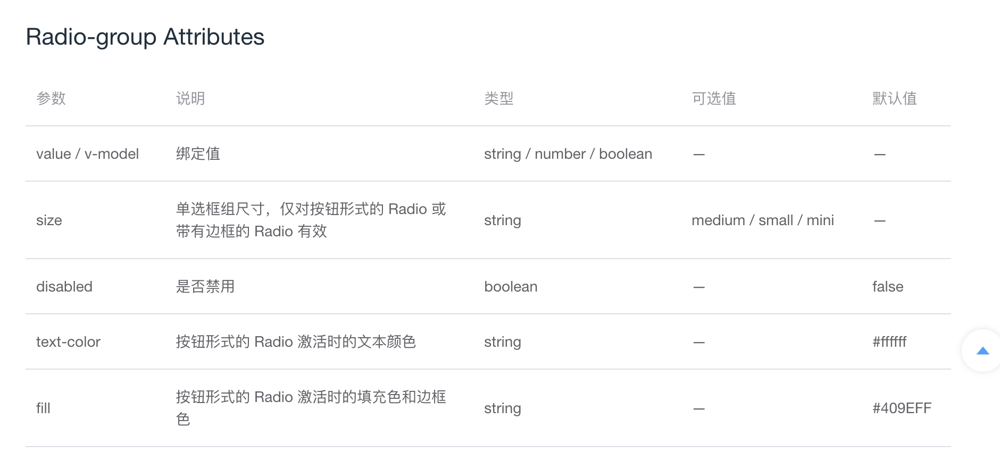
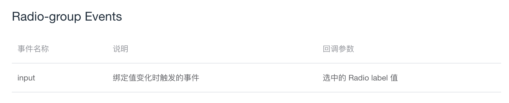
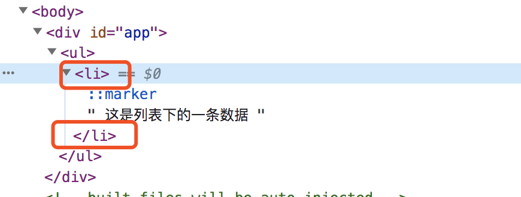
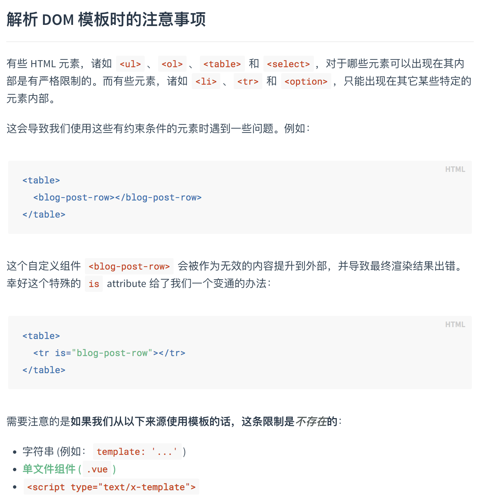
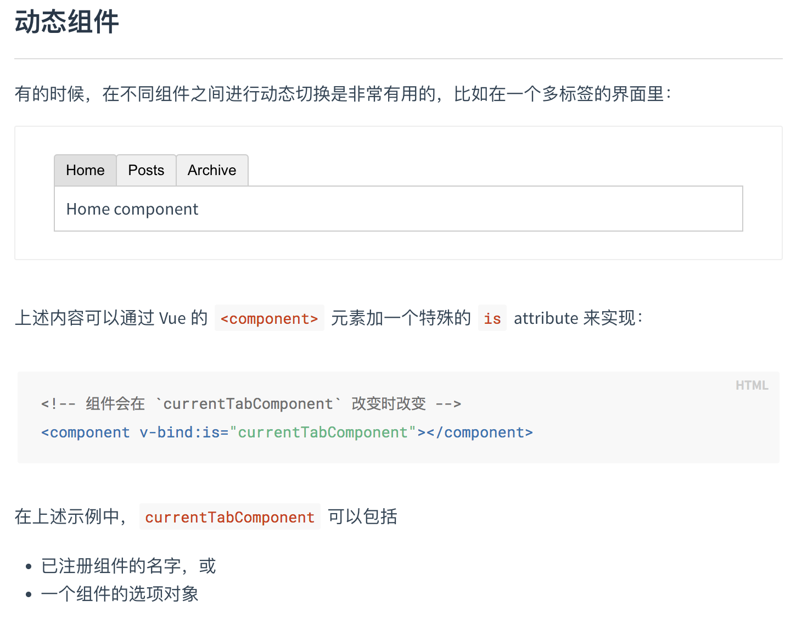

# Radio-group 组件

## 一. 概述
1. Radio-group 组件的基本用法，及其提供的属性和方法
2. Radio-group 组件中代码知识点的提取
3. 整体完成 Radio-group 组件代码以及代码详解

## 二. Radio-group 组件的基本用法
Radio-group 组件为单选框组，适用于在多个互斥的选项中选择的场景。
```HTML
<template>
  <el-radio-group v-model="radio">
    <el-radio :label="3">备选项</el-radio>
    <el-radio :label="6">备选项</el-radio>
    <el-radio :label="9">备选项</el-radio>
  </el-radio-group>
</template>

<script>
  export default {
    data () {
      return {
        radio: 3
      };
    }
  }
</script>
```

## 三. Radio-group 组件提供的属性和事件
（1）属性


（2）事件


## 四. 代码知识点提取
### 4.1 is 属性
案例：在 radio-group 的源代码中有这样一段
```HTML
<component
  :is="_elTag"
  class="el-radio-group"
  ...
  >
  <slot></slot>
</component>
```
其中来说明一下 is 属性
+ is 属性值为 div，ul，li，a等具体的标签时
+ is 属性解决 DOM 内模板限制的问题
+ is 用于动态组件

（1）is 属性值为 div，ul，li，a等具体的标签  

例如：将 is 属性设置为 li 标签
```HTML
<template>
  <ul>
    <component :is="'li'">
      这是列表下的一条数据
    </component>
  </ul>
</template>
```
渲染结果：


将 component 标签的所在位置渲染成了 li。  
这样可以动态的根据不同的情况去渲染不同的标签。

（2）is 属性解决 DOM 内模板限制的问题  

Vue官方文档的解释：
  

由于目前项目开发中，采用单文件组件的形式比较多，所以一般情况下没有这个限制。  

（3）is 用于动态组件
  

### 4.2 $vnode.data
例子：还是延续刚才的案例，看一下计算属性 _elTag 的相关代码：
```javaScript
computed: {
  _elTag() {
    let tag = (this.$vnode.data || {}).tag;
    if (!tag || tag === 'component') tag = 'div';
    return tag;
  },
}
```
这段代码说明了：component 渲染的标签需要获取 this.$vnode.data 中的 tag 属性，如果该属性不存在或者该属性为 component，则标签默认为 div。  

（1）$vnode.data 包含哪些  
$vnode.data 包含一些节点上的数据，比如 attrs、class、style 等。  

在 vue 源代码中写明了vnode 包含的属性：
```javaScript
export default class VNode {
  tag?: string
  data: VNodeData | undefined
  children?: Array<VNode> | null
  ...
}
```
其中 VNodeData 包含的属性有：
```javaScript
export interface VNodeData {
  key?: string | number
  slot?: string
  ref?: string | Ref | ((el: any) => void)
  is?: string
  pre?: boolean
  tag?: string
  staticClass?: string
  class?: any
  staticStyle?: { [key: string]: any }
  style?: string | Array<Object> | Object
  normalizedStyle?: Object
  props?: { [key: string]: any }
  attrs?: { [key: string]: string }
  domProps?: { [key: string]: any }
  hook?: { [key: string]: Function }
  on?: { [key: string]: Function | Array<Function> }
  nativeOn?: { [key: string]: Function | Array<Function> }
  transition?: Object
  show?: boolean // marker for v-show
  inlineTemplate?: {
    render: Function
    staticRenderFns: Array<Function>
  }
  directives?: Array<VNodeDirective>
  keepAlive?: boolean
  scopedSlots?: { [key: string]: Function }
  model?: {
    value: any
    callback: Function
  }

  [key: string]: any
}
```

（2）$vnode.data 中的 tag 属性如何传入  
（2.1）直接用 template 模板形式  
```HTML
<template>
  <el-radio-group>
    <el-radio v-model="radio" label="1">选项1</el-radio>
    <el-radio v-model="radio" label="2">选项2</el-radio>
    <el-radio v-model="radio" label="3" border>选项3</el-radio>
  </el-radio-group>
</template>
<script>
export default {
  data() {
    return {
      radio: '1',
    }
  }
}
</script>
```
采用这种形式是无法传入 tag 的，获取到的 (this.$vnode.data || {}).tag 为 undefined，然后默认展示的标签为 div。  

（2.2）使用 createElement 创建节点传入 tag
```javaScript
<script>
export default {
  data() {
    return {
      radioGroupValue: '1'
    }
  },
  render() {
    const self = this;
    const h = this.$createElement;
    let radioGroupValue = '1';
    return h(
      'el-radio-group',
      {
        tag: 'section' // 传入 tag，渲染成 section 标签
      },
      [
        h('el-radio',
          {
            props: { label: '1' },
            attrs: { value: self.radioGroupValue },
            on: {
              input(value) {
                self.radioGroupValue = value;
              }
            }
          }, 
          '选项1'),
        h('el-radio',
          {
            props: { label: '2' },
            attrs: { value: self.radioGroupValue },
            on: {
              input(value) {
                self.radioGroupValue = value;
              }
            }
          }, 
          '选项2')
      ]
    );
  }
};

</script>
```
不过此种方法写法比较复杂，通常不会用到，一般情况下 radio-group 组件会被渲染成 div 标签。  

## 五. 代码分析

### 5.1 template 部分
```HTML
<template>
  <component
    :is="_elTag"
    class="el-radio-group"
    role="radiogroup"
    @keydown="handleKeydown"
  >
    <slot></slot>
  </component>
</template>
```
（1）用 slot 插槽接收 radio-group 组件中传入的部分（一般是 radio 或 radio-button）。  
（2）用 is 属性动态渲染标签。

### 5.2 script 部分
（1）监听 props 变化，设置属性的值、尺寸、是否禁用等属性。  
（2）在组件的值发生改变时，使用 $emit 调用父组件的自定义事件。  
（3）监听键盘事件，按下左、右、上、下键，可以在radio组件内切换不同的选项。

### 5.3 Radio 组件中的处理部分
在 Radio 组件中通过寻找其父组件，来判断是否被包含在 radio-group 组件中，如果被包含在了 radio-group 中，则 radio-group 组件接收到的属性值优先级较高。  

## 六. 完成组件代码及代码详解
完成一个 radio-group 组件，并且将 radio 组件中与 radio-group 相关的代码补充进去。  

（1）组件的注册  
在 radio 文件夹里面新建一个 radio-group 文件，设置组件的 name 和 componentName 为 ElRadioGroup。  
在 main.js 文件里面使用 Vue.component 来全局注册这个组件。  

（2）组件的基本 template 部分  
a. 采用 is 属性来动态渲染组件的标签，并且用插槽接收父组件传过来的标签内内容。
```HTML
<component
  :is="_elTag"
  class="el-radio-group"
  role="radiogroup"
  >
  <slot></slot>
</component>
```
b. 计算属性 _elTag 首先判断 $vnode.data 是否存在 tag 标签，如果不存在或者 tag 为 component 则默认为 div 标签，否则取 $vnode.data 中的 tag 属性。  
```javaScript
computed: {
  _elTag() {
    let tag = (this.$vnode.data || {}).tag;
    if (!tag || tag === 'component') tag = 'div';
    return tag;
  },
},
```

（3）使用组件的部分  
a. 新建一个页面，将 radio-group 组件内部写入 radio 组件，并且使用 v-model 将 radio-group 组件的双向数据绑定为 groupValue 变量。  
```HTML
<template>
  <el-radio-group v-model="groupValue">
    <el-radio label="1">选项1</el-radio>
    <el-radio label="2">选项2</el-radio>
    <el-radio label="3" border>选项3</el-radio>
  </el-radio-group>
</template>
<script>
export default {
  data() {
    return {
      groupValue: '2',
    }
  },
}
</script>
```

（4）在 Radio 里面增加是否是 Radio-group 中的 Radio 的判断  
a. 在 radio.vue 文件中增加计算属性 isGroup，判断 radio 是否被包含在 radio-group 组件中，如果被包含在 radio-group 组件中，isGroup 返回 true，否则返回 false。  
```javaScript
computed: {
  isGroup() {
    // parent 变量保存组件的父级元素信息
    let parent = this.$parent;
    while (parent) {
      if (parent.$options.componentName !== 'ElRadioGroup') {
        // 如果父级的 componentName 不是 ElRadioGroup 则继续向上查找
        parent = parent.$parent;
      } else {
        // 如果父级的 componentName 是 ElRadioGroup
        // 用变量 _radioGroup 保存父级信息，并且返回 true
        this._radioGroup = parent;
        return true;
      }
    }
    // 查找不到则返回 false
    return false;
  },
}
```
b. 可以先在页面上显示出来 isGroup，看一下返回的结果。
```HTML
<!-- radio 右侧的描述 -->
<span class="el-radio__label" @keydown.stop>
  <slot></slot>{{isGroup}}
  <template v-if="!$slots.default">{{ label }}</template>
</span>
```

（5）value 属性的处理  
a. radio-group 也可以用 v-model，所以组件内部用 value 属性接收值。  
```javaScript
props: {
  value: {}
},
```
b. 在 radio.vue 文件中的计算属性 model 的 getter 方法中，先判断 isGroup 是否为 true，如果为 true，获取变量 _radioGroup 的 value，否则获取 radio 组件的 value。
```javaScript
model: {
  get() {
    return this.isGroup ? this._radioGroup.value : this.value;
  },
  ...
},
```
c. 在 radio.vue 文件中引入 Emitter，用来向上查找 radio-group 组件，并在 model 的 getter 方法中判断 isGroup 是否为 true，如果是 group，则查找到 ElRadioGroup 的 input 方法，并调用。  
```javaScript
model: {
  ...
  set(val) {
    if (this.isGroup) {
      this.dispatch('ElRadioGroup', 'input', [val]);
    } else {
      this.$emit('input', val);
    }
    ...
  }
},
```
d. 改变选中时让 radio-group 组件监听到 change 事件，在 radio 组件的 handleChange 方法中增加如果是单选按钮组，则向上查找 radio-group 组件的自定义方法 handleChange，并触发该方法。  
```javaScript
methods: {
  handleChange() {
    this.$nextTick(() => {
      ...
      this.isGroup && this.dispatch('ElRadioGroup', 'handleChange', this.model);
    });
  }
}
```
e. 在 radio-group 组件中增加监听自定义事件 handleChange，在 handleChange 方法中触发父组件的 change 方法。  
```javaScript
created() {
  this.$on('handleChange', value => {
    this.$emit('change', value);
  });
},
```

（6）disabled 属性的处理  
a. props 监听父组件传入的 disabled 属性
```javaScript
props: {
  ...
  disabled: Boolean
}
```
b. 修改 radio.vue 文件中的 isDisabled 计算属性，判断 isGroup 是否为 true，如果为 true，优先取 radio-group 的 disabled 属性，然后再取 radio 的 disabled 属性。  
```javaScript
computed: {
  ...
  isDisabled() {
    return this.isGroup
      ? this._radioGroup.disabled || this.disabled
      : this.disabled;
  },
}
```

（7）size 属性的处理  
a. props 监听父组件传入的 size 属性  
```javaScript
props: {
  ...
  size: String,
}
```
b. 设置计算属性 radioGroupSize 监听 size 的改变
```javaScript
computed: {
  ...
  radioGroupSize() {
    return this.size;
  }
}
```
c. 修改 radio.vue 文件中的 radioSize 计算属性，isGroup 是否为 true，如果为 true，优先取 radio-group 的 radioGroupSize  属性，然后再取 radio 的 size 属性。  
```javaScript
computed: {
  radioSize() {
    return this.isGroup
      ? this._radioGroup.radioGroupSize || this.size
      : this.size;
  },
}
```

（8）fill 和 text-color 属性的处理  
a. props 监听父组件传入的 fill 和 text-color，由于 fill 和 text-color 是 radio-button 组件中用到的，所以这里先接收一下传入的属性，不做其他处理，讲到 radio-button 组件时再去讲这部分。  
```javaScript
props: {
  fill: String,
  textColor: String,
}
```

（9）键盘事件上、下、左、右的处理  
Chrome 浏览器会自带这个功能，写这部分功能时可以用 safari 浏览器调试。  

a. 设置监听的键盘事件对象  
Object.freeze() 方法用于冻结一个对象，冻结的对象不能被新增、删除、修改属性，并且不能修改已有属性的可枚举性、可配置性、可写性。并且该对象的原型也不能被修改。  
Object.freeze() 是浅冻结，对于对象里面的对象是无法冻结的。  
```javaScript
const keyCode = Object.freeze({
  LEFT: 37,
  UP: 38,
  RIGHT: 39,
  DOWN: 40
});
```
b. 在 radio-group 组件上监听 keydown 事件
```javaScript
<component
  ...
  @keydown="handleKeydown"
  >
  <slot></slot>
</component>
```
c. handleKeydown() 方法处理键盘的上下左右
```javaScript
methods: {
  handleKeydown(e) {
    // 用 target 变量保存事件触发的元素
    const target = e.target;
    // 判断当前触发的是 input 元素还是 label 元素
    const className = target.nodeName === 'INPUT' ? '[type=radio]' : '[role=radio]';
    // 获取到当前组件模板根标签下的所有同类型元素
    // this.$el 指向当前组件模板的根标签
    const radios = this.$el.querySelectorAll(className);
    const length = radios.length;
    // 获取触发的元素的索引值
    const index = [].indexOf.call(radios, target);
    // 获取到当前组件模板根标签下的全部 role=radio 的元素
    const roleRadios = this.$el.querySelectorAll('[role=radio]');
    switch (e.keyCode) {
      case keyCode.LEFT:
      case keyCode.UP:
        e.stopPropagation();
        e.preventDefault();
        // 按下左或上，则让前一个元素点击并聚焦，如果当前是第一个元素，则让最后一个元素点击并聚焦
        if (index === 0) {
          roleRadios[length - 1].click();
          roleRadios[length - 1].focus();
        } else {
          roleRadios[index - 1].click();
          roleRadios[index - 1].focus();
        }
        break;
      case keyCode.RIGHT:
      case keyCode.DOWN:
        // 按下右或下，则让下一个元素点击并聚焦，如果当前是最后一个元素，则让第一个元素点击并聚焦
        if (index === (length - 1)) {
          e.stopPropagation();
          e.preventDefault();
          roleRadios[0].click();
          roleRadios[0].focus();
        } else {
          roleRadios[index + 1].click();
          roleRadios[index + 1].focus();
        }
        break;
      default:
        break;
    }
  }
},
```
d. 先点击一个单选按钮，然后按上下左右进行切换，可以看到切换的选中效果  

（10）屏幕阅读器相关 tabIndex 的处理  
a. radio.vue 文件中的计算属性 tabIndex，增加判断如果是按钮组，且该按钮的 value 值与按钮组传入的 value 值不一致，则不能聚焦。  
```javaScript
tabIndex() {
  return (this.isDisabled || (this.isGroup && this.model !== this.label)) ? -1 : 0;
}
```
b. 如果 radio-group 按钮组没有默认的选项时，将第一个 radio 的 tabIndex 设置为0。代表元素是可聚焦的，相对顺序是该元素处于DOM中的位置决定的。  
```javaScript
mounted() {
  const radios = this.$el.querySelectorAll('[type=radio]');
  const firstLabel = this.$el.querySelectorAll('[role=radio]')[0];
  if (![].some.call(radios, radio => radio.checked) && firstLabel) {
    firstLabel.tabIndex = 0;
  }
},
```

## 六. 总结
1. 本节课讲了 radio-group 组件，以及其和 radio 组件的代码交互部分。
2. 讲了 radio-group 组件与键盘选中有关的处理方法。