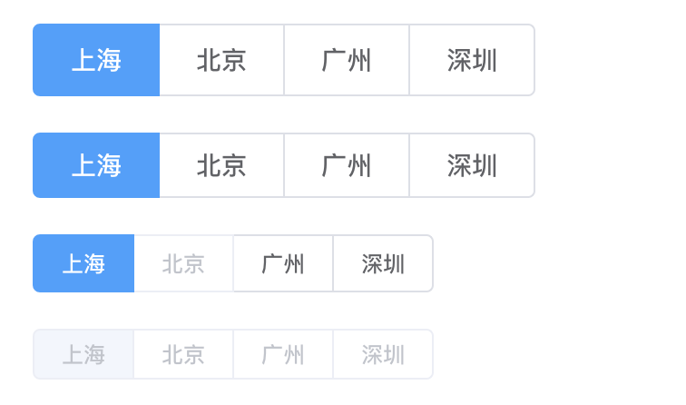
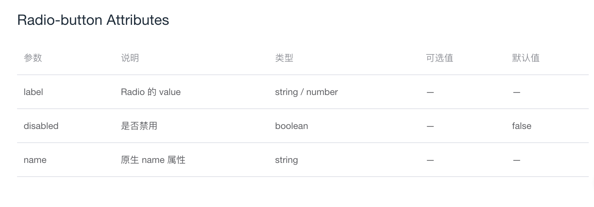

# Radio-button 组件

## 一. 概述
1. Radio-button 组件的基本用法
2. Radio-button 组件提供的属性和方法
3. 与 Radio 组件的不同之处以及 Radio-button 组件的代码分析

## 二. Radio-button 组件的基本用法
Radio-button 为按钮样式的单选组合，被包含在 Radio-group 组件中。

例如：


相关代码：
```HTML
<template>
  <div>
    <el-radio-group v-model="radio1">
      <el-radio-button label="上海"></el-radio-button>
      <el-radio-button label="北京"></el-radio-button>
      <el-radio-button label="广州"></el-radio-button>
      <el-radio-button label="深圳"></el-radio-button>
    </el-radio-group>
  </div>
  <div style="margin-top: 20px">
    <el-radio-group v-model="radio2" size="medium">
      <el-radio-button label="上海" ></el-radio-button>
      <el-radio-button label="北京"></el-radio-button>
      <el-radio-button label="广州"></el-radio-button>
      <el-radio-button label="深圳"></el-radio-button>
    </el-radio-group>
  </div>
  <div style="margin-top: 20px">
    <el-radio-group v-model="radio3" size="small">
      <el-radio-button label="上海"></el-radio-button>
      <el-radio-button label="北京" disabled ></el-radio-button>
      <el-radio-button label="广州"></el-radio-button>
      <el-radio-button label="深圳"></el-radio-button>
    </el-radio-group>
  </div>
  <div style="margin-top: 20px">
    <el-radio-group v-model="radio4" disabled size="mini">
      <el-radio-button label="上海"></el-radio-button>
      <el-radio-button label="北京"></el-radio-button>
      <el-radio-button label="广州"></el-radio-button>
      <el-radio-button label="深圳"></el-radio-button>
    </el-radio-group>
  </div>
</template>

<script>
  export default {
    data () {
      return {
        radio1: '上海',
        radio2: '上海',
        radio3: '上海',
        radio4: '上海'
      };
    }
  }
</script>
```

## 三. Radio-button 组件提供的属性和事件
（1）属性


（2）事件
由于是包含在 radio-group 组件中的，所以 radio-button 不单独向外提供监听的事件，由 radio-group 去监听 input 或 change 事件。

## 四. 与 Radio 组件的不同之处以及代码分析

### 4.1 与 radio 组件的不同之处
（1）样式与 radio 不同，是按钮样式。  
（2）需要被 radio-group 包含，接收 Radio-group 的 value 值，自己不单独接收 value 值。  

### 4.2 代码分析
```HTML
<template>
  <!-- class 样式不同 -->
  <label
    class="el-radio-button"
    :class="[
      size ? 'el-radio-button--' + size : '',
      { 'is-active': value === label },
      { 'is-disabled': isDisabled },
      { 'is-focus': focus }
    ]"
    role="radio"
    :aria-checked="value === label"
    :aria-disabled="isDisabled"
    :tabindex="tabIndex"
    @keydown.space.stop.prevent="value = isDisabled ? value : label"
  >
    <input
      class="el-radio-button__orig-radio"
      :value="label"
      type="radio"
      v-model="value"
      :name="name"
      @change="handleChange"
      :disabled="isDisabled"
      tabindex="-1"
      @focus="focus = true"
      @blur="focus = false"
      autocomplete="off"
    >
    <span
      class="el-radio-button__inner"
      :style="value === label ? activeStyle : null"
      @keydown.stop>
      <slot></slot>
      <template v-if="!$slots.default">{{label}}</template>
    </span>
  </label>
</template>
<script>
  import Emitter from '../../utils/mixins/emitter';

  export default {
    name: 'ElRadioButton',

    mixins: [Emitter],

    props: {
      label: {},
      disabled: Boolean,
      name: String
    },
    data() {
      return {
        focus: false
      };
    },
    computed: {
      // 直接获取、设置的是按钮组的 value
      value: {
        get() {
          return this._radioGroup.value;
        },
        set(value) {
          this._radioGroup.$emit('input', value);
        }
      },
      _radioGroup() {
        let parent = this.$parent;
        while (parent) {
          if (parent.$options.componentName !== 'ElRadioGroup') {
            parent = parent.$parent;
          } else {
            return parent;
          }
        }
        return false;
      },
      // 通过 radio-group 组件传过来的属性，处理按钮的背景色、文字颜色等
      activeStyle() {
        return {
          backgroundColor: this._radioGroup.fill || '',
          borderColor: this._radioGroup.fill || '',
          boxShadow: this._radioGroup.fill ? `-1px 0 0 0 ${this._radioGroup.fill}` : '',
          color: this._radioGroup.textColor || ''
        };
      },
      size() {
        return this._radioGroup.radioGroupSize;
      },
      isDisabled() {
        return this.disabled || this._radioGroup.disabled;
      },
      tabIndex() {
        return (this.isDisabled || (this._radioGroup && this.value !== this.label)) ? -1 : 0;
      }
    },

    methods: {
      // 改变时仅改变按钮组的 value
      handleChange() {
        this.$nextTick(() => {
          this.dispatch('ElRadioGroup', 'handleChange', this.value);
        });
      }
    }
  };
</script>
```

## 五. 总结
本章节简单讲解了一下 radio-button 组件与 radio 组件的不同之处。