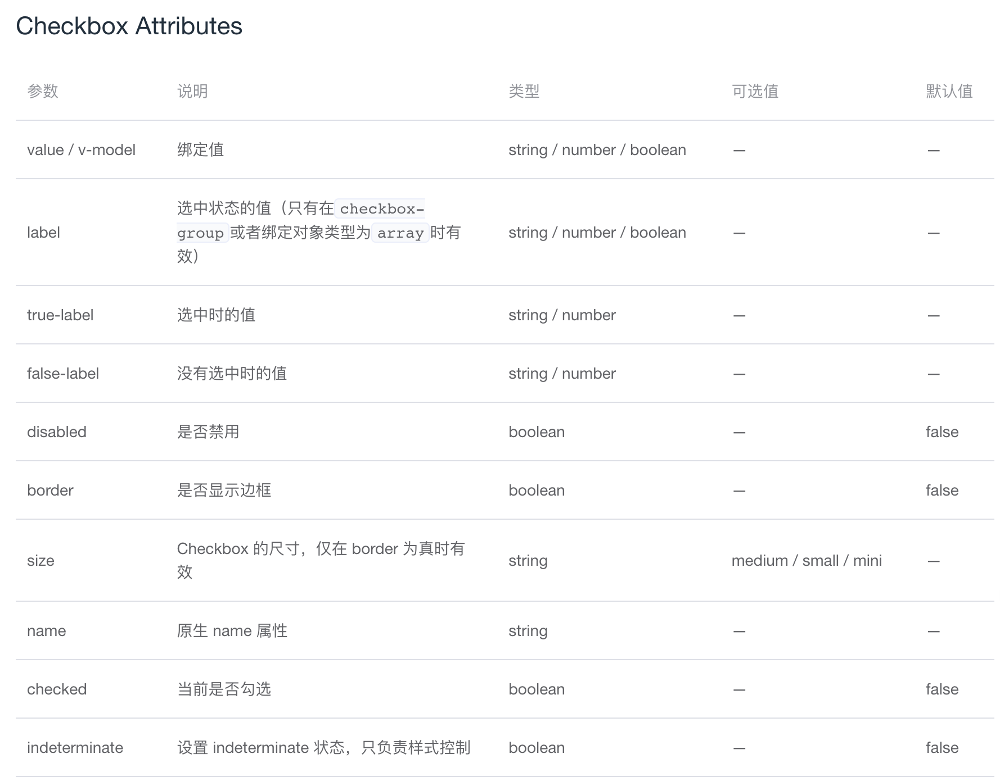
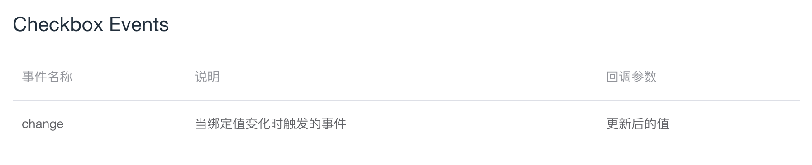
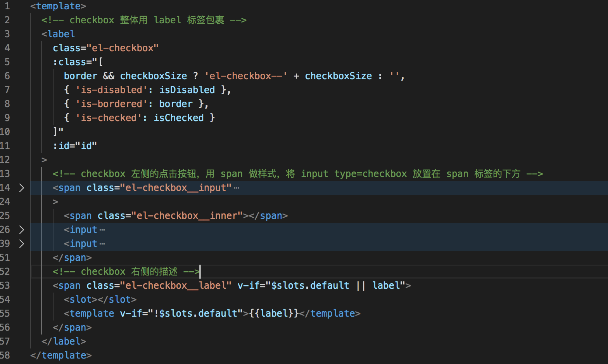

# Checkbox 组件

## 一. 概述
1. Checkbox 组件的基本用法及其提供的属性和方法
2. Checkbox 组件代码中的知识点提取
3. Checkbox 组件代码详解

## 二. Checkbox 组件的基本用法
Checkbox 组件单独使用可以表示两种状态间的切换。  
例如：

相关代码：
```HTML
<template>
  <!-- `checked` 为 true 或 false -->
  <el-checkbox v-model="checked">备选项</el-checkbox>
</template>
<script>
  export default {
    data() {
      return {
        checked: true
      };
    }
  };
</script>
```

## 三. Checkbox 组件提供的属性和事件
（1）属性

其中 indeterminate 是指半选时的样式。
（2）事件


## 四. 代码知识点提取
### 4.1  true-label 和 false-label 属性
true-label 和 false-label 是 Vue 特有的属性，需要和 v-model 配合起来使用。  
使用方式如下：  
```HTML
<template>
      <input
        type="checkbox"
        v-model="checkboxVal"
        true-value="是"
        false-value="否"
        name="toggle"
        @change="handleChange"
      />
</template>
<script>
export default {
  data() {
    return {
      checkboxVal: '是'
    }
  },
  methods: {
    handleChange() {
        // 选中为“是”，未选中为“否”
        console.log(this.checkboxVal)
    },
  }
}
</script>
```
在切换时可以看到 v-model 绑定的 checkboxVal 值在选中的时候被设置为“是”，未选中时被设置为“否”。  
注意：true-value 和 false-value 是不会影响到 value 的属性的，浏览器在提交表单时，如果该 checkbox 是未被选中的，则不会被包含到。如果希望 true-value 或 false-value 的其中之一被表单提交，需要使用单选按钮。 
 
解释看如下案例：  
```HTML
<template>
  <form id="formData" @submit.prevent="handleSubmit($event)">
    <div>
      <input
        type="checkbox"
        v-model="checkboxVal"
        true-value="是"
        false-value="否"
        name="toggle"
      />
      {{ checkboxVal }}
    </div>
    <input type="submit" value="提交">
  </form>
</template>
<script>
export default {
  data() {
    return {
      checkboxVal: '是'
    }
  },
  methods: {
    handleSubmit(event) {
      const formData = new FormData(event.target);
      const checkbox = formData.get('toggle')
      console.log(checkbox)
    }
  }
}
</script>
```

当 checkbox 被选中时，用 formData.get('toggle') 打印出来的才有值，如果没有选中，则 formData.get('toggle') 打印出来为 null，获取不到。所以如果需要 true-value 或 false-value 的其中之一被表单提交，需要使用单选按钮。  

### 4.2 aria-controls 属性
（1）概述
aria-controls是一种用于描述HTML元素之间关系的属性，它用来指定一个元素与另一个元素之间的关系。aria-controls的作用是在一个元素中指定另一个元素需要控制或者操作的相关内容，这可以帮助使用辅助技术的用户更加轻松、方便地操作和理解页面功能。  
比如：Checkbox 组件的半选按钮，所控制的其他按钮的范围。  
（2）使用方法
在需要控制其他元素的元素上添加aria-controls属性，其属性值指向需要控制的元素的ID即可。  
例如：
```HTML
<button aria-controls="target-element">打开模态窗口</button>
<div id="target-element" role="dialog">模态窗口内容...</div>
```
（3）使用该属性需要注意的点
+ 使用aria-controls属性时，必须指定需要控制的元素的ID，而且这个ID必须存在于页面中。
+ 为了能够正确地描述元素之间的关系，使用aria-controls属性的元素必须具有与其相应的角色和状态属性。可能用到的角色属性包括button、radio、checkbox等，可能用到的状态属性包括disabled、selected等。  
+ 不要在同一个元素上重复指定aria-controls属性，否则会导致属性值冲突，从而使控制行为无法正常进行。

## 五. 代码分析
（1）template 部分


（2）script 部分
+ 多选框支持绑定布尔、数组、字符串、数字类型的值。
+ 支持 Vue 提供的 true-value 和 false-value 属性。
+ 支持传入禁用、勾选等其他样式属性。

## 六. 完成组件代码及代码详解
首先，完成一个 Checkbox 组件，不包含 Checkbox-group、Checkbox-button 以及 Form 表单与 Checkbox 的相关影响。  

（1）组件的注册  
在 components 文件夹里面新建一个 checkbox 文件夹，里面新建 checkbox.vue 文件。设置组件的 name 和 componentName 都为 ElCheckbox。  

（2）checkbox 的基本 template 部分  
a. 在 checkbox 组件文件中先将组件基础的 HTML 部分写出来，之后在此基础上增加 checkbox 组件的功能。
```HTML
<template>
  <!-- checkbox 整体用 label 标签包裹 -->
  <label
    class="el-checkbox"
  >
    <!-- checkbox 左侧的点击按钮，用 span 做样式，将 input type=checkbox 放置在 span 标签的下方 -->
    <span class="el-checkbox__input">
      <span class="el-checkbox__inner"></span>
      <input
        class="el-checkbox__original"
        type="checkbox"
      />
    </span>
    <!-- checkbox 右侧的描述 -->
    <span class="el-checkbox__label"></span>
  </label>
</template>
<script>
export default {
  name: 'ElCheckbox',
    
  componentName: 'ElCheckbox',
}
</script>
```

（3）使用组件的部分  
a. 新建一个文件，文件内部引入 Checkbox 组件。
```HTML
<template>
  <div>
    <el-checkbox></el-checkbox>
  </div>
</template>
<script>
export default {
  
}
</script>
```

（4）设置 checkbox 的中文描述  
a. 在引入 Checkbox 组件的文件中，将右侧的中文描述传入到组件内部。  
```HTML
<template>
  <div>
    <el-checkbox>备选项</el-checkbox>
  </div>
</template>
<script>
export default {
  
}
</script>
```
b. 在组件内部的右侧描述中使用 slot 插槽的形式去接收父组件传过来标签内内容。  
```HTML
<!-- checkbox 右侧的描述 -->
<span class="el-checkbox__label">
  <slot></slot>
</span>
```

（5）设置 checkbox 的绑定值 v-model  
（5.1）v-model 绑定 Boolean 类型的值  
a. 使用 checkbox 组件时，用 v-model 绑定一个 Boolean 类型的值，初始值为 false。  
```HTML
<template>
  <div>
    <el-checkbox v-model="isCheck">备选项</el-checkbox>
  </div>
</template>
<script>
export default {
  data() {
    return {
      isCheck: false
    }
  }
}
</script>
```
b. 组件内部默认用 value 去接收。
```javaScript
props: {
  value: {},
}
```
c. data 中定义 selfModel 变量，作为记录组件内部的 input 的值的变量，该变量默认值为 false。
```javaScript
data() {
  return {
    selfModel: false,
  }
},
```
d. 定义计算属性 model 作为组件内部 input 的 v-model 绑定值。  
（d-1）在 model 的 getter 方法里面判断传过来的 value 是否为 undefined，如果不是 undefined 则采用传过来的 value 值，否则采用 selfModel 变量的默认 false 的值。  
```javaScript
computed: {
  model: {
    get() {
      return this.value !== undefined ? this.value : this.selfModel;
    },
    ...
  }
},
```
（d-2）在 model 的 setter 方法里面当值变化时，调用父组件的 input 方法，并且将 selfModel 变量的值设置为改变后的值。
```javaScript
computed: {
  model: {
    ...
    set(val) {
      this.$emit('input', val);
      this.selfModel = val;
    }
  }
},
```
（d-3）将组件内部 input 的 v-model 值绑定为 model 变量。  
```HTML
<span class="el-checkbox__input">
  <span class="el-checkbox__inner"></span>
<!-- 将 v-model 的值绑定为 model 变量 -->
  <input
    class="el-checkbox__original"
    type="checkbox"
    v-model="model"
  />
</span>
```
（d-4）设置组件的选中：设置计算属性 isChecked 判断 model 为 Boolean 类型时的选中结果，并且将 is-checked 的样式添加到 dom 元素上。  
```javaScript
computed: {
  isChecked() {
    if ({}.toString.call(this.model) === '[object Boolean]') {
      return this.model;
    }
  }
}
```
将 { 'is-checked': isChecked } 分别绑定在 el-checkbox 和 el-checkbox__input 两个元素上。
```HTML
:class="[
  { 'is-checked': isChecked }
]"
```
e. 切换选中时让父组件可以监听到 change 事件：input 增加 change 事件监听方法 handleChange，handleChange 方法中使用 emit 让父组件监听到 change 事件。  
```HTML
<input
  class="el-checkbox__original"
  type="checkbox"
  :value="label"
  v-model="model"
  @change="handleChange"
/>
```
```javaScript
methods: {
  handleChange(ev) {
    let value = ev.target.checked;
    this.$emit('change', value, ev);
  }
}
```
（5.2）v-model 绑定 Array 类型的值  
v-model 也可以绑定 Array 类型的值，此时需要 Checkbox 组件传入 label 属性。  
a. 使用 checkbox 组件时，传入 label 属性，并且将 v-model 的绑定值改为数组类型。  
```HTML
<template>
  <div>
    <el-checkbox v-model="checkList" :label="labelVal">备选项</el-checkbox>
  </div>
</template>
<script>
export default {
  data() {
    return {
      labelVal: 1,
      checkList: [1]
    }
  }
}
</script>
```
b. 使用 props 接收传入的 label 属性。
```javaScript
props: {
  value: {},
}
```
c. 将组件内部 input 的 value 值绑定为传入的 label。
```HTML
<input
  class="el-checkbox__original"
  type="checkbox"
  :value="label"
  v-model="model"
/>
```
d. 完善组件的右侧描述部分，如果父组件标签内未传入内容，但是 label 属性有值，则展示 label 属性的值。
```HTML
<!-- checkbox 右侧的描述 -->
<span class="el-checkbox__label" v-if="$slots.default || label">
  <slot></slot>
  <template v-if="!$slots.default">{{label}}</template>
</span>
```
e. 修改计算属性 isChecked，支持传入数组的选中。
```javaScript
isChecked() {
  ...
  } else if (Array.isArray(this.model)) {
    return this.model.indexOf(this.label) > -1
  }
}
```

（6）true-label 和 false-label 属性的处理  
a. 父组件传入 true-label 和 false-label 属性，并且将 v-model 改为与 true-label 一致，将组件内部传入的文案也设置为 v-model 绑定的变量。
```HTML
<template>
  <div>
    <el-checkbox
      v-model="checkVal"
      true-label="选中了"
      false-label="未选中"
    >{{checkVal}}</el-checkbox>
  </div>
</template>
<script>
export default {
  data() {
    return {
      checkVal: "选中了"
    }
  },
}
</script>
```
b. props 接收传入的 true-label 和 false-label 属性。
```javaScript
props: {
  trueLabel: [String, Number],
  falseLabel: [String, Number],
}
```
c. 修改 input，根据是否传入 true-label 或 false-label 属性，来展示不同的 input。判断如果传入了 true-label 或 false-label，则将 value 属性去掉，增加 true-value 和 false-value 属性。  
```HTML
<input
  v-if="trueLabel || falseLabel"
  class="el-checkbox__original"
  type="checkbox"
  :true-value="trueLabel"
  :false-value="falseLabel"
  v-model="model"
  @change="handleChange"
/>
<input
  v-else
  class="el-checkbox__original"
  type="checkbox"
  :value="label"
  v-model="model"
  @change="handleChange"
/>
```
d. 完善计算属性 isChecked，如果传入的不是布尔类型，也不是数组，则判断是否和 true-label 的值一致，如果一致也为选中状态。  
```javaScript
computed: {
  isChecked() {
    ...
    } else if (this.model !== null && this.model !== undefined) {
      return this.model === this.trueLabel;
    }
  }
}
```
e. 修改 handleChange 方法，如果传入了 true-label 或 false-label 属性，则将返回的 value 值改为 true-label 或 false-label 属性的值。  
```javaScript
methods: {
  ...
  handleChange(ev) {
    let value;
    if (ev.target.checked) {
      value = this.trueLabel === undefined ? true : this.trueLabel;
    } else {
      value = this.falseLabel === undefined ? false : this.falseLabel;
    }
    this.$emit('change', value, ev);
  }
}
```

（7）当前是否勾选 checked 属性的处理
a. 父组件传入 checked 属性。
```HTML
<template>
  <div>
    <el-checkbox
      v-model="isChecked"
      checked
    >备选项</el-checkbox>
  </div>
</template>
<script>
export default {
  data() {
    return {
      isChecked: false
    }
  },
}
</script>
```
b. props 监听父组件传过来的 checked 属性。
```javaScript
props: {
  ...
  checked: Boolean,
  ...
}
```
c. 如果 checked 为 true，则改变计算属性 model 的值，如果 model 是数组且不包含 checked 为 true 的选项，则将该选项 push 进 model 数组中，如果不是数组则将 model 优先设置为 true-label 的值，如果 true-label 没有值，则设置为 true。
```javaScript
methods: {
  addToStore() {
    if (
      Array.isArray(this.model) &&
      this.model.indexOf(this.label) === -1
    ) {
      this.model.push(this.label);
    } else {
      this.model = this.trueLabel || true;
    }
  },
},
created() {
  this.checked && this.addToStore();
}
```

（8）禁用 disabled 属性的处理
a. 父组件传入 disabled 属性。
```HTML
<template>
  <div>
    <el-checkbox
      v-model="isChecked"
      disabled
    >备选项</el-checkbox>
  </div>
</template>
<script>
export default {
  data() {
    return {
      isChecked: false
    }
  },
}
</script>
```
b. props 监听父组件传过来的 disabled 属性。
```javaScript
props: {
  ...
  disabled: Boolean,
  ...
}
```
c. 计算属性 isDisabled 监听 disabled 的改变。
```javaScript
computed: {
  ...
  isDisabled() {
    return this.disabled;
  }
  ...
}
```
d. 给 input 元素增加 disabled 属性 :disabled="isDisabled"。
```HTML
<input
  v-if="trueLabel || falseLabel"
  class="el-checkbox__original"
  type="checkbox"
  :disabled="isDisabled"
  :true-value="trueLabel"
  :false-value="falseLabel"
  v-model="model"
  @change="handleChange"
/>
<input
  v-else
  class="el-checkbox__original"
  type="checkbox"
  :disabled="isDisabled"
  :value="label"
  v-model="model"
  @change="handleChange"
/>
```
e. 在 el-checkbox 和 el-checkbox__input 增加 disabled 属性的样式
```HTML
{ 'is-disabled': isDisabled },
```

（9）边框 border 属性的处理  
a. 父组件传入 border 属性。  
```HTML
<template>
  <div>
    <el-checkbox
      v-model="isChecked"
      border
    >备选项</el-checkbox>
  </div>
</template>
<script>
export default {
  data() {
    return {
      isChecked: false
    }
  },
}
</script>
```
b. props 监听父组件传入的 border 属性。
```javaScript
props: {
  border: Boolean,                
}
```
c. 在 el-checkbox 上面增加 border 属性的样式。
```HTML
{ 'is-bordered': border },
```

（10）尺寸 size 属性的处理  
a. 父组件传入 size 属性。  
```HTML
<template>
  <div>
    <el-checkbox
      v-model="isChecked"
      border
      size="mini"
    >备选项</el-checkbox>
  </div>
</template>
<script>
export default {
  data() {
    return {
      isChecked: false
    }
  },
}
</script>
```
b. props 监听传入的 size 属性。
```javaScript
props: {
  size: String
}
```
c. 设置计算属性 checkboxSize 监听传入的 size 属性的改变。
```javaScript
computed: {
  checkboxSize() {
    return this.size;
  }
}
```
d. 当 border 和 size 两个属性均存在的情况下，将 size 的样式加在 el-checkbox 元素上。
```HTML
border && checkboxSize ? 'el-checkbox--' + checkboxSize : '',
```

（11）半选状态 indeterminate 属性的处理  
a. 父组件传入 indeterminate 属性。
```HTML
<template>
  <div>
    <el-checkbox
      v-model="isChecked"
      :indeterminate="isIndeterminate"
    >备选项</el-checkbox>
  </div>
</template>
<script>
export default {
  data() {
    return {
      isChecked: false,
      isIndeterminate: true
    }
  },
}
</script>
```
b. props 监听父组件传入的 indeterminate 属性。
```javaScript
props: {
  ...
  indeterminate: Boolean,
  ...
}
```
c. 在 el-checkbox__input 上面增加 indeterminate 样式。  
```HTML
'is-indeterminate': indeterminate,
```

（12）原生 name 属性的处理  
a. 监听父组件传过来的 name 属性。
```javaScript
props: {
  name: String
}
```
b. 将 name 属性绑定在 checkbox 上。
```HTML
<input
  v-if="trueLabel || falseLabel"
  class="el-checkbox__original"
  type="checkbox"
  :name="name"
  :disabled="isDisabled"
  :true-value="trueLabel"
  :false-value="falseLabel"
  v-model="model"
  @change="handleChange"
/>
<input
  v-else
  class="el-checkbox__original"
  type="checkbox"
  :name="name"
  :disabled="isDisabled"
  :value="label"
  v-model="model"
  @change="handleChange"
/>
```

（13）屏幕阅读器相关处理  
a. props 接收 id 和 controls 属性，用于增加 aria-controls 属性的值。  
```javaScript
props: {
  ...
  controls: String,
  border: Boolean,
  ...
}
```
b. 将传入的 id 属性增加到组件根元素上面。  
```HTML
<label
  class="el-checkbox"
  ...
  :id="id"
>
</label>
```
c. 给组件根元素增加 aria-controls 属性。
```javaScript
mounted() {
  if (this.indeterminate) {
    this.$el.setAttribute('aria-controls', this.controls);
  }
},
```
d. 增加 role属性、aria- 前缀属性、tabIndex 属性。  
（d-1）给最外层 label 元素增加如下属性，表示如果是半选则增加 role、tabIndex 和 aria-checked 属性。  
```HTML
:tabindex="indeterminate ? 0 : false"
:role="indeterminate ? 'checkbox' : false"
:aria-checked="indeterminate ? 'mixed' : false"
```
（d-2）给内层的 input 元素增加属性，表明如果是半选，对屏幕阅读器隐藏 input。  
```HTML
:aria-hidden="indeterminate ? 'true' : 'false'"
```
**注意：**
和源代码不同的地方是，源代码中将 role 等属性加到了包裹 input 的 span 标签上，但是经查阅 aria-controls 属性，使用该属性的元素必须具有与其相应的角色与状态属性，则将 role 等属性放到了最外层的 label 标签上面。  

（14）focus 状态的处理，增加 is-focus 的 class，用于样式处理  
a. 在 data 下设置 focus 变量，初始值为 false。  
```javaScript
data() {
  return {
    ...
    focus: false,
  }
},
```
b. 在触发 input 的 focus 和 blur 时，切换 focus 变量。  
```HTML
<input
  ...
  @focus="focus = true"
  @blur="focus = false"
/>
<input
  ...
  @focus="focus = true"
  @blur="focus = false"
/>
```
c. 在 el-checkbox__input 增加 focus 样式。  
```HTML
'is-focus': focus
```
相关 focus 样式，是在 focus 时出现的蓝色边框。  
```CSS
.el-checkbox__inner {
  border-color: $--checkbox-input-border-color-hover;
}
```

## 七. 总结
1. true-value 和 false-value 属性。
2. aria-controls 属性。
3. Checkbox 组件支持绑定的数据类型，支持的一些属性，以及其内部的处理。