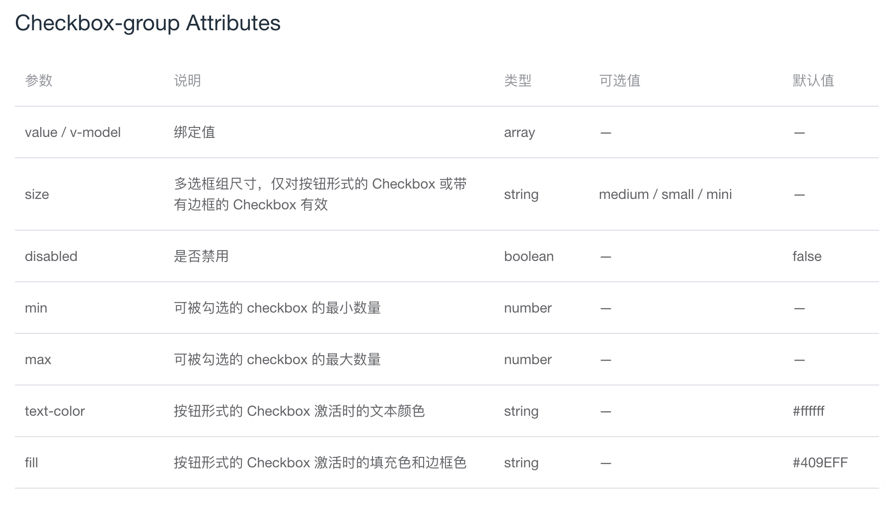
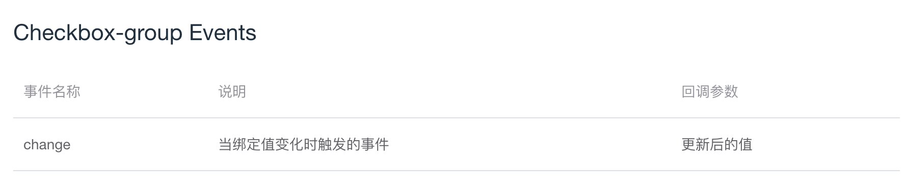

# Checkbox-group 组件

## 一. 概述
1. Checkbox-group 组件的基本用法，及其提供的属性和方法
2. Checkbox-group 组件中代码知识点的提取
3. 整体完成 Checkbox-group 组件代码以及代码详解

## 二. Checkbox-group 组件基本用法
Checkbox-group 组件适用于多个勾选框绑定到同一个数组的情景，通过是否勾选来表示这一组选项中选中的项。  


相关代码：
```HTML
<template>
  <el-checkbox-group v-model="checkList">
    <el-checkbox label="复选框 A"></el-checkbox>
    <el-checkbox label="复选框 B"></el-checkbox>
    <el-checkbox label="复选框 C"></el-checkbox>
    <el-checkbox label="禁用" disabled></el-checkbox>
    <el-checkbox label="选中且禁用" disabled></el-checkbox>
  </el-checkbox-group>
</template>

<script>
  export default {
    data () {
      return {
        checkList: ['选中且禁用','复选框 A']
      };
    }
  };
</script>
```

解释说明：  
checkbox-group 把多个 Checkbox 管理为一组，只需要在 Group 使用 v-model 绑定 Array 类型的变量就可以。label 属性是 Checkbox 对应的值，label 与数组中的元素相对应，如果存在选中的值则为选中状态，否则为不选中。  

## 三. Checkbox 组件提供的属性和事件
（1）属性
  

（2）提供的方法
  

## 四. 代码知识点
### 4.1 aria-label 属性
aria-label 属性为无障碍 API，用来给元素增加标签描述，接收字符串为参数。  
比如 element-ui 中的 Checkbox-group 组件就使用到了 aria-label 属性进行描述：  
```HTML
<div class="el-checkbox-group" role="group" aria-label="checkbox-group">
  ...
</div>
```

## 五. 代码分析
### 5.1 template 部分
```HTML
<template>
  <div class="el-checkbox-group" role="group" aria-label="checkbox-group">
    <slot></slot>
  </div>
</template>
```
设置一个div元素，包裹传入的多个选择框元素。

### 5.2 script 部分
1. 接收数组形式的绑定值。
2. 接收尺寸、禁用、可被勾选的最小、最大数量等属性。
3. 在 Checkbox 组件中获取父组件 Checkbox-group 中传入的属性，并且在属性一致的情况下 Checkbox-group 组件传入的属性的优先级高于 Checkbox 组件的属性的优先级。

## 六. 完成组件代码及代码详解
完成一个 checkbox-group 组件，并且将 checkbox 组件中与 checkbox-group 相关的代码补充进去。  

（1）组件的注册  
在 checkbox 文件夹中新建 checkbox-group 文件。设置组件的 name 和 component 都为 ElCheckboxGroup。  

（2）checkbox-group 的基本 template 部分  
a. 一个 div 标签内部包裹父组件内部传过来的内容，div 设置属性 role="group"，aria-label="checkbox-group"。  
```HTML
<template>
  <div class="el-checkbox-group" role="group" aria-label="checkbox-group">
    <slot></slot>
  </div>
</template>
<script>
export default {
  name: 'ElCheckboxGroup',

  componentName: 'ElCheckboxGroup',
}
</script>
```

（3）使用 checkbox-group 组件部分  
a. 新建一个 checkboxGroup 文件，文件内部引入 checkbox-group 组件，并且在 checkbox-group 组件内容写入三个 checkbox 组件。  
```HTML
<template>
  <el-checkbox-group>
    <el-checkbox>备选项1</el-checkbox>
    <el-checkbox>备选项2</el-checkbox>
    <el-checkbox>备选项3</el-checkbox>
  </el-checkbox-group>
</template>
```

（4）绑定值 v-model 的处理  
a. 在引入 checkbox-group 组件的文件中，checkbox 组件增加 label 属性，checkbox-group 组件增加 v-model 绑定值。  
```HTML
<template>
  <el-checkbox-group v-model="checkList">
    <el-checkbox :label="1">备选项1</el-checkbox>
    <el-checkbox :label="2">备选项2</el-checkbox>
    <el-checkbox :label="3">备选项3</el-checkbox>
  </el-checkbox-group>
</template>
<script>
export default {
  data() {
    return {
      checkList: [1]
    }
  }
}
</script>
```
b. 在 checkbox-group 组件中用 props 使用默认的 value 属性用来接收 v-model 的绑定值。  
```javaScript
props: {
  value: {}
}
```
c. 在 checkbox 组件中设置计算属性 isGroup 来判断该多选框是否被包含在多选框组里面。  
```javaScript
isGroup() {
  // parent 变量保存组件的父级元素信息
  let parent = this.$parent;
  while (parent) {
    if (parent.$options.componentName !== 'ElCheckboxGroup') {
      // 如果父级的 componentName 不是 ElCheckboxGroup 则继续向上查找
      parent = parent.$parent;
    } else {
      // 如果父级的 componentName 是 ElCheckboxGroup
      // 用变量 _checkboxGroup 保存父级信息，并且返回 true
      this._checkboxGroup = parent;
      return true;
    }
  }
  return false;
},
```
d. 在 checkbox 组件中设置计算属性 store 根据多选框还是多选框组来获取不同的 value 值。判断 _checkboxGroup 是否存在，如果存在，则取多选框组的值，否则取多选框的值。  
```javaScript
store() {
  return this._checkboxGroup ? this._checkboxGroup.value : this.value;
},
```
e. 修改计算属性 model 的 getter 和 setter 方法，新增判断如果是多选框组，则获取/设置多选框组的值，否则获取/设置多选框的值。  
（e-1）getter 方法修改成如果 isGroup 是 true，则取计算属性 store 的值，否则还是取之前 checkbox 的 value 值。  
```javaScript
computed: {
  ...
  model: {
    get() {
      return this.isGroup
        ? this.store : this.value !== undefined
          ? this.value : this.selfModel;
    },
  }
}
```
（e-2）setter 方法修改成如果 isGroup 是 true，则向上查找并触发多选框组的 input 方法。  
```javaScript
import Emitter from '../../utils/mixins/emitter';

mixins: [Emitter],

computed: {
  ...
  model: {
    set(val) {
      if (this.isGroup) {
        this.dispatch('ElCheckboxGroup', 'input', [val]);
      } else {
        this.$emit('input', val);
        this.selfModel = val;
      }
    },
  }
}
```
f. 在 handleChange 方法中增加如果是多选框组，则触发 checkbox-group 组件的 change 方法。  
```javaScript
methods: {
  handleChange(ev) {
    ...
    // 需要放在 nextTick 中，否则得到的是上一次的值
    this.$nextTick(() => {
      if (this.isGroup) {
        this.dispatch('ElCheckboxGroup', 'change', [this._checkboxGroup.value]);
      }
    });
  }
}
```
g. 选中状态在之前讲 checkbox 组件时已经处理过为数组时的选中了。

（5）禁用 disabled 属性的处理  
a. 在引入 checkbox-group 组件的文件中增加 disabled 属性。
```HTML
<template>
  <el-checkbox-group v-model="checkList" disabled>
    <el-checkbox :label="1">备选项1</el-checkbox>
    <el-checkbox :label="2">备选项2</el-checkbox>
    <el-checkbox :label="3">备选项3</el-checkbox>
  </el-checkbox-group>
</template>
<script>
export default {
  data() {
    return {
      checkList: [1]
    }
  },
  
}
</script>
```
b. checkbox-group 组件中用 props 接收 disabled 属性。
```javaScript
props: {
  disabled: Boolean,
}
```
c. 修改 checkbox 组件中的计算属性 isDisabled，判断 isGroup 是否为 true，如果为 true 则获取多选框组的 disabled 属性。
```javaScript
computed: {
  isDisabled() {
    return this.isGroup
      ? this._checkboxGroup.disabled || this.disabled
      : this.disabled
  },
}
```

（6）可被勾选的最小数量 min，最大数量 max 的处理  
a. 引入 checkbox-group 组件的文件中增加最小数量min，最大数量max这两个属性。  
```HTML
<template>
  <el-checkbox-group v-model="checkList" :min="1" :max="2">
    <el-checkbox :label="1">备选项1</el-checkbox>
    <el-checkbox :label="2">备选项2</el-checkbox>
    <el-checkbox :label="3">备选项3</el-checkbox>
  </el-checkbox-group>
</template>
<script>
export default {
  data() {
    return {
      checkList: [1]
    }
  },
}
</script>
```

b. 在 checkbox-group 组件中使用 props 接收 min 和 max。  
```javaScript
props: {
  min: Number,
  max: Number,
}
```

c. 在 checkbox 组件的 data 中增加变量 isLimitExceeded，用于判断勾选数量是否超出限制。  
```javaScript
data() {
  return {
    ...
    isLimitExceeded: false
  }
}
```

d. 修改计算属性 model，判断如果超出了最小、最大限制则将变量 isLimitExceeded 设置为 true，并且不能触发 checkbox-group 组件的 input 方法。
```javaScript
computed: {
  ...
  model: {
    ...
    set(val) {
      if (this.isGroup) {
        (this._checkboxGroup.min !== undefined &&
          val.length < this._checkboxGroup.min &&
          (this.isLimitExceeded = true));

        (this._checkboxGroup.max !== undefined &&
          val.length > this._checkboxGroup.max &&
          (this.isLimitExceeded = true));

        this.isLimitExceeded === false &&
        this.dispatch('ElCheckboxGroup', 'input', [val]);
      } else {
        this.$emit('input', val);
        this.selfModel = val;
      }
    }
  }
}
```

e. 在 handleChange 方法中增加判断如果 isLimitExceeded 已经超出了限制，则不能触发 change 方法。  
```javaScript
methods: {
  handleChange(ev) {
    if (this.isLimitExceeded) return;
    ...
  }
}
```

f. 增加计算属性 isLimitDisabled，判断此次点击之后该 checkbox 是否会被禁止点击。如果 min 或 max 有任意属性存在，分两种情况：
+ 当已选数量大于等于最大数量时，禁用没有选中的 checkbox。
+ 当已选数量小于等于最小数量时，禁用已经选中的 checkbox。
```javaScript
computed: {
  isLimitDisabled() {
    const { max, min } = this._checkboxGroup;
    return !!(max || min) &&
      (this.model.length >= max && !this.isChecked) ||
      (this.model.length <= min && this.isChecked);
  },
}
```

g. 修改计算属性 isDisabled，增加 isLimitDisabled 的判断。
```javaScript
computed: {
  ...
  isDisabled() {
    return this.isGroup
      ? this._checkboxGroup.disabled || this.disabled || this.isLimitDisabled
      : this.disabled
  },
  ...
}
```

（7）尺寸 size 属性的处理  
a. 引入 checkbox-group 组件的文件中增加size属性，size="mini"，并且在每一个 checkbox 上面增加 border 属性。  
```HTML
<template>
  <el-checkbox-group v-model="checkList" size="mini">
    <el-checkbox :label="1" border>备选项1</el-checkbox>
    <el-checkbox :label="2" border>备选项2</el-checkbox>
    <el-checkbox :label="3" border>备选项3</el-checkbox>
  </el-checkbox-group>
</template>
<script>
export default {
  data() {
    return {
      checkList: [1]
    }
  },
}
</script>
```
b. 在 checkbox-group 组件中使用 props 获取传入的 size 属性。
```javaScript
props: {
  size: String,
}
```
c. 在 checkbox-group 组件中设置计算属性 checkboxGroupSize 监听 size 属性的改变。
```javaScript
computed: {
  checkboxGroupSize() {
    return this.size;
  }
}
```
d. 在 checkbox 组件中修改计算属性 checkboxSize，如果 isGroup 为 true，优先获取 checkbox-group 传入的 size。
```javaScript
computed: {
  ...
  checkboxSize() {
    return this.isGroup
      ? this._checkboxGroup.checkboxGroupSize || this.size
      : this.size;
  }
}
```

（8）接收 text-color 和 fill 属性，用于后续讲解的 Checkbox-button 组件  
a. 在 checkbox-group 组件中使用 props 接收传入的 text-color 和 fill 属性，这两个属性是 checkbox-button 组件使用到的。  
```javaScript
props: {
  ...
  fill: String,
  textColor: String
}
```

## 七. 总结
1. 讲解了 aria-label 属性。
2. 讲解了 checkbox-group 组件以及其与 checkbox 组件相关的部分。