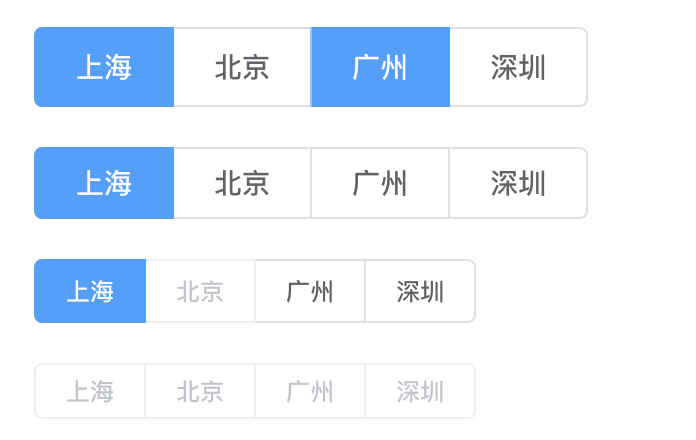
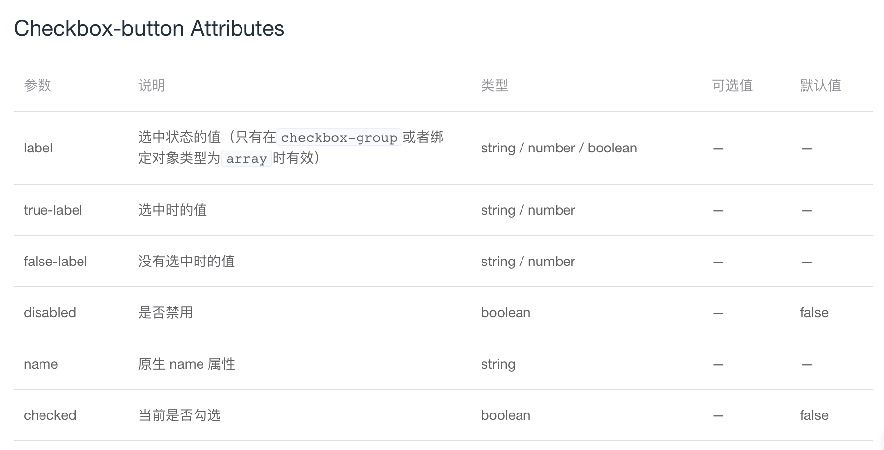

# Checkbox-button 组件

## 一. 概述
1. Checkbox-button 组件的基本用法
2. Checkbox-button 组件提供的属性和方法
3. 与 Checkbox 组件的不同之处以及 Checkbox-button 组件的代码分析

## 二. Checkbox-button 组件的基本用法
Checkbox-button 为按钮样式的多选组合。  
例如：

相关代码：
```HTML
<template>
  <div>
    <el-checkbox-group v-model="checkboxGroup1">
      <el-checkbox-button v-for="city in cities" :label="city" :key="city">{{city}}</el-checkbox-button>
    </el-checkbox-group>
  </div>
  <div style="margin-top: 20px">
    <el-checkbox-group v-model="checkboxGroup2" size="medium">
      <el-checkbox-button v-for="city in cities" :label="city" :key="city">{{city}}</el-checkbox-button>
    </el-checkbox-group>
  </div>
  <div style="margin-top: 20px">
    <el-checkbox-group v-model="checkboxGroup3" size="small">
      <el-checkbox-button v-for="city in cities" :label="city" :disabled="city === '北京'" :key="city">{{city}}</el-checkbox-button>
    </el-checkbox-group>
  </div>
  <div style="margin-top: 20px">
    <el-checkbox-group v-model="checkboxGroup4" size="mini" disabled>
      <el-checkbox-button v-for="city in cities" :label="city" :key="city">{{city}}</el-checkbox-button>
    </el-checkbox-group>
  </div>
</template>
<script>
  const cityOptions = ['上海', '北京', '广州', '深圳'];
  export default {
    data () {
      return {
        checkboxGroup1: ['上海'],
        checkboxGroup2: ['上海'],
        checkboxGroup3: ['上海'],
        checkboxGroup4: ['上海'],
        cities: cityOptions
      };
    }
  }
</script>
```

## 三. Checkbox-button 提供的属性和事件
（1）属性

在 checkbox-button 的源代码中，是可以接收 v-model 绑定值的（这里与 radio-button 不同，radio-button 不能单独绑定 v-model），但是不包含在 checkbox-group 里面的 checkbox-button 样式会有一些问题（缺少一半的圆角），所以在文档中没有写出 v-model 绑定值，通常也不会单独使用，一般需要包含在 checkbox-group 组件中。  

## 四. 与 Checkbox 组件的不同之处以及代码分析
Checkbox-button 组件与 Checkbox 组件基本相同，仅有一些样式不同：  
1. Checkbox-button 从 Checkbox-group 中接收 fill 和 text-color 这两个属性，用于按钮的填充和按钮的文字颜色。
2. Checkbox-button 不单独接收 size 属性，需要通过 Checkbox-group 来控制尺寸 size。  

## 五. 总结
本章简单说明了 Checkbox-button 组件，其与 Checkbox 组件仅有一些样式的不同。