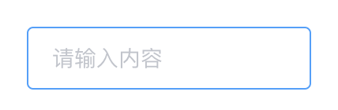
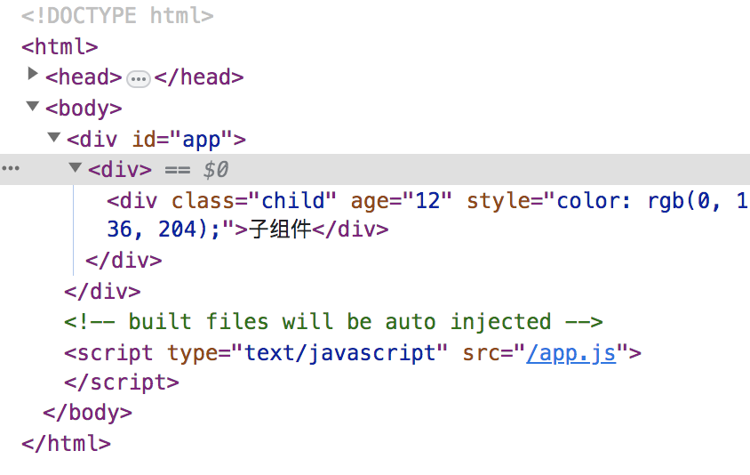
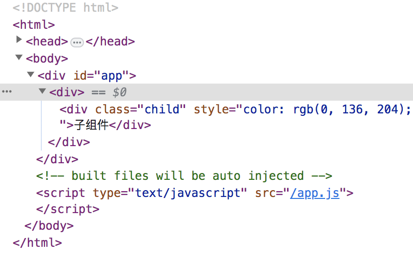

# Input 组件

## 一. 概述
本章节讲一下 Input 组件，Input 组件比之前讲的两个组件要复杂一些。
由于 Input 组件提供的属性较多，需要先将 Input 组件提供的属性进行分类，一类一类的去讲解，最后完成整个 Input 组件。
而且在讲 Input 组件之前，会把组件里面涉及的知识点提出来，先去将知识点进行讲解，有助于理解整个组件的实现思路。
顺序：属性分类 → 涉及知识点 → 完成整个 Input 组件。
本节课讲 Input 组件中，type!=textarea 部分，type=textarea 的部分放到下节课讲。  

### 1.1 课程讲解流程  
1. 首先讲解 Input 组件的基本用法。
2. 然后将 Input 组件提供的属性根据不同的作用分类，为后续按步骤完成 Input 组件做铺垫。
3. 然后讲解 Input 组件包含的知识点（主要讲解包含到的不常用到的知识点）。
4. 最后一步一步的完成 Input 组件的代码。

### 1.2 课程讲解的知识点
+ 元素 input 的事件 compositionstart、compositionupdate、compositionend。
+ vue 的 inheritAttrs 属性以及 v-bind="$attrs"。

## 二. Input 组件的基本使用
### 2.1 基本用法

```HTML
<el-input v-model="input" placeholder="请输入内容"></el-input>

<script>
export default {
  data() {
    return {
      input: ''
    }
  }
}
</script>
```

### 2.2 其他功能
（1）可禁用。
（2）可清空。
（3）可以作为密码框。
（4）可以在前面或后面增加 icon。
（5）可以调整尺寸。
（6）可以限制输入文字的长度。

## 三. Input 组件提供的属性和方法
### 3.1 提供的属性
类别一：绑定值属性
| 序号 | 参数 | 说明 | 类型 | 可选值 | 默认值 |
| --- | --- | --- | --- | --- | --- |
| 1 | value/v-model | 绑定值 | String/Number | -- | -- |

类别二：原生属性
| 序号 | 参数 | 说明 | 类型 | 可选值 | 默认值 |
| --- | --- | --- | --- | --- | --- |
| 1 | type | 类型 | String | text，textarea 和其他原生 input 的 type 值 | text |
| 2 | maxlength | 原生属性，最大输入长度 | number | -- | -- |
| 3 | minlength | 原生属性，最小输入长度 | number | -- | -- |
| 4 | placeholder | 输入框占位文本 | String | -- | -- |
| 5 | disabled | 禁用 | boolean | -- | false |
| 6 | autocomplete | 原生属性，自动补全 | string | on, off | off |
| 7 | name | 原生属性 | string | -- | -- |
| 8 | readonly | 原生属性，是否只读 | boolean | -- | -- |
| 9 | max | 原生属性，设置最大值 | -- | -- | -- |
| 10 | min | 原生属性，设置最小值 | -- | -- | -- |
| 11 | step | 原生属性，设置输入字段的合法数字间隔 | -- | -- | -- |

类别三：可清空属性
| 序号 | 参数 | 说明 | 类型 | 可选值 | 默认值 |
| --- | --- | --- | --- | --- | --- |
| 1 | clearable | 是否可清空 | boolean | -- | false |

类别四：显示密码图标属性
| 序号 | 参数 | 说明 | 类型 | 可选值 | 默认值 |
| --- | --- | --- | --- | --- | --- |
| 1 | show-password | 是否显示切换密码图标 | boolean | -- | false |

类别五：字数统计属性
| 序号 | 参数 | 说明 | 类型 | 可选值 | 默认值 |
| --- | --- | --- | --- | --- | --- |
| 1 | show-word-limit | 是否显示输入字数统计，只在 type=text 或 type=textarea 时有效 | boolean | -- | false |

类别六：尺寸与图标属性
| 序号 | 参数 | 说明 | 类型 | 可选值 | 默认值 |
| --- | --- | --- | --- | --- | --- |
| 1 | size | 输入框尺寸，只在 type != textarea 时有效 | string | medium / small / mini | -- |
| 2 | prefix-icon | 输入框头部图标 | string | -- | -- |
| 3 | suffix-icon | 输入框尾部图标 | string | -- | -- |

类别七：屏幕阅读器相关属性
| 序号 | 参数 | 说明 | 类型 | 可选值 | 默认值 |
| --- | --- | --- | --- | --- | --- |
| 1 | label | 输入框关联的label文字 | string | -- | -- |
| 2 | tabindex | 输入框的tabindex | string | -- | -- |

### 3.2 提供的插槽
| 序号 | name | 说明 |
| --- | --- | --- |
| 1 | prefix | 输入框头部内容，只对 type=text 有效 |
| 2 | suffix | 输入框尾部内容，只对 type=text 有效 |
| 3 | prepend | 输入框前置内容，只对 type=text 有效 |
| 4 | append | 输入框后置内容，只对 type=text 有效|

### 3.3 提供的事件
| 序号 | 事件 | 说明 | 回调参数 |
| --- | --- | --- | --- |
| 1 | blur | 在 Input 失去焦点时触发 | (event: Event) |
| 2 | focus | 在 Input 获得焦点时触发 | (event: Event) |
| 3 | change | 仅在输入框失去焦点或用户按下回车时触发 | (value: string | number) |
| 4 | input | 在 Input 值改变时触发 | (value: string | number) |
| 5 | clear | 在点击由 clearable 属性生成的清空按钮时触发 | -- |

### 3.4 提供的方法
| 序号 | 方法名 | 说明 |
| --- | --- | --- |
| 1 | focus | 使 input 获取焦点 |
| 2 | blur | 使 input 失去焦点 |
| 3 | select | 选中 input 中的文字 |

## 四. Input 组件相关知识点讲解
### 4.1 compositionstart、compositionupdate、compositionend 事件
#### 4.1.1 概述
这三个是复合事件，用于处理 IME 的输入序列，IME 是指输入法编辑器，IME 由将键击转换为拼音和表意字符的引擎和通常用于表意字的字典组成。比如当用户输入拼音时，就可以用这三个事件捕捉到。

#### 4.1.2 详细介绍
以输入拼音为例，详细介绍这三个事件的触发时机。  
（1）compositionstart：切换到中文输入法输入拼音时触发。  
（2）compositionupdate：每输入一下拼音时都会触发。  
（3）compositionend：拼音输入完成，关闭中文输入法时触发。  

具体案例：
```HTML
<template>
  <div>
    <input
      type="text"
      @compositionstart="handleCompositionstart"
      @compositionupdate="handleCompositionupdate"
      @compositionend="handleCompositionend"
    />
  </div>
</template>
<script>
export default {
  methods: {
    handleCompositionstart() {
      console.log('开始输入拼音')
    },
    handleCompositionupdate() {
      console.log('正在输入拼音')
    },
    handleCompositionend() {
      console.log('已经完成输入')
    }
  }
}
</script>
```

#### 4.1.3 Input 组件的应用
在 Input 组件中，应用了这三个事件去判断当前键盘按下时是直接在输入框里面输入的，还是输入的是拼音。  

### 4.2 vue 的 inheritAttrs 属性以及 v-bind="$attrs"
#### 4.2.1 概述
默认情况下父作用域的不被认做 props 的 attribute 绑定将会作为普通的 HTML attribute 应用在子组件的根元素上。通过设置 inheritAttrs 为 false，将不会被默认绑定到子组件的根元素上。通过属性 $attrs 可以获取到这些属性显性的绑定到非根元素上。  
inheritAttrs 设置为 false 不会影响到 class 和 style 的绑定。

#### 4.2.2 具体案例
父组件：传入了一个属性 age
```HTML
<template>
  <div>
    <child :age="12" style="color: #0088cc;"></child>
  </div>
</template>
<script>
import child from './child';

export default {
  components: {
    child
  }
}
</script>
```
子组件：
```HTML
<template>
  <div class="child">子组件</div>
</template>
```
没有使用 inheritAttrs: false 的渲染结果：  
  
增加了 inheritAttrs: false 的渲染结果：
  

## 五. 实现 Input 组件
### 5.1 实现 Input 组件的思路
第一步：由于此前已经引入了全部的 CSS，所以可以先将 input 组件最基础的 HTML 结构以及对应的样式 class 写好，这样方便些后面的逻辑部分。  
第二步：通过给属性分类，来按照类别实现每一类属性的功能，在实现过程中如果涉及到事件或方法，则一并实现。具体实现顺序如下：  
  + 绑定值属性 value/v-model
  + 原生属性
  + 可清空属性
  + 显示密码图标属性
  + 尺寸与图标属性
  + 字数统计属性
  + 屏幕阅读器相关属性  

第三步：实现插槽功能。
第四步：检查还有哪些事件或方法没有实现，因为在实现属性功能的过程中，应该已经实现了一部分的事件和方法了，所以这里检查一下，把没有实现的进行补齐。  
第五步：根据官网提供的案例检查组件的完成情况。例如：将可清空、密码框、计数功能等属性传入到组件中，检查功能的实现情况。  

### 5.2 Input 组件代码实现
#### 5.2.1 第一部分：注册组件并实现基本HTML结构
（1）组件的注册  
在 components 文件夹里面新建一个 checkbox 文件夹，里面新建 checkbox.vue 文件。设置组件的 name 和 componentName 都为 ElInput。  
在 main.js 文件中引入该组件，使用 Vue.component 完成组件的注册。  
```javaScript
import Input from './components/input/input';

const components = [
  ...
  Input
]

components.forEach(component => {
  Vue.component(component.name, component);
});
```
（2）input 组件的基本 template 部分
基本的 template 部分是一个 div 包裹一个 input，然后再分别把 div 和 input 的样式写上。这样一个基本的 HTML 结构就完成了，然后在此基础上增加 input 的功能。  
```HTML
<template>
  <div class="el-input">
    <input class="el-input__inner" />
  </div>
</template>
<script>
export default {
  name: 'ElInput',

  componentName: 'ElInput',
}
</script>
```
（3）引入组件部分
新建一个文件，文件内部引入 input 组件。
```HTML
<template>
  <div>
    <el-input></el-input>
  </div>
</template>
<script>
export default {
  
}
</script>
```

#### 5.2.2 第二部分：实现每一类属性的功能
##### 5.2.2.1 绑定值属性 value/v-model
（1）在引入 input 组件时绑定 v-model。
```HTML
<template>
  <div>
    <el-input v-model="val"></el-input>
  </div>
</template>
<script>
export default {
  data() {
    return {
      val: '输入框值'
    }
  }
}
</script>
```
（2）组件内部接收 value 值，并且设置计算属性 nativeInputValue，监听 value 值的改变来给 input 赋值。  
```HTML
<template>
  <div class="el-input">
    <input
      class="el-input__inner"
      ref="input"
      @input="handleInput"
    />
  </div>
</template>
<script>
export default {
  props: {
    value: [String, Number],
  },
  computed: {
    nativeInputValue() {
      return this.value === null || this.value === undefined ? '' : String(this.value);
    }
  },
  watch: {
    nativeInputValue() {
      this.setNativeInputValue();
    }
  },
  methods: {
    getInput() {
      return this.$refs.input || this.$refs.textarea;
    },
    setNativeInputValue() {
      const input = this.getInput();
      if (!input) return;
      if (input.value === this.nativeInputValue) return;
      input.value = this.nativeInputValue;
    },
    handleInput(event) {
      // 解决 IE 浏览器中 Input 初始化自动执行的问题
      if (event.target.value === this.nativeInputValue) return;
      this.$emit('input', event.target.value);
      this.$nextTick(this.setNativeInputValue);
    }
  },
  mounted() {
    this.setNativeInputValue();
  }
}
</script>
```
（3）处理拼音输入时 input 值的变化问题  
前两步绑定 v-model 值还存在一个小的问题，如果是输入的拼音，引入组件绑定 input 方法拿到的 value 是包含在输入法输入的拼音的那部分的，所以在还未输入到输入框时，不能设置 input 的 value 值，也不能触发父级的 input 方法。  
通过设置变量 isComposing 来去判断是否是输入法输入（比如说输入拼音），如果是输入拼音，则不触发 input，如果拼音已经输入完成，则触发 input。  
```HTML
<template>
  <div class="el-input">
    <input
      ...
      @compositionstart="handleCompositionStart"
      @compositionupdate="handleCompositionUpdate"
      @compositionend="handleCompositionEnd"
      @input="handleInput"
    />
  </div>
</template>
<script>
export default {
  data() {
    return {
      isComposing: false,
    }
  },
  methods: {
    handleCompositionStart(event) {
      this.$emit('compositionstart', event);
      this.isComposing = true;
    },
    handleCompositionUpdate(event) {
      this.$emit('compositionupdate', event);
      this.isComposing = true;
    },
    handleCompositionEnd(event) {
      this.$emit('compositionend', event);
      if (this.isComposing) {
        this.isComposing = false;
        this.handleInput(event);
      }
    },
    handleInput(event) {
      // 如果正在输入拼音，直接 return
      if (this.isComposing) return;
      ...
    }
  }
}
</script>
```
其中 handleCompositionUpdate 在 element-ui 源代码中有一个是否是韩语的判断，如果是韩语则设置为 false，不是设置为 true，这里就不处理韩语了，统一在输入法键盘输入时设置为 true。  

##### 5.2.2.2 原生属性
通过设置 inheritAttrs: false 避免不被认做 props 的属性默认被绑定在 input 组件的根元素上。然后在 input 元素上使用 v-bind="$attrs" 来绑定传入的不被认做 props 的属性。
```HTML
<template>
  <div class="el-input">
    <input
      ...
      v-bind="$attrs"
      ...
    />
  </div>
</template>
<script>
export default {
  inheritAttrs: false,
}
</script>
```
通过这样绑定后，可以不做特殊处理直接去绑定的原生属性有：  
1. maxlength
2. minlength
3. placeholder
4. autocomplete
5. name
6. max
7. min
8. step
9. autofocus

需要特殊处理的原生属性有：  
1. type：需要根据 type 去判断是 text 还是 textarea 去显示不同的控件。
2. disabled：由于 input 可以放在 form 表单里面，所以需要单独获取 disabled 属性，然后设置计算属性去监听 input 的 disabled 的变化和 form 表单的 disabled 变化，优先获取 input 的 disabled 状态。
3. readonly：readonly 属性需要和“显示清空”、“显示密码框”、“计数功能”相互作用，所以需要单独用 props 接收 readonly 属性。  

###### 5.2.2.2.1 原生属性 —— type 的处理
props 接收 type 属性，并且根据 type 属性去展示不同的样式 class，在 input 元素中绑定 type 属性。
```HTML
<template>
  <div :class="[
    type === 'textarea' ? 'el-textarea' : 'el-input',
    ]"
  >
    <template v-if="type !== 'textarea'">
      <input :type="type" />
    </template>
  </div>
</template>
<script>
export default {
  props: {
    type: {
      type: String,
      default: 'text'
    },
  }
}
</script>
```
监听 type 的变化，如果 type 变化了执行 setNativeInputValue 方法，重新给组件赋值。
```javaScript
watch: {
  type() {
    this.$nextTick(() => {
      this.setNativeInputValue();
    });
  }
}
```

###### 5.2.2.2.2 原生属性 —— disabled 的处理
props 接收 disabled 属性，然后设置计算属性 inputDisabled 变量监听 disabled 的改变（后续还会监听 form 表单的 disabled 属性的改变）。然后将 disabled 属性和其样式 class 绑定在元素上。  
```HTML
<template>
  <div :class="[
    {
      'is-disabled': inputDisabled,
    }
    ]"
  >
    <template v-if="type !== 'textarea'">
      <input :disabled="inputDisabled" ... />
    </template>
  </div>
</template>
<script>
export default {
  props: {
    disabled: Boolean,
  },
  computed: {
    inputDisabled() {
      return this.disabled;
    },
  }
}
</script>
```

###### 5.2.2.2.3 原生属性 —— readonly 的处理
接收 readonly 属性，待后续需要时会用到。
```HTML
<script>
export default {
  readonly: Boolean,
}
</script>
```

#### 5.2.2.3 可清空属性
（1）可清空图标的显示情况  
可清空图标是在输入框有值，并且输入框聚焦或者鼠标移入输入框的情况下显示的。点击清空图标可以讲输入框内容清空。  
（2）可清空功能实现  
（2.1）设置两个变量分别监听 mouseenter/mouseleave，focus/blur 属性，为显示可清空图标做准备。  
```HTML
<template>
  <div ...
    @mouseenter="hovering = true"
    @mouseleave="hovering = false"
  >
    <template v-if="type !== 'textarea'">
      <input ...
        @focus="handleFocus"
        @blur="handleBlur"
      />
    </template>
  </div>
</template>
<script>
export default {
  data() {
    return {
      hovering: false,
      focused: false,
      ...
    }
  },
  methods: {
    handleBlur(event) {
      this.focused = false;
      this.$emit('blur', event);
    },
    handleFocus(event) {
      this.focused = true;
      this.$emit('focus', event);
    },    
  },
}
</script>
```
（2.2）接收可清空属性，并且设置计算属性 判断显示清空图标的条件。  
```HTML
<script>
export default {
  props: {
    clearable: {
      type: Boolean,
      default: false
    },
  },
  computed: {
    showClear() {
      return this.clearable &&
        !this.inputDisabled &&
        !this.readonly &&
        this.nativeInputValue &&
        (this.focused || this.hovering);
    },
  }
}
</script>
```
（2.3）将清空图标放在 input 组件的后置内容中。  
```HTML
<template>
  <div>
    <template v-if="type !== 'textarea'">
      <input .../>
      <span
        class="el-input__suffix"
        v-if="getSuffixVisible()">
        <!-- 方法 getSuffixVisible 来判断后置内容是否显示 -->
        <span class="el-input__suffix-inner">
          <i v-if="showClear"
            class="el-input__icon el-icon-circle-close el-input__clear"
          ></i>
        </span>
      </span>
    </template>
  </div>
</template>
```
方法 getSuffixVisible：
```javaScript
methods: {
  // 目前只判断 showClear 是否为 true，后续增加密码图标等功能时还会继续增加判断
  getSuffixVisible() {
    return this.showClear;
  }
}
```
将后置内容的 class 加在最外层的 div 上面，这个 class 是让 inner 部分的 padding-right 加宽一些：
```HTML
<div :class="[
    ...
    {
      ...
      'el-input--suffix': clearable
    }
    ]"
>
</div>
```
（2.4）点击清空按钮执行清空功能。  
给清空按钮绑定 click 事件，执行 clear 方法：  
```HTML
<i v-if="showClear"
  class="el-input__icon el-icon-circle-close el-input__clear"
  @click="clear"
></i>

clear() {
  this.$emit('input', '');
  this.$emit('change', '');
  this.$emit('clear');
},
```
此时点击清空后，输入框中的内容就被清空了，但是还有一个问题，输入框在清空后失去焦点了，往往用户的操作习惯是清空后继续输入，所以不能让输入框失去焦点。  
所以需要在清空按钮处增加 @mousedown.prevent，因为 mousedown 事件默认行为是除了点击对象外，所有焦点对象失去焦点，只要增加 @mousedown.prevent，输入框就不会失去焦点了。

#### 5.2.2.4 显示密码图标属性
（1）密码图标的作用及显示情况  
作用：将用户输入的内容显示成小圆点的密文形式。  
密码图标的显示情况：当输入框设置了 show-password 属性，并且输入框有值或者输入框在聚焦的情况下，显示密码图标。  
（2）密码图标功能的实现  
（2.1）显示密码图标  
props 接收 show-password 属性，并且设置计算属性 showPwdVisible 判断密码图标的显示条件，再将密码图标放在组件的后置内容中。  
```javaScript
props: {
  showPassword: {
    type: Boolean,
    default: false
  },
}

computed: {
  showPwdVisible() {
    return this.showPassword &&
      !this.inputDisabled &&
      !this.readonly &&
      (!!this.nativeInputValue || this.focused);
  },
}
```
将密码图标放在组件的后置内容中，并且修改 getSuffixVisible 方法，将密码图标显示出来。  
```HTML
<span
  class="el-input__suffix"
  v-if="getSuffixVisible()"
>
  <span class="el-input__suffix-inner">
    ...
    <i v-if="showPwdVisible"
        class="el-input__icon el-icon-view el-input__clear"
    ></i>
  </span>
</span>
```
getSuffixVisible 方法增加 showPassword 的判断：
```javaScript
getSuffixVisible() {
  return this.showClear || this.showPassword;
}
```
将 class el-input--suffix 加上 showPassword 的判断：
```HTML
<div :class="[
  ...
  {
    ...
    'el-input--suffix': clearable || showPassword
  }
  ]"
>
</div>
```
（2.2）点击密码图标进行明文和密文的切换  
设置 passwordVisible 变量，作为明文和密文的类型判断。通过改变 input 元素的 type 属性（显示明文时 type=text，显示密码时 type=password）。点击密码图标时切换变量 passwordVisible。  
```javaScript
data() {
  return {
    passwordVisible: false
  }
},

methods: {
  focus() {
    this.getInput().focus();
  },
  handlePasswordVisible() {
    this.passwordVisible = !this.passwordVisible;
    this.$nextTick(() => {
      this.focus();
    });
  },
}
```
修改绑定的 type 属性，增加 passwordVisible 的判断。
```HTML
<input
  :type="showPassword ? (passwordVisible ? 'text': 'password') : type"
/>
```

#### 5.2.2.5 字数统计属性
（1）字数统计属性实现思路：
+ 接收传入的 show-word-limit 属性。
+ 判断字数统计属性在何种情况下显示：
  + show-word-limit 为 true
  + 传入了 max-length
  + 是 text 类型或者 textarea 类型
  + 不是禁用或只读状态
  + show-password 不为 true，也就是不是密码框
+ 设置计算属性 upperLimit 来获取 maxlength 的值。
+ 设置计算属性 textLength 来实时获取 value 值的长度。
+ 设置计算属性 inputExceed 判断是否超出字数。
+ 页面显示字数统计样式，超出最大字数的样式。
（2）代码实现：
```javaScript
// 接收传入的 show-word-limit 属性
props: {
  showWordLimit: {
      type: Boolean,
      default: false
    },
}
computed: {
  // 判断字数统计属性在何种情况下显示
  isWordLimitVisible() {
    return this.showWordLimit &&
      this.$attrs.maxlength &&
      (this.type === 'text' || this.type === 'textarea') &&
      !this.inputDisabled &&
      !this.readonly &&
      !this.showPassword;
  },
  // 设置计算属性 upperLimit 来获取 maxlength 的值
  upperLimit() {
    return this.$attrs.maxlength;
  },
  textLength() {
    if (typeof this.value === 'number') {
      return String(this.value).length;
    }

    return (this.value || '').length;
  },
  inputExceed() {
    return this.isWordLimitVisible &&
      (this.textLength > this.upperLimit);
  }
}
// 在方法 getSuffixVisible 上面增加 showWordLimit 的判断
getSuffixVisible() {
  return this.showClear|| 
    this.showPassword || 
    this.isWordLimitVisible;
}
```
页面结构部分：
```HTML
<!-- 字数统计样式 -->
<span class="el-input__suffix-inner">
  <span v-if="isWordLimitVisible" class="el-input__count">
    <span class="el-input__count-inner">
      {{ textLength }}/{{ upperLimit }}
    </span>
  </span>
</span>
<!-- 超出最大字数的样式，在最外层增加样式 -->
:class="[
  {'is-exceed': inputExceed,}
]"
```
其中，超出最大字数的样式是在 v-model 绑定值时，如果绑定的 value 值，超出了最大字数，则展示字数超限的样式。

#### 5.2.2.6 尺寸与图标属性
（1）尺寸属性 size  
（1.1）实现思路
+ props 接收 size 属性，并且设置计算属性 inputSize 监听 size 的改变。（后续结合 form 组件，在计算属性里面还需要监听 form 的 size）。
+ 在最外层根据不同的 size 增加不同的样式 class。
（1.2）代码实现
```javaScript
// props 接收 size 属性
props: {
  size: String,
}

// 计算属性 inputSize 监听 size 的改变
computed: {
  inputSize() {
    return this.size;
  },
}
```
```HTML
<!-- 根据不同的 size 增加不同的样式 class -->
<!-- 不同的尺寸的高度和字号不同 -->
inputSize ? 'el-input--' + inputSize : '',
```
（2）图标属性  
（2.1）实现思路  
+ props 接收 suffixIcon 和 prefixIcon 属性。
+ 增加 suffix 和 prefix 的 class 样式。
+ 在 HTML 中增加前置图标和后置图标元素。
（2.2）代码实现  
```javaScript
// props 接收 suffixIcon 和 prefixIcon 属性
props: {
  suffixIcon: String,
  prefixIcon: String,
}
```
```HTML
<!-- 增加 suffix 和 prefix 的 class 样式 -->
'el-input--prefix': prefixIcon,
'el-input--suffix': suffixIcon || clearable || showPassword

<!-- 在 HTML 中增加前置图标元素 -->
<span class="el-input__prefix" v-if="prefixIcon">
  <i class="el-input__icon"
    v-if="prefixIcon"
    :class="prefixIcon">
  </i>
</span>

<!-- 在 HTML 中增加后置图标元素 -->
<span class="el-input__suffix-inner">
  <template v-if="suffixIcon">
    <i class="el-input__icon"
      v-if="suffixIcon"
      :class="suffixIcon">
    </i>
  </template>
</span>
```
```javaScript
// 修改 getSuffixVisible 方法，增加 suffixIcon 的判断
getSuffixVisible() {
  return this.suffixIcon ||
    this.showClear|| 
    this.showPassword || 
    this.isWordLimitVisible;
}
```

#### 5.2.2.7 屏幕阅读器相关属性
（1）aria-label 属性  
aria-label 属性用于没有给输入框设计对应的 label 文本位置时，aria-label 为读屏软件提供描述信息。  
（2）增加 label 和 tabIndex 属性  
接收 label 和 tabIndex 属性，并且绑定在 input 元素上。  
```javaScript
// 接收 label 和 tabIndex 属性
props: {
  label: String,
  tabindex: String
}
```
```HTML
<!-- 绑定在 input 元素上 -->
<input
  :aria-label="label"
  :tabindex="tabindex"
/>
```

### 5.2.3 第三部分：实现插槽功能
#### 5.2.3.1 实现 prefix 和 suffix 插槽
（1）prefix 和 suffix 位置描述  
prefix 和 suffix 是输入框头部和尾部的内容，展示在输入框的内部，和传入的头部图标尾部图标展示的位置一致。  
（2）代码实现  
+ 分别在 class 为 el-input__prefix 和 el-input__suffix 元素的内部，采用具名插槽的形式，将传入的元素插入。
+ v-if 显示判断增加 $slots.prefix 和 $slots.suffix。
+ 最外层的 class 增加 $slots.prefix 和 $slots.suffix 的判断。  
```HTML
<!-- 前置内容 -->
<span class="el-input__prefix" v-if="$slots.prefix || prefixIcon">
  <slot name="prefix"></slot>
  ...
</span>

<!-- 后置内容 -->
<span class="el-input__suffix-inner">
  <template v-if="$slots.suffix || suffixIcon">
      <slot name="suffix"></slot>
      ...
  </template>
</span>
```
+ 在方法 getSuffixVisible 增加 this.$slots.suffix 的显示判断。
```javaScript
getSuffixVisible() {
  return this.$slots.suffix ||
    this.suffixIcon ||
    this.showClear|| 
    this.showPassword || 
    this.isWordLimitVisible;
}
```

#### 5.2.3.2 实现 prepend 和 append 插槽
（1）prepend 和 append 位置描述  
prepend 和 append 是输入框前置和输入框后置的内容，展示在输入框的外部。  
（2）将 prepend 和 append 元素放置在组件中
+ 在组件的HTML结构中增加前置元素和后置元素。
+ 增加前置元素和后置元素的 class。
```HTML
<!-- 在 type!=textarea 的 template 元素中增加前置元素和后置元素 -->
<!-- 前置元素 -->
<div class="el-input-group__prepend" v-if="$slots.prepend">
  <slot name="prepend"></slot>
</div>
<!-- 后置元素 -->
<div class="el-input-group__append" v-if="$slots.append">
  <slot name="append"></slot>
</div>

在最外层增加前置元素和后置元素的 class
'el-input-group': $slots.prepend || $slots.append,
'el-input-group--append': $slots.append,
'el-input-group--prepend': $slots.prepend,
```
（3）重新计算 prefix 和 suffix 的位置  
由于 prefix 和 suffix 的位置是参照输入框绝对定位的元素，所以在增加了 prepend 和 append 元素后，如果输入框还存在 prefix 和 suffix 元素，需要将其的横向位置分别向右或者向左进行移动，避免图标位置与 prefix 和 suffix 的位置重叠。  
计算图标横向位移的方法：  
```javaScript
updateIconOffset() {
  // 提供 calcIconOffset 方法接收 prefix 和 suffix 两个参数
  this.calcIconOffset('prefix');
  this.calcIconOffset('suffix');
},
```
calcIconOffset 方法：  
```javaScript
calcIconOffset(place) {
  // 获取到 class 为 el-input__prefix 或 el-input__suffix
  let elList = [].slice.call(this.$el.querySelectorAll(`.el-input__${place}`) || []);
  if (!elList.length) return;
  // 设置变量 el
  let el = null;
  for (let i = 0; i < elList.length; i++) {
    // 如果获取到的 el-input__prefix 或 el-input__suffix 的父级元素就是该组件的根元素
    if (elList[i].parentNode === this.$el) {
      // 则将 el-input__prefix 或 el-input__suffix 赋值给 el 变量
      el = elList[i];
      break;
    }
  }
  if (!el) return;
  const pendantMap = {
    suffix: 'append',
    prefix: 'prepend'
  };
  
  const pendant = pendantMap[place];
  if (this.$slots[pendant]) {
    // 如果存在前置元素或后置元素，则获取前置元素或后置元素的 offsetWidth，将 el 向右或向左移动对应的宽度
    el.style.transform = `translateX(${place === 'suffix' ? '-' : ''}${this.$el.querySelector(`.el-input-group__${pendant}`).offsetWidth}px)`;
  } else {
    // 如果不存在则 el 移除 style 属性
    el.removeAttribute('style');
  }
},
```
在 mounted、updated 钩子函数中调用 updateIconOffset，在载入后和更新后都需要重新计算图标的位置。  
```javaScript
mounted() {
  ...
  this.updateIconOffset();
},
updated() {
  this.$nextTick(this.updateIconOffset);
}
```

### 5.2.4 第四部分：补齐事件和方法
#### 5.2.4.1 补齐事件
目前已经实现的事件有 blur，focus，input 和 clear，未实现的有 change。  
在 input 元素上面增加 change 事件，执行 handleChange 方法，方法内部采用 emit 触发父组件的 change 事件。  
```javaScript
// handleChange 方法
handleChange(event) {
  this.$emit('change', event.target.value);
},
```

#### 5.2.4.2 补齐方法
目前对外提供的可以调用到的方法有 focus，还需要提供 blur 和 select。  
blur 方法：  
```javaScript
blur() {
  this.getInput().blur();
},
```
select 方法：
```javaScript
select() {
  this.getInput().select();
},
```

## 六. 总结
本节课讲了 Input 组件，重点内容包括：
+ 在输入拼音时，对于 value 值的处理，value 不能包含拼音部分。
+ 清空功能，点击清空图标时，阻止默认行为，如果输入框之前是聚焦的状态，让输入框可以继续保持聚焦状态。
+ 在实现清空、文字计数等功能时，需要注意当输入框在只读或禁用状态时，不展示这些功能的图标。
+ 输入框内部图标位置的动态计算。