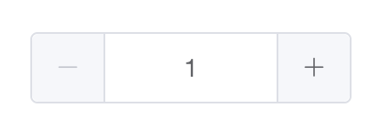

# Input-Number 组件

## 一. 概述
上一节课讲解了 Input 组件，这一节课讲解一下根据 Input 组件再次封装的 Input-Number 组件。
**课程讲解流程：**
1. 讲解 Input-Number 组件的基本用法和其提供的功能。
2. 根据功能将 Input-Number 组件的属性进行分类，后续讲解源代码时根据属性的分类去讲解。
3. 讲解 Input-Number 组件涉及到的知识点。
4. 根据 Input-Number 组件的功能，一步一步的完成组件代码。

## 二. Input-Number 组件的基本用法
### 2.1 基础用法

使用 v-model 绑定变量即可，变量的初始值即为默认值。

### 2.2 提供的功能
1. 可禁用。
2. 步数：允许定义递增、递减的步数控制。
3. 严格步数：只能输入步数的倍数。
4. 精度。
5. 尺寸。
6. 按钮位置：默认按钮位置显示在左右两边，也可以仅显示在右侧。

## 三. Input-Number 组件提供的属性和事件
### 3.1 提供的属性
类别一：绑定值属性
| 序号 | 参数 | 说明 | 类型 | 可选值 | 默认值 |
| --- | --- | --- | --- | --- | --- |
| 1 | value/v-model | 绑定值 | number | -- | 0 |

类别二：控制按钮属性
| 序号 | 参数 | 说明 | 类型 | 可选值 | 默认值 |
| --- | --- | --- | --- | --- | --- |
| 1 | controls | 是否使用控制按钮 | boolean | -- | true |
| 2 | controls-position | 控制按钮位置 | string | right | -- |
| 3 | step | 计数器步长 | number | -- | 1 |

类别三：严格步长属性
| 序号 | 参数 | 说明 | 类型 | 可选值 | 默认值 |
| --- | --- | --- | --- | --- | --- |
| 1 | step-strictly | 是否只能输入 step 的倍数 | boolean | -- | false |

类别四：最大/最小值属性
| 序号 | 参数 | 说明 | 类型 | 可选值 | 默认值 |
| --- | --- | --- | --- | --- | --- |
| 1 | min | 设置计数器允许的最小值 | number | -- | -Infinity |
| 2 | max | 设置计数器允许的最大值 | number | -- | Infinity |

类别五：数值精度属性
| 序号 | 参数 | 说明 | 类型 | 可选值 | 默认值 |
| --- | --- | --- | --- | --- | --- |
| 1 | precision | 数值精度 | number | -- | -- |

类别六：禁用属性
| 序号 | 参数 | 说明 | 类型 | 可选值 | 默认值 |
| --- | --- | --- | --- | --- | --- |
| 1 | disabled | 是否禁用计数器 | boolean | -- | false |

类别七：尺寸属性
| 序号 | 参数 | 说明 | 类型 | 可选值 | 默认值 |
| --- | --- | --- | --- | --- | --- |
| 1 | size | 计数器尺寸 | string | large, small | -- |

类别八：原生name、placeholder属性及屏幕阅读器相关属性
| 序号 | 参数 | 说明 | 类型 | 可选值 | 默认值 |
| --- | --- | --- | --- | --- | --- |
| 1 | name | 原生属性 | string | -- | -- |
| 2 | label | 输入框关联的label文字 | string | -- | -- |
| 3 | placeholder | 输入框默认 placeholder | string | -- | -- |

### 3.2 提供的事件
| 序号 | 事件名称 | 说明 | 回调参数 |
| --- | --- | --- | --- |
| 1 | change | 绑定值被改变时触发 | currentValue, oldValue |
| 2 | blur | 在组件 Input 失去焦点时触发 | (event: Event) |
| 3 | focus | 在组件 Input 获得焦点时触发 | (event: Event) |

### 3.3 提供的方法
| 序号 | 方法名 | 说明 | 参数 |
| --- | --- | --- | --- |
| 1 | focus | 使 input 获取焦点 | -- |
| 2 | select | 选中 input 中的文字 | -- |

## 四. Input-Number 组件相关知识点讲解
### 4.1 role=spinbutton 与 aria-valuemax、aria-valuemin、aria-valuenow 属性
之前的课程中讲过 aria- 开头的属性是用来定义残障人士更容易访问 Web 内容和 Web 应用程序。  
来说明一下如下这三个 aria- 开头的属性以及 role=spinbutton 控件代表的含义：  
+ role=spinbutton 代表递增和递减数字的控件。
+ aria-valuemax 代表计数器控件的最大值。
+ aria-valuemin 代表计数器控件的最小值。
+ aria-valuenow 代表计数器当前的值。

### 4.2 指令 repeat-click 的实现
#### 4.2.1 指令 repeat-click 的作用
鼠标长按在绑定的元素上面时，持续执行绑定的方法。在 input-number 组件中，用于鼠标长按加、减按钮时，进行持续的递增或递减。

#### 4.2.2 指令实现思路
在 bind 钩子中绑定监听事件，监听 mousedown 事件，如果鼠标按下和抬起的持续时间小于设置的时间范围，会触发一次回调函数，如果大于设置的时间，则会每隔设置的时间，触发一次回调函数，并且在鼠标抬起时，清除定时器。

#### 4.2.3 指令 repeat-click 的代码详解
先来说明一下实现该指令时，封装的绑定监听事件以及移除监听事件的相关方法：  
（1）on 方法：用于绑定监听事件，兼容 IE 浏览器  
```javaScript
export const on = (function() {
  if (!isServer && document.addEventListener) {
    // 判断 document.addEventListener 是否存在，
    return function(element, event, handler) {
      // 如果元素、事件、回调方法都存在则绑定监听事件
      if (element && event && handler) {
        element.addEventListener(event, handler, false);
      }
    };
  } else {
    // 不存在，使用 attachEvent 兼容IE浏览器
    return function(element, event, handler) {
      if (element && event && handler) {
        element.attachEvent('on' + event, handler);
      }
    };
  }
})();
```
（2）off 方法：用于取消事件监听，兼容 IE 浏览器  
```javaScript
export const off = (function() {
  if (!isServer && document.removeEventListener) {
    // 判断 document.removeEventListener 是否存在
    return function(element, event, handler) {
      // 如果元素、事件存在，则取消监听的绑定事件
      if (element && event) {
        element.removeEventListener(event, handler, false);
      }
    };
  } else {
    // 不存在，使用 detachEvent 兼容IE浏览器
    return function(element, event, handler) {
      if (element && event) {
        element.detachEvent('on' + event, handler);
      }
    };
  }
})();
```
（3）once 方法：用于监听绑定事件后，回调函数只触发一次
```javaScript
export const once = function(el, event, fn) {
  var listener = function() {
    // 如果传入了回调函数，则执行该函数
    if (fn) {
      fn.apply(this, arguments);
    }
    // 取消事件监听
    off(el, event, listener);
  };
  // 绑定事件监听
  on(el, event, listener);
};
```
再来看一下 repeat-click 指令的具体实现：
```javaScript
export default {
  bind(el, binding, vnode) {
    let interval = null;
    let startTime;
    // 每隔多长时间执行一次方法
    const maxIntervals = isMac() ? 100 : 200;
    // 绑定的方法
    const handler = () => vnode.context[binding.expression].apply();
    const clear = () => {
      // 小于间隔时间，则执行方法
      if (Date.now() - startTime < maxIntervals) {
        handler();
      }
      // 并且在鼠标抬起时清除计时器
      clearInterval(interval);
      interval = null;
    }
    on(el, 'mousedown', (e) => {
      // 如果点击的不是鼠标左键，则直接 return 
      if (e.button !== 0) return;
      // 变量 startTime 记录当前鼠标 mousedown 的时间
      startTime = Date.now();
      // 绑定鼠标 mouseup 事件
      once(document, 'mouseup', clear);
      clearInterval(interval);
      // 每隔 maxIntervals 时间执行一次方法
      interval = setInterval(handler, maxIntervals);
    })
  }
}
```

## 五. 实现 Input-Number 组件
第一步：实现 input-number 组件的 HTML 基本结构以及将对应的 class 写好，为实现后续逻辑做好基础。  
第二步：根据对属性的分类，按照类别去实现每一类属性的功能：  
  + 绑定值属性。
  + 控制按钮属性。
  + 最大/最小值属性。
  + 步长/严格步长属性。
  + 数值精度属性。
  + 禁用属性。
  + 尺寸属性。
  + 原生name属性及屏幕阅读器相关属性。  

第三步：根据组件提供的事件和方法，完成提供事件和方法的功能。  
第四步：检查组件功能是否完整。

### 5.1 Input-Number 组件注册与基本结构实现
（1）组件的注册  
在 components 文件夹里面新建一个 input-number 文件夹，里面新建 input-number.vue 文件。设置组件的 name 为 ElInputNumber。  
在 main.js 文件中引入该组件，使用 Vue.component 完成组件的注册。  
```javaScript
import InputNumber from './components/input-number/input-number';

const components = [
  ...
  InputNumber
]

components.forEach(component => {
  Vue.component(component.name, component);
});
```
（2）组件的基本 HTML 结构  
组件的基本 HTML 结构是最外层一个 div 包裹，里面包含 input 组件。  
```HTML
<template>
  <div
    class="el-input-number"
  >
    <el-input ref="input"></el-input>
  </div>
</template>
<script>
export default {
  name: 'ElInputNumber',
  
}
</script>
```

### 5.2 Input-Number 组件属性功能实现
#### 5.2.1 绑定值属性
（1）绑定值属性的设置需要注意  
+ input-number 组件仅支持输入数字，当用户的输入不符合规范时，不能将不符合规范的输入显示在输入框中。
+ input-number 组件后续需要支持处理最大/最小值、步长以及精度属性，即使用户输入了数字，后续也需要校验是否符合其他限制。  

（2）绑定值属性的实现思路  
+ 首先需要监听传入的 value 值的变化，组件内部用变量来存储计数器数值的数据源。
+ 计数器的数据源分为两个部分保存：
  + 第一部分是用户手动触发 input 事件在输入过程中的内容，用 userInput 变量保存。
  + 第二部分是传入计数器的值，用 currentValue 变量保存。
+ 设置计算属性 displayValue 展示 input 元素的数值：根据 userInput 和 currentValue 变量的变化去设置计算属性 displayValue 作为输入框展示的值的变量。
+ 根据用户的输入去改变 userInput 的值，用户输入完成后判断输入是否为数字，如果为数字则改变 currentValue 的值。  

（3）代码实现  
第一步：监听传入的 value 值的变化，用 userInput 和 currentValue 变量存储值，并且将传入的值绑定在 input 元素上。
```HTML
<template>
  <div class="el-input-number">
    <el-input ref="input" :value="displayValue"></el-input>
  </div>
</template>
<script>
export default {
  props: {
    value: {},
  },
  data() {
    return {
      currentValue: 0,
      userInput: null
    };
  },
  watch: {
    value: {
      immediate: true,
      handler(value) {
        let newVal = value === undefined ? value : Number(value);
        if (newVal !== undefined) {
          // 如果传入的值不是数字，则直接 return
          if (isNaN(newVal)) {
            return;
          }
        }
        // 将存储传入计数器的值的变量存储为 newVal
        this.currentValue = newVal;
        // 将存储用户输入的变量的值设置为 null
        this.userInput = null;
        this.$emit('input', newVal);
      }
    }
  },
  computed: {
    displayValue() {
      // 如果存在用户输入的值，则直接返回用户输入的值
      if (this.userInput !== null) {
        return this.userInput;
      }
      // 否则返回 currentValue
      return this.currentValue;
    }
  }
}
</script>
```
第二步：在用户输入触发 input 事件时，用 userInput 变量存储用户实时输入的值。在用户输入完成后触发 change 事件时，判断用户输入的是否为数字，如果是数字则触发 currentValue 变量的改变并且将用户实时输入的值 userInput 设置为 null。  
```HTML
<template>
  <div class="el-input-number">
    <el-input
        ref="input"
        :value="displayValue"
        @input="handleInput"
        @change="handleInputChange"
    ></el-input>
  </div>
</template>
<script>
export default {
  methods: {
    // 给计数器设置新的值
    setCurrentValue(newVal) {
      // 存储原先计数器的值
      const oldVal = this.currentValue;
      if (oldVal === newVal) return;
      // 如果新旧值不相等，则重新设置值，并且将用户输入过程中的变量置为空
      this.userInput = null;
      this.$emit('input', newVal);
      this.$emit('change', newVal, oldVal);
      this.currentValue = newVal;
    },
    handleInput(value) {
      // 变量 userInput 记录用户输入过程中的值
      this.userInput = value;
    },
    handleInputChange(value) {
      const newVal = value === '' ? undefined : Number(value);
      // 用户输入完成后，判断用户输入值是否为数字或者是空字符串
      if (!isNaN(newVal) || value === '') {
        this.setCurrentValue(newVal);
      }
      // 将用户输入过程中的变量设置为 null
      this.userInput = null;
    },
  }
}
</script>
```

#### 5.2.2 控制按钮与步长属性
（1）控制按钮的作用  
控制按钮是输入框左、右两侧的递减、递增按钮，方便递减、递增数值，并且还支持长按持续递减、递增。  
控制按钮与步长是结合使用的，默认的步长为1，每点击一次都会递减或递增对应步长。  

（2）控制按钮实现思路  
+ 接收 controls 属性，controls 属性为 true 时显示递减、递增按钮，并且控制按钮支持 controls-position 属性，传入 right 则控制按钮在右侧。
+ 递减、递增按钮绑定 repeat-click 指令，支持长按持续递减、递增，点击递减、递增按钮，按照步长实现递减、递增功能。
+ 处理浮点数运算的计算精度问题。  
+ 增加当 input 元素处于选中状态时，点击上、下按键触发递增、递减功能。

（3）代码实现  
第一步：接收 controls 属性，controls 属性为 true 时显示递减、递增按钮，并且控制按钮支持 controls-position 属性，传入 right 则控制按钮在右侧。  
javaScript 部分：  
```javaScript
props: {
  value: {},
  controls: {
    type: Boolean,
    default: true
  },
  controlsPosition: {
    type: String,
    default: ''
  },
},
```
HTML 部分：  
```HTML
<template>
  <div
    :class="[
      'el-input-number',
      { 'is-without-controls': !controls },
      { 'is-controls-right': controlsAtRight }
    ]"
  >
    <span
      class="el-input-number__decrease"
      role="button"
      v-if="controls"
    >
      <i :class="`el-icon-${controlsAtRight ? 'arrow-down' : 'minus'}`"></i>
    </span>
    <span
      class="el-input-number__increase"
      role="button"
      v-if="controls"
    >
      <i :class="`el-icon-${controlsAtRight ? 'arrow-up' : 'plus'}`"></i>
    </span>
    ...
  </div>
</template>
```
第二步：递减、递增按钮绑定 repeat-click 指令，支持长按持续递减、递增，点击递减、递增按钮，按照步长实现递减、递增功能。  
HTML 部分：  
```HTML
<template>
  <div ...>
    <span ...
      class="el-input-number__decrease"
      v-repeat-click="decrease"
    >
      <i :class="`el-icon-${controlsAtRight ? 'arrow-down' : 'minus'}`"></i>
    </span>
    <span ...
      class="el-input-number__increase"
      v-repeat-click="increase"
    >
      <i :class="`el-icon-${controlsAtRight ? 'arrow-up' : 'plus'}`"></i>
    </span>
    ...
  </div>
</template>
```
javaScript 部分：  
```javaScript
// 引入 repeat-click 指令
import RepeatClick from '../../utils/directives/repeat-click';

directives: {
  repeatClick: RepeatClick
},
// 接收 step 属性
props: {
  step: {
    type: Number,
    default: 1
  },
}
// 执行递增和递减方法
// 递增方法
_increase(val, step) {
  if (typeof val !== 'number' && val !== undefined) return this.currentValue;
  return val + step;
},
// 点击递增按钮
increase() {
  const value = this.value || 0;
  const newVal = this._increase(value, this.step);
  this.setCurrentValue(newVal);
},
// 递减方法
_decrease(val, step) {
  if (typeof val !== 'number' && val !== undefined) return this.currentValue;
  return val - step;
},
// 点击递减按钮
decrease() {
  const value = this.value || 0;
  // 根据步长递减
  const newVal = this._decrease(value, this.step);
  this.setCurrentValue(newVal);
},
```
第三步：处理浮点数运算的计算精度问题。  
上一步实现的递减、递增在整数运算时没有问题，但是在浮点数运算时存在问题，这一步就解决一下浮点数运算的计算结果出现误差的问题。  
思路是先将浮点数乘以对应的小数位数放大为整数，进行算术运算后，再除以对应的小数位数，重新转换为小数。  
+ 获取计数器的值和步长的小数后的位数，取较多的位数作为转化为整数的10的指数。
+ 重新修改递增和递减方法，先转化为整数计算，再除以对应的小数位数，重新转换为小数。  

获取计数器的值和步长中较多的小数位数：  
```javaScript
methods: {
  // 获取一个数的小数位数
  getPrecision(value) {
    if (value === undefined) return 0;
    // 转换成字符串
    const valueString = value.toString();
    // 获取 . 的位置
    const dotPosition = valueString.indexOf('.');
    let precision = 0;
    // 如果存在小数
    if (dotPosition !== -1) {
      // 计算小数的位数
      precision = valueString.length - dotPosition - 1;
    }
    return precision;
  },
},
computed: {
  // 计数器的小数位数
  numPrecision() {
    const { value, step } = this;
    // 获取步长的小数位数
    const stepPrecision = this.getPrecision(step);
    // 获取值和步长的小数位数中的较大值
    return Math.max(this.getPrecision(value), stepPrecision);
  },
}
```
修改递增和递减方法：
```javaScript
methods: {
  // 递增方法
  _increase(val, step) {
    if (typeof val !== 'number' && val !== undefined) return this.currentValue;
    // 根据获取到的小数位数计算转换为整数需要乘以多少，如果是1位小数需要乘以10，两位小数需要乘以100
    // 取10的 numPrecision 次幂
    const precisionFactor = Math.pow(10, this.numPrecision);
    return (precisionFactor * val + precisionFactor * step) / precisionFactor;
  },
  // 递减方法
  _decrease(val, step) {
    if (typeof val !== 'number' && val !== undefined) return this.currentValue;
    // 根据获取到的小数位数计算转换为整数需要乘以多少，如果是1位小数需要乘以10，两位小数需要乘以100
    // 取10的 numPrecision 次幂
    const precisionFactor = Math.pow(10, this.numPrecision);
    return (precisionFactor * val - precisionFactor * step) / precisionFactor;
  },
}
```  
第四步：增加当 input 元素处于选中状态时，点击上、下按键触发递增、递减功能。
```HTML
<el-input
  ...
  @keydown.up.native.prevent="increase"
  @keydown.down.native.prevent="decrease"
></el-input>
```

#### 5.2.3 严格步长属性
（1）严格步长的作用  
严格步长是指只能输入步长的倍数，初始的传值也只能传步长的倍数，如果不是步长的倍数会自动转换为步长的倍数。  

（2）严格步长的实现思路  
+ 接收严格步长 stepStrictly 属性，如果为 true，则初始传的 value 值需要经过再次计算是否符合步长，如果符合则返回原值，如果不符合根据计算返回一个符合步长的值。
+ 展示在计数器输入框中的计算属性 displayValue 也需要经过计算是否符合步长，如果不符合则需要重新计算返回一个符合步长的值，这样如果计数器从非严格步长改为严格步长，计数器的值也会被重新计算。  

（3）代码实现  
第一步：接收严格步长 stepStrictly 属性，如果为 true，则初始传的 value 值需要经过再次计算是否符合步长，如果符合则返回原值，如果不符合根据计算返回一个符合步长的值。  
```javaScript
// 监听传入的严格步长属性
props: {
  stepStrictly: {
    type: Boolean,
    default: false
  },
}

// 修改监听 value 值改变时的处理
watch: {
  value: {
    immediate: true,
    handler(value) {
      ...
      if (newVal !== undefined) {
        ...
        // 如果传入了严格步长
        if (this.stepStrictly) {
          // 计算转换成整数计算需要的倍数
          const stepPrecision = this.getPrecision(this.step);
          const precisionFactor = Math.pow(10, stepPrecision);
          // 用传入的值除以步长，获取到四舍五入的整数值，然后再乘以步长（计算过程中采用转换成整数的方式处理精度问题）
          newVal = Math.round(newVal / this.step) * precisionFactor * this.step / precisionFactor;
        }
      }
      ...
    }
  }
}
```
第二步：展示在计数器输入框中的计算属性 displayValue 也需要经过计算是否符合步长，如果不符合则需要重新计算返回一个符合步长的值。  
```javaScript
computed: {
  displayValue() {
      ...
      let currentValue = this.currentValue;
    if (typeof currentValue === 'number') {
      // 如果传入了严格步长
      if (this.stepStrictly) {
        // 计算转换成整数计算需要的倍数
        const stepPrecision = this.getPrecision(this.step);
        const precisionFactor = Math.pow(10, stepPrecision);
        // 用传入的值除以步长，获取到四舍五入的整数值，然后再乘以步长（计算过程中采用转换成整数的方式处理精度问题）
        currentValue = Math.round(currentValue / this.step) * precisionFactor * this.step / precisionFactor;
      }
    }
    // 否则返回 currentValue
    return currentValue;
  }
}
```

#### 5.2.4 数值精度属性
（1）数值精度的作用  
相当于小数点后保留几位小数，如果数值是1，精度为2，则计数器展示 1.00。  

（2）数值精度的实现思路  
+ 接收精度 precision 属性，并且验证 precision 是大于等于0的整数。
+ 修改计算属性 numPrecision，numPrecision 目的是计算放大到整数时10的指数，如果传入了精度，就取传入的精度的值，否则还是获取步长和数值的小数位数较多的值。
+ 增加四舍五入的方法。
+ 修改监听 value 值变化的处理、设置值的 setCurrentValue 方法、递增、递减方法，给这些监听或方法增加四舍五入的方法处理。
+ 修改展示 input 值的计算属性 displayValue，增加精度的处理。  

（3）代码实现  
第一步：接收精度 precision 属性，并且验证 precision 是大于等于0的整数。  
```javaScript
precision: {
  type: Number,
  validator(val) {
    return val >= 0 && val === parseInt(val, 10);
  }
}
```
第二步：修改计算属性 numPrecision。
```javaScript
// 计数器的小数位数
numPrecision() {
  const { value, step, precision } = this;
  // 获取步长的小数位数
  const stepPrecision = this.getPrecision(step);
  if (precision !== undefined) {
    if (stepPrecision > precision) {
      console.warn('[input-number]中保留的精度位数应该大于或等于步长的位数')
    }
    return precision;
  } else {
    // 获取值和步长的小数位数中的较大值
    return Math.max(this.getPrecision(value), stepPrecision);
  }
},
```
第三步：增加四舍五入的方法。
```javaScript
// 四舍五入的方法
toPrecision(num, precision) {
  // 如果没有传入精度则采用 numPrecision 计算出的精度
  if (precision === undefined) precision = this.numPrecision;
  // 处理四舍五入
  return parseFloat(Math.round(num * Math.pow(10, precision)) / Math.pow(10, precision));
},
```
第四步：修改监听 value 值变化的处理、设置值的 setCurrentValue 方法、递增、递减方法，给这些监听或方法增加四舍五入的方法处理。
```javaScript
// 修改监听 value 值变化的处理
watch: {
  value: {
    immediate: true,
    handler(value) {
      let newVal = value === undefined ? value : Number(value);
      if (newVal !== undefined) {
        ...
        // 如果传入了精度，则做四舍五入处理
        if (this.precision !== undefined) {
          newVal = this.toPrecision(newVal, this.precision);
        }     
      }
      ...
    }
  }
},
```
```javaScript
methods: {
  // 给计数器设置新的值
  setCurrentValue(newVal) {
    // 存储原先计数器的值
    const oldVal = this.currentValue;
    // 设置了精度时做四舍五入的处理
    if (typeof newVal === 'number' && this.precision !== undefined) {
      newVal = this.toPrecision(newVal, this.precision);
    }
    ...
  },
  // 递增、递减方法的返回值做四舍五入的处理
  _increase(val, step) {
    if (typeof val !== 'number' && val !== undefined) return this.currentValue;
    // 根据获取到的小数位数计算转换为整数需要乘以多少，如果是1位小数需要乘以10，两位小数需要乘以100
    // 取10的 numPrecision 次幂
    const precisionFactor = Math.pow(10, this.numPrecision);
    return this.toPrecision((precisionFactor * val + precisionFactor * step) / precisionFactor);
  },
  _decrease(val, step) {
    if (typeof val !== 'number' && val !== undefined) return this.currentValue;
    // 根据获取到的小数位数计算转换为整数需要乘以多少，如果是1位小数需要乘以10，两位小数需要乘以100
    // 取10的 numPrecision 次幂
    const precisionFactor = Math.pow(10, this.numPrecision);
    return this.toPrecision((precisionFactor * val - precisionFactor * step) / precisionFactor);
  },
}
```
第五步：修改展示 input 的值的计算属性 displayValue，增加精度的处理。
```javaScript
computed: {
  displayValue() {
    ...
    let currentValue = this.currentValue;
    if (typeof currentValue === 'number') {
      // 处理精度，补全缺失的0，由于之前已经处理过四舍五入了，这一步主要补齐精度后面的0
      if (this.precision !== undefined) {
        currentValue = currentValue.toFixed(this.precision);
      }
    }
    // 否则返回 currentValue
    return currentValue;
  }
}
```

#### 5.2.5 最大/最小值属性
（1）最大/最小值的作用  
设置计数器的最小/最大值。  

（2）最大/最小值的实现思路  
+ 接收最大、最小的属性传值，并且给 input 元素增加最大、最小值属性。  
+ 监听 value 值是否超出最大、最小边界，如果超出边界，取最大、最小值。
+ 监听设置值的方法 setCurrentValue 时，是否超出最大、最小边界，如果超出边界，取最大、最小值。
+ 增加计算属性 minDisabled 和 maxDisabled，计算控制按钮在下一次点击时会不会超出限制，从而使控制按钮禁用。  

（3）代码实现  
第一步：接收最大、最小的属性传值，并且给 input 元素增加最大、最小值属性。  
```javaScript
max: {
  type: Number,
  default: Infinity
},
min: {
  type: Number,
  default: -Infinity
},
```
```HTML
<el-input
  ...
  :max="max"
  :min="min"
  ...
></el-input>
```
第二步：监听 value 值是否超出最大、最小边界，如果超出边界，取最大、最小值。
```javaScript
watch: {
  value: {
    immediate: true,
    handler(value) {
      let newVal = value === undefined ? value : Number(value);
      if (newVal !== undefined) {
        ...  
      }
      // 是否超出最大、最小边界，如果超出边界，取最大、最小值
      if (newVal >= this.max) newVal = this.max;
      if (newVal <= this.min) newVal = this.min;
      // 将存储传入计数器的值的变量存储为 newVal
      this.currentValue = newVal;
      ...
    }
  }
},
```
第三步：监听设置值的方法 setCurrentValue 时，是否超出最大、最小边界，如果超出边界，取最大、最小值。
```javaScript
methods: {
  // 给计数器设置新的值
  setCurrentValue(newVal) {
    ...
    // 是否超出最大、最小边界，如果超出边界，取最大、最小值
    if (newVal >= this.max) newVal = this.max;
    if (newVal <= this.min) newVal = this.min;
    if (oldVal === newVal) return;
    ...
  },
}
```
第四步：增加计算属性 minDisabled 和 maxDisabled，计算控制按钮在下一次点击时会不会超出限制，从而使控制按钮禁用。
```javaScript
// 增加计算属性 minDisabled 和 maxDisabled
computed: {
  // 递减禁用
  minDisabled() {
    // 计算下一次递减之后会不会小于最小值
    return this._decrease(this.value, this.step) < this.min;
  },
  // 递增禁用
  maxDisabled() {
    // 计算下一次递增之后会不会大于最大值
    return this._increase(this.value, this.step) > this.max;
  },
}
// 按钮禁用时，递减、递增方法也不能触发
methods: {
  // 点击递增按钮
  increase() {
    if (this.maxDisabled) return;
    ...
  },
  // 点击递减按钮
  decrease() {
    if (this.minDisabled) return;
    ...
  },
}
```
```HTML
<!-- 将禁用样式增加上 -->
<span
  class="el-input-number__decrease"
  ...
  :class="{'is-disabled': minDisabled}"
>
  <i :class="`el-icon-${controlsAtRight ? 'arrow-down' : 'minus'}`"></i>
</span>
<span
  class="el-input-number__increase"
  ...
  :class="{'is-disabled': maxDisabled}"
>
  <i :class="`el-icon-${controlsAtRight ? 'arrow-up' : 'plus'}`"></i>
</span>
```

#### 5.2.6 禁用属性
（1）实现思路  
+ 接收禁用属性 disabled，并且设置计算属性 inputNumberDisabled 监听 disabled 的改变。
+ 给 input 元素增加 disabled 属性，并且增加上 disabled 样式。  

（2）代码实现  
第一步：接收禁用属性 disabled，并且设置计算属性 inputNumberDisabled 监听 disabled 的改变。  
```javaScript
props: {
  // 接收禁用属性 disabled
  disabled: Boolean,
},
computed: {
  // 设置计算属性 inputNumberDisabled 监听 disabled 的改变
  inputNumberDisabled() {
    return this.disabled;
  },
}
```
第二步：给 input 元素增加 disabled 属性，并且增加上 disabled 样式。
```HTML
<template>
  <div
    :class="[
      'el-input-number',
      { 'is-disabled': inputNumberDisabled }, ...
    ]"
  >
    <el-input
      ref="input"
      :disabled="inputNumberDisabled"
      ...
    ></el-input>
  </div>
</template>
```

#### 5.2.7 尺寸属性
接收传入的尺寸 size，设置计算属性 inputNumberSize 监听 size 的改变，将 size 属性传入 input 组件中，并且给 size 增加其对应的样式。
```javaScript
props: {
  size: String,
},
computed: {
  inputNumberSize() {
    return this.size;
  },
}
```
```HTML
<template>
  <div
    :class="[
      'el-input-number',
      inputNumberSize ? 'el-input-number--' + inputNumberSize : '',
      ...
    ]"
  >
    <el-input
      ...
      :size="inputNumberSize"
      ...
    ></el-input>
  </div>
</template>
```

#### 5.2.8 原生name、placeholder属性及屏幕阅读器相关属性
（1）原生name、placeholder属性  
接收 name 和 placeholder 属性，并且绑定到 input 元素上。  
```javaScript
props: {
  name: String,
  placeholder: String,
}
```
```HTML
<el-input
  :placeholder="placeholder"
  :name="name"
  ...
></el-input>
```
（2）屏幕阅读器相关属性与功能  
+ 接收 label 属性，用于屏幕阅读器中描述 input 控件。  

```javaScript
props: {
  label: String,
}
```
```HTML
<el-input
  ...
  :label="label"
  ...
></el-input>
```  

+ 给 input 元素设置 role 属性，以及 aria- 开头的属性，用于描述计数器。

```javaScript
mounted() {
  let innerInput = this.$refs.input.$refs.input;
  innerInput.setAttribute('role', 'spinbutton');
  innerInput.setAttribute('aria-valuemax', this.max);
  innerInput.setAttribute('aria-valuemin', this.min);
  innerInput.setAttribute('aria-valuenow', this.currentValue);
  innerInput.setAttribute('aria-disabled', this.inputNumberDisabled);
},
// 更新计数器的 aria-valuenow 属性
updated() {
  if (!this.$refs || !this.$refs.input) return;
  const innerInput = this.$refs.input.$refs.input;
  innerInput.setAttribute('aria-valuenow', this.currentValue);
}
```

### 5.3 提供事件和方法
#### 5.3.1 提供事件
提供 change、blur、focus 三个事件，其中 change 事件在 setCurrentValue 方法中已经用 emit 让父组件监听到了。  
还需要实现 blur 和 focus 事件。  
```HTML
<el-input
  ...
  @blur="handleBlur"
  @focus="handleFocus"
  ...
></el-input>
```
```javaScript
methods: {
  handleBlur(event) {
    this.$emit('blur', event);
  },
  handleFocus(event) {
    this.$emit('focus', event);
  },
}
```

#### 5.3.2 提供方法
提供 focus 和 select 两个方法。
```javaScript
methods: {
  focus() {
    this.$refs.input.focus();
  },
  select() {
    this.$refs.input.select();
  }
}
```

## 六. 总结
本节讲了 Input-Number 组件，主要讲解的知识点是：  
+ 介绍了 repeat-click 指令的实现思路及具体实现。
+ 介绍了实现 Input-Number 需要注意的浮点数运算问题。
+ 介绍了屏幕阅读器相关的 aria-valuemax、aria-valuemin、aria-valuenow 属性。  

