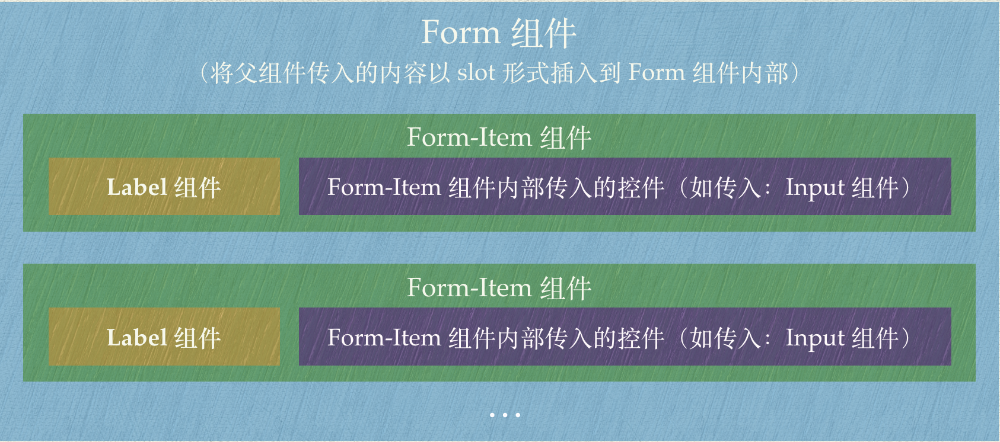

# Form 组件

## 一. 概述
本节课讲解 Form 组件以及其内部的 Form-Item 组件，具体讲解流程如下：  
1. 用一个简单的案例去介绍 Form 组件的基本用法。
2. 介绍 Form 组件提供的功能。
3. 以组件提供的功能为基准，将 Form 组件的属性、方法、事件进行分类。
4. 根据 Form 组件的功能去实现每一个功能与其相对应的属性、方法、事件。
5. 在实现 Form 组件的过程中，将原先讲解的组件进行完善，补充与 Form 组件相关的部分（比如一些需要继承 Form 组件传入的属性）。

## 二. Form 组件基本介绍
```HTML
<el-form ref="form" :model="form" label-width="80px">
  <el-form-item label="活动名称" prop="name">
    <el-input v-model="form.name"></el-input>
  </el-form-item>
  <el-form-item label="活动性质" prop="type">
    <el-checkbox-group v-model="form.type">
      <el-checkbox label="美食/餐厅线上活动" name="type"></el-checkbox>
      <el-checkbox label="地推活动" name="type"></el-checkbox>
      <el-checkbox label="线下主题活动" name="type"></el-checkbox>
      <el-checkbox label="单纯品牌曝光" name="type"></el-checkbox>
    </el-checkbox-group>
  </el-form-item>
  <el-form-item>
    <el-button type="primary">提交</el-button>
    <el-button>取消</el-button>
  </el-form-item>
</el-form>
<script>
  export default {
    data() {
      return {
        form: {
          name: '',
          type: [],
        }
      }
    }
  }
</script>
```
Form 组件的最基本属性是接收一个 model 参数，作为表单的数据对象。
Form-Item 组件接收 prop 属性，该属性与表单域的 model 字段值的对象中的属性相对应，在使用表单验证和重置方法的情况下，该属性是必填的。
Form 组件内部嵌套的组件通过 v-model 去绑定 model 对象参数中的属性。  

## 三. Form 组件提供的功能
将 Form 组件提供的功能进行细分。
1. 基础表单域，接收 model 参数作为表单数据对象。
2. 表单域内数据的重置功能。
3. 行内表单，表单内控件放置在同一行内。
4. 表单域标签的位置、宽度以及后缀可设置。
5. 表单域的验证功能：
  a. 表单验证验证规则。
  b. 是否隐藏必填字段的标签旁边的红色星号。
  c. 是否显示校验错误信息。
  d. 是否以行内形式展示校验信息。
  e. 是否在输入框中显示校验结果反馈图标。
  f. 是否在 rules 属性改变后立即触发一次验证。
  g. 表单域验证的错误信息。
6. 表单域中控件的尺寸可以通过设置 size 来控制。
7. 表单域可以通过设置 disabled 来控制所有控件的启用/禁用状态。

## 四. 根据提供的功能将属性、方法、事件进行划分
### 4.1 基础表单域
Form 和 Form-Item 组件组合生成表单，Form 组件支持传递 model 属性作为表单的数据对象，表单的每一项 Form-Item 组件支持传递 label 作为表单项的标签文本。  
（1）Form 组件相关
Form 组件提供的属性：
| 序号 | 参数 | 说明 | 类型 | 可选值 | 默认值 |
| --- | --- | --- | --- | --- | --- |
| 1 | model | 表单数据对象 | object | -- | -- |
（2）Form-Item 组件相关  
Form-Item 组件提供的属性：  
| 序号 | 参数 | 说明 | 类型 | 可选值 | 默认值 |
| --- | --- | --- | --- | --- | --- |
| 1 | label | 标签文本 | string | -- | -- |
Form-Item 组件提供的插槽：
| 序号 | name | 说明 |
| --- | --- | --- |
| 1 | -- | Form Item 的内容 |
| 2 | label | 标签文本的内容 |

### 4.2 表单域内数据的重置功能
表单域提供 resetFields 方法对整个表单进行重置，每一个表单项提供 resetField 方法用于对该表单项进行重置。
（1）Form 组件相关
Form 组件提供的方法：
| 序号 | 方法名 | 说明 | 参数 |
| --- | --- | --- | --- |
| 1 | resetFields | 对整个表单进行重置，将所有字段值重置为初始值并移除校验结果 | -- |
（2）Form-Item 组件相关
Form-Item 组件提供的属性：
| 序号 | 参数 | 说明 | 类型 | 可选值 | 默认值 |
| --- | --- | --- | --- | --- | --- |
| 1 | prop | 表单域 model 字段，在使用 validate、resetFields 方法的情况下，该属性是必填的 | string | 传入 Form 组件的 model 中的字段 | -- |
Form-Item 组件提供的方法：
| 序号 | 方法名 | 说明 | 参数 |
| --- | --- | --- | --- |
| 1 | resetField | 对该表单项进行重置，将其值重置为初始值并移除校验结果 | -- |

### 4.3 行内表单
默认情况下，表单项是垂直方向排列的，如果表单垂直方向空间受限且表单较简单时，可以在一行内放置表单。
（1）Form 组件相关
Form 组件提供的属性：
| 序号 | 参数 | 说明 | 类型 | 可选值 | 默认值 |
| --- | --- | --- | --- | --- | --- |
| 1 | inline | 行内表单模式 | boolean | -- | false |

### 4.4 表单域标签的位置、宽度以及后缀可设置
表单域 label 标签的位置、宽度以及后缀可以整体设置，每个表单项 label 标签的宽度也可以单独设置。
（1）Form 组件相关
Form 组件提供的属性：  
| 序号 | 参数 | 说明 | 类型 | 可选值 | 默认值 |
| --- | --- | --- | --- | --- | --- |
| 1 | label-position | 表单域标签的位置，如果值为 left 或者 right 时，则需要设置 label-width | string | right/left/top | right |
| 2 | label-width | 表单域标签的宽度，例如 '50px'。作为 Form 直接子元素的 form-item 会继承该值。支持 auto | string | -- | -- |
| 3 | label-suffix | 表单域标签的后缀 | string | -- | -- |
（2）Form-Item 组件相关
Form-Item 组件提供的属性：
| 序号 | 参数 | 说明 | 类型 | 可选值 | 默认值 |
| --- | --- | --- | --- | --- | --- |
| 1 | label-width | 表单域标签的的宽度，例如 '50px'。支持 auto | string | -- | -- |

### 4.5 表单域的验证功能
表单域提供验证功能，配置验证规则以及一些其他的属性去校验表单项。
（1）Form 组件相关
Form 组件提供的属性：
| 序号 | 参数 | 说明 | 类型 | 可选值 | 默认值 |
| --- | --- | --- | --- | --- | --- |
| 1 | rules | 表单验证规则 | object | -- | -- |
| 2 | hide-required-asterisk | 是否隐藏必填字段的标签旁边的红色星号 | boolean | -- | false |
| 3 | show-message | 是否显示校验错误信息 | boolean | -- | true |
| 4 | inline-message | 是否以行内形式展示校验信息 | boolean | -- | false |
| 5 | status-icon | 是否在输入框中显示校验结果反馈图标 | boolean | -- | false |
| 6 | validate-on-rule-change | 是否在 rules 属性改变后立即触发一次验证 | boolean | -- | true |
Form 组件提供的方法：
| 序号 | 方法名 | 说明 | 参数 |
| --- | --- | --- | --- |
| 1 | validate | 对整个表单进行校验的方法，参数为一个回调函数。该回调函数会在校验结束后被调用，并传入两个参数：是否校验成功和未通过校验的字段。若不传入回调函数，则会返回一个 promise | Function(callback: Function(boolean, object)) |
| 2 | validateField | 对部分表单字段进行校验的方法 | Function(props: array | string, callback: Function(errorMessage: string)) |
| 3 | clearValidate | 移除表单项的校验结果。传入待移除的表单项的 prop 属性或者 prop 组成的数组，如不传则移除整个表单的校验结果 | Function(props: array | string) |
Form 组件提供的事件：
| 序号 | 事件名称 | 说明 | 回调参数 |
| --- | --- | --- | --- |
| 1 | validate | 任一表单项被校验后触发 | 被校验的表单项 prop 值，校验是否通过，错误消息（如果存在） |
（2）Form-Item 组件相关
Form-Item 组件提供的属性：
| 序号 | 参数 | 说明 | 类型 | 可选值 | 默认值 |
| --- | --- | --- | --- | --- | --- |
| 1 | required | 是否必填，如不设置，则会根据校验规则自动生成 | boolean | -- | false |
| 2 | rules | 表单验证规则 | object | -- | -- |
| 3 | error | 表单域验证错误信息, 设置该值会使表单验证状态变为 error，并显示该错误信息 | string | -- | -- |
| 4 | show-message | 是否显示校验错误信息 | boolean | -- | true |
| 5 | inline-message | 以行内形式展示校验信息 | boolean | -- | false |
Form-Item 组件提供的方法：
| 序号 | 方法名 | 说明 | 参数 |
| --- | --- | --- | --- |
| 1 | clearValidate | 移除该表单项的校验结果 | -- |
Form-Item 组件提供的插槽：
| 序号 | name | 说明 |
| --- | --- | --- |
| 1 | error | 自定义表单校验信息的显示方式，参数为 { error } |

### 4.6 表单域可配置控件尺寸
表单域可以整体配置控件的尺寸，单独的表单项也可以配置尺寸。
（1）Form 组件相关
Form 组件提供的属性：
| 序号 | 参数 | 说明 | 类型 | 可选值 | 默认值 |
| --- | --- | --- | --- | --- | --- |
| 1 | size | 用于控制该表单内组件的尺寸 | string | medium / small / mini | -- |
（2）Form-Item 组件相关
Form-Item 组件提供的属性：
| 序号 | 参数 | 说明 | 类型 | 可选值 | 默认值 |
| --- | --- | --- | --- | --- | --- |
| 1 | size | 用于控制该表单域下组件的尺寸 | string | medium / small / mini | -- |

### 4.7 表单域可配置启用/禁用状态
表单域可以配置启用/禁用状态，从而控制每一个表单项的启用/禁用状态。
（1）Form 组件相关
Form 组件提供的属性：
| 序号 | 参数 | 说明 | 类型 | 可选值 | 默认值 |
| --- | --- | --- | --- | --- | --- |
| 1 | disabled | 是否禁用该表单内的所有组件。若设置为 true，则表单内组件上的 disabled 属性不再生效 | boolean | -- | false |

## 五. Form 组件结构分析

如图所示：
Form 组件提供插槽，将其内部传入的内容以插槽的形式插入到 Form 组件中。
Form 组件内部会传入一个或多个 Form-Item 组件，Form-Item 组件可以拆分为两个部分：
+ 有关中文描述的 label 组件部分。
+ Form-Item 组件内部传入的内容部分，通常为传入与 Form 相关的一些组件，如：输入款、单选按钮等。

## 六. 根据 Form 组件提供的功能来完成组件代码
### 6.1 新建组件及注册组件
#### 6.1.1 Form 组件
新建 form 文件夹，文件夹内部新建 form.vue 文件作为 form 组件的文件，将组件的 name 和 componentName 设置为 ElForm。
在 main.js 文件中注册组件。
```javaScript
import Form from './components/form/form';

const components = [
  Form,
]

components.forEach(component => {
  Vue.component(component.name, component);
});
```
#### 6.1.2 Form-Item 组件
在 form 文件夹内部新建 form-item.vue 文件作为 form-item 组件的文件，将组件的 name 和 componentName 设置为 ElFormItem。
在 main.js 文件中注册组件。
```javaScript
import FormItem from './components/form/form-item';

const components = [
  FormItem,
]

components.forEach(component => {
  Vue.component(component.name, component);
});
```

#### 6.1.3 label-wrap 组件
在 form 文件夹内部新建 label-wrap 文件作为 label-wrap 组件的文件，由于 label-wrap 组件只在 form-item 组件中会用到，所以无需设置 name 和 componentName 属性，也无需全局注册组件。

### 6.2 组件基本的 HTML 结构
#### 6.2.1 Form 组件的基本结构
组件最外层用 form 标签包裹，设置 class 为 el-form，标签内部使用 slot 插槽来将传入到父级内部的内容插入到组件中。
```HTML
<template>
  <form class="el-form">
    <slot></slot>
  </form>
</template>
<script>
export default {
  name: 'ElForm',
  componentName: 'ElForm',
}
</script>
```

#### 6.2.2 Form-Item 组件
组件最外层使用 div 包裹，其中包含两个部分：
+ 用于表单项中文描述的 label-wrap 组件。
+ 用于表单项控件展示的部分，用 slot 插槽去接收父组件传过来的内容部分。
```HTML
<template>
  <div class="el-form-item">
    <!-- label-wrap 组件 -->
    <label-wrap></label-wrap>
    <!-- 表单项控件 -->
    <div class="el-form-item__content">
      <slot></slot>
    </div>
  </div>
</template>
<script>
import LabelWrap from './label-wrap';

export default {
  name: 'ElFormItem',
  componentName: 'ElFormItem',
  
  components: {
    LabelWrap
  },
}
</script>
```

#### 6.2.3 label-wrap 组件
label-wrap 组件需要根据用户传入的插槽或属性来显示，所以在讲到“实现基础表单域”的时候再去讲 label-wrap 组件的基本结构。

### 6.3 使用组件
新建一个文件，使用 Form 组件，并且在 Form-Item 组件内部传入之前讲解的 Radio、Checkbox、Input、Input-Number 组件。
```HTML
<template>
  <div>
    <el-form ref="form" :model="form">
      <el-form-item label="活动名称">
        <el-input v-model="form.name"></el-input>
      </el-form-item>
      <el-form-item label="活动性质">
        <el-checkbox-group v-model="form.type">
          <el-checkbox label="1" name="type">美食/餐厅线上活动</el-checkbox>
          <el-checkbox label="2" name="type">地推活动</el-checkbox>
          <el-checkbox label="3" name="type">线下主题活动</el-checkbox>
          <el-checkbox label="4" name="type">单纯品牌曝光</el-checkbox>
        </el-checkbox-group>
      </el-form-item>
      <el-form-item label="特殊资源">
        <el-radio-group v-model="form.resource">
          <el-radio label="1">线上品牌商赞助</el-radio>
          <el-radio label="2">线下场地免费</el-radio>
        </el-radio-group>
      </el-form-item>
      <el-form-item label="活动数量">
        <el-input-number v-model="form.amount">
        </el-input-number>
      </el-form-item>
    </el-form>
  </div>
</template>
<script>
export default {
  data() {
    return {
      form: {
        name: '',
        type: [],
        resource: '',
        amount: 1,
      }
    }
  }
}
</script>
```

### 6.4 实现基础表单域
#### 6.4.1 实现基础表单域涉及到的属性
（1）Form 组件：model 属性。
（2）Form-Item 组件：label 属性，以及名称为 label 的具名插槽。

#### 6.4.2 Form 组件的 model 属性
（1）在 Form 组件中，用 props 接收 model 属性，用于后续做表单的重置及验证等功能。
```javaScript
props: {
  model: Object,
}
```

#### 6.4.3 Form-Item 组件的 label
（1）在 Form-Item 组件中接收 label 属性，并且在 label-wrap 组件的内部传入 label。
```javaScript
props: {
  label: String,
},
```
在 label-wrap 组件中传入 label 标签，判断如果传入了 label，或者传入了名称是 label 的具名插槽，则展示 label 标签。
在 label 标签的内部接收父组件传过来的插槽内容，如果父组件没有传过来名为 label 的插槽内容，则展示 slot 标签内部的后备内容。
从这段代码可以看出，如果是 label 属性和插槽模板同时传值的情况下，插槽的优先级较高。
```HTML
<label-wrap>
  <label class="el-form-item__label" v-if="label || $slots.label">
    <slot name="label">{{label}}</slot>
  </label>
</label-wrap>
```
（2）在 label-wrap 组件内部采用 render() 函数来构建 DOM
使用 render() 函数是因为 render() 函数更加灵活，可以处理更复杂的渲染逻辑，由于 label 支持很多属性设置，需要根据设置渲染不同的标签，所以使用 render() 函数来更加灵活的渲染。
```HTML
<script>
export default {
  render() {
    const slots = this.$slots.default;
    if (!slots) return null;
    // render 函数来返回虚拟DOM节点
    return slots[0];
  }
}
</script>
```

### 6.5 表单域的重置功能
#### 6.5.1 表单域的重置功能涉及到的属性和方法
（1）Form 组件：resetFields 方法。
（2）Form-Item 组件：prop 属性、resetField 方法。

#### 6.5.2 表单域重置功能的实现思路
第一步：在 Form-Item 组件中，获取到其父组件 Form 组件，为后续获取 Form 组件的属性做准备。
第二步：在 Form-Item 组件中，根据 Form 组件传入的 model 属性，获取到对应的表单项的 value 值。
第三步：在 Form-Item 组件中的 mounted 钩子中，记录组件的初始值。
第四步：在 Form-Item 组件中，触发 Form 组件的自定义方法 addField，并且将 Form-Item 组件的 this 作为参数传入。在 Form 组件监听 addField 方法，方法中将传入的 this 全部推入一个数组变量中。
第五步：当 Form-Item 组件触发 beforeDestroy 钩子时，触发 Form 组件的自定义方法 removeField，并且将 Form-Item 组件的 this 作为参数传入。在 Form 组件监听 removeField 方法，将被销毁的组件对应的字段删除。
第六步：在 Form-Item 组件中，设置 resetField 方法，用于将组件中的值进行重置。
第七步：在 Form 组件中，设置 resetFields 方法，用于重置整个 Form 表单的值。

#### 6.5.3 在 Form-Item 组件中获取到 Form 组件
在 Form-Item 组件中，获取到其父组件 Form 组件，为后续获取 Form 组件的属性做准备。
```javaScript
computed: {
  form() {
    // 获取该组件的父级
    let parent = this.$parent;
    let parentName = parent.$options.componentName;
    // 如果父级不是 ElForm 则继续向上获取，直到获取到 ElForm
    while (parentName !== 'ElForm') {
      parent = parent.$parent;
      parentName = parent.$options.componentName;
    }
    // 返回父级
    return parent;
  },
},
```

#### 6.5.4 根据 model 属性，获取到对应表单的 value 值
在 Form-Item 组件中，根据 Form 组件传入的 model 属性，获取到对应的表单项的 value 值。
（1）在使用 Form-Item 组件时传入 prop 属性
（2）在 Form-Item 组件中接收 prop 属性  
```javaScript
props: {
  prop: String,
}
```
（3）设置计算属性 fieldValue，从传入的 model 中获取对应 prop 属性的值  
```javaScript
computed: {
  fieldValue() {
    // 获取到 form 组建的 model 属性
    const model = this.form.model;
    // 如果 model 或者 prop 任意一个不存在，则直接 return
    if (!model || !this.prop) { return; }
    // 将 prop 属性的值作为在 model 对象寻找值的 path
    let path = this.prop;
    // 如果 prop 属性的值存在:则替换成.（作为属性下的属性）
    if (path.indexOf(':') !== -1) {
      path = path.replace(/:/, '.');
    }
    // 在 model 下寻找对应属性的值
    return getPropByPath(model, path, true).v;
  },
}
```
（4）根据对象的属性获取值的方法
```javaScript
export function getPropByPath(obj, path, strict) {
  let tempObj = obj;
  // 将中括号属性转换为 .
  path = path.replace(/\[(\w+)\]/g, '.$1');
  // 将属性前面的 . 去掉 比如：.into.name 转换为 into.name
  path = path.replace(/^\./, '');
  // 用 . 来分割
  let keyArr = path.split('.');
  // 一层一层的来找到对应的属性
  let i = 0;
  for (let len = keyArr.length; i < len - 1; ++i) {
    if (!tempObj && !strict) break;
    let key = keyArr[i];
    if (key in tempObj) {
      tempObj = tempObj[key];
    } else {
      if (strict) {
        throw new Error('please transfer a valid prop path to form item!');
      }
      break;
    }
  }
  return {
    o: tempObj, // 属性所在对象
    k: keyArr[i], // 属性的 key
    v: tempObj ? tempObj[keyArr[i]] : null // 属性的值
  };
};
```

#### 6.5.5 在 mounted 钩子中，记录组件的初始值
在 Form-Item 组件中的 mounted 钩子中，记录组件的初始值。
```javaScript
mounted() {
  if (this.prop) {
    // 获取表单项的值作为初始值
    let initialValue = this.fieldValue;
    // 兼容数组类型
    if (Array.isArray(initialValue)) {
      initialValue = [].concat(initialValue);
    }
    // 将初始值绑定在 this 上
    Object.defineProperty(this, 'initialValue', {
      value: initialValue
    });
  }
}
```

#### 6.5.6 在 Form 组件中存入每一个 Form-Item 组件
在 Form-Item 组件中，触发 Form 组件的自定义方法 addField，并且将 Form-Item 组件的 this 作为参数传入。在 Form 组件监听 addField 方法，方法中将传入的 this 全部推入一个数组变量中。
Form-Item 组件：
```javaScript
// 引入emitter
import emitter from '../../utils/mixins/emitter';

mixins: [emitter],

mounted() {
  if (this.prop) {
    // 触发父组件的自定义方法 addField
    this.dispatch('ElForm', 'el.form.addField', [this]);
  }
}
```
Form 组件：
```javaScript
data() {
  return {
    fields: [], // 设置 fields 变量用于存储表单项
  }
},

created() {
  this.$on('el.form.addField', (field) => {
    if (field) {
      // 将每一个表单项都推入到 fields 数组中
      this.fields.push(field);
    }
  })
}
```

#### 6.5.7 当 Form-Item 组件被销毁时，将字段从 Form 组件中删除
当 Form-Item 组件触发 beforeDestroy 钩子时，触发 Form 组件的自定义方法 removeField，并且将 Form-Item 组件的 this 作为参数传入。在 Form 组件监听 removeField 方法，将被销毁的组件对应的字段删除。
Form-Item 组件：
```javaScript
beforeDestroy() {
  // 触发 Form 组件的 el.form.removeField 方法
  this.dispatch('ElForm', 'el.form.removeField', [this]);
}
```
Form 组件：
```javaScript
created() {
  ...
  // 监听 el.form.removeField 方法
  this.$on('el.form.removeField', (field) => {
    if (field.prop) {
      // 找到对应的字段从 fields 数组中删除
      this.fields.splice(this.fields.indexOf(field), 1);
    }
  });
},
```

#### 6.5.8 Form-Item 组件中设置 resetField 方法
在 Form-Item 组件中，设置 resetField 方法，用于将组件中的值进行重置。
```javaScript
resetField() {
  let model = this.form.model;
  let value = this.fieldValue;
  let path = this.prop;
  if (path.indexOf(':') !== -1) {
    path = path.replace(/:/, '.');
  }
  // 通过 getPropByPath 方法获取到表单项属性所在对象、属性的 key、以及属性的值
  let prop = getPropByPath(model, path, true);
  // 将属性的值重置为初始值
  if (Array.isArray(value)) {
    prop.o[prop.k] = [].concat(this.initialValue);
  } else {
    prop.o[prop.k] = this.initialValue;
  }
},
```

#### 6.5.9 Form 组件中设置 resetFields 方法
在 Form 组件中，设置 resetFields 方法，用于重置整个 Form 表单的值。
```javaScript
methods: {
  resetFields() {
    // 循环表单项，依次调用每一个表单项的 resetField 方法
    this.fields.forEach(field => {
      field.resetField();
    });
  },
}
```

### 6.6 行内表单
#### 6.6.1 行内表单涉及到的属性
（1）Form 组件：inline 属性。

#### 6.6.2 实现行内表单
Form 组件接收 inline 属性，并且设置 inline 属性的样式。
```javaScript
props: {
  inline: Boolean,
}
```
绑定 class 样式：
```HTML
:class="[{ 'el-form--inline': inline }]"
```
el-form--inline 样式是将 display 设置为 inline-block。

### 6.7 表单域标签的位置、宽度以及后缀可设置
#### 6.7.1 表单标签设置涉及到的属性
（1）Form 组件：label-position、label-width、label-suffix 属性。
（2）Form-Item 组件：label-width 属性。

#### 6.7.2 label-position 属性
（1）含义：label-position 表示表单标签域的位置。
（2）具体实现：Form 接收 labelPosition 属性，并且设置对应的样式。  
```javaScript
props: {
  labelPosition: String,
}
```
绑定 labelPosition 样式：
```HTML
:class="[
  labelPosition ? 'el-form--label-' + labelPosition : '',
]"
```
labelPosition 分为 3 种：
+ top：是清除了 label 的浮动，并且 text-align 设置为 left。
+ left：是 text-align 设置为 left。
+ right：是 text-align 设置为 right。

#### 6.7.3 label-width 属性
含义：表单域标签的宽度，支持 auto。  

**分两种情况来实现：**
+ 当 label-width 设置为一个具体的数值。
+ 当 label-width 设置为 auto。

##### 6.7.3.1 当 label-width 设置为一个具体数值的实现
（1）Form 组件和 Form-Item 组件分别接收传入的 label-width 属性。
```javaScript
props: {
  labelWidth: String,
}
```
（2）Form-Item 组件中的 label 绑定计算属性 labelStyle，用于实时计算 label 的 width。  
HTML：
```HTML
<label-wrap>
  <label
    ...
    :style="labelStyle"
  >
    <slot name="label">{{label}}</slot>
  </label>
</label-wrap>
```
JavaScript：
```javaScript
computed: {
  labelStyle() {
    // 设置 ret 变量为一个空对象
    const ret = {};
    // 如果 labelPosition 设置为 top 则直接返回
    if (this.form.labelPosition === 'top') return ret;
    // 如果设置了 label-width 优先取 form-item 的，再取 form 的
    const labelWidth = this.labelWidth || this.form.labelWidth;
    // 如果 labelWidth 存在，返回设置的 labelWidth
    if (labelWidth) {
      ret.width = labelWidth;
    }
    return ret;
  },
}
```
（3）Form-Item 组件中的包裹控件的 div 绑定计算属性 contentStyle，用于实时计算其 margin-left。
HTML：
```HTML
<div class="el-form-item__content" :style="contentStyle">
  <slot></slot>
</div>
```
JavaScript：
```javaScript
contentStyle() {
  const ret = {};
  const label = this.label;
  // 如果 labelPosition 设置为 top，或者是行内表单，则直接返回
  if (this.form.labelPosition === 'top' || this.form.inline) return ret;
  // 如果不存在 label 属性，也不存在 label-width 属性，则直接返回
  if (!label && !this.labelWidth) return ret;
  const labelWidth = this.labelWidth || this.form.labelWidth;
  // 把右侧控件的 margin-left 设置为 labelWidth 的值
  ret.marginLeft = labelWidth;
  return ret;
},
```

##### 6.7.3.2 当 label-width 设置为 auto
**实现思路：**
+ 先去计算每一个 Form-Item 设置为 auto 时需要占用的宽度。
+ 再去将每一个 Form-Item 占用的宽度在 Form 组件中记录下来，去计算整个表单的 label 最大宽度。
+ 根据计算的 Form-Item 宽度或 Form 表单的最大 label 宽度，去给包裹控件的 div 赋值 margin-left。
+ 如果 label-position 没有设置为 left，则需要计算包裹 label 的 div 的 margin-left 值，将 label 推向 right 方向。

**第一步：先去计算每一个 Form-Item 设置为 auto 时需要占用的宽度**
（1）label-wrap 组件传入属性 is-auto-width 和属性 update-all，用于判断设置的 label-width 是否为 auto。
Form-Item 组件：
```HTML
<label-wrap
  :is-auto-width="labelStyle && labelStyle.width === 'auto'"
  :update-all="form.labelWidth === 'auto'"
>
  ...
</label-wrap>
```
label-wrap 组件：
```javaScript
props: {
  isAutoWidth: Boolean,
  updateAll: Boolean
},
```
（2）label-wrap 组件内部计算 auto 的 width
给元素增加 div 包裹：
```javaScript
render() {
  const slots = this.$slots.default;
  if (!slots) return null;
  if (this.isAutoWidth) {
    // 如果 width 是 auto，则用一个 div 包裹，用于计算这个包裹元素的宽度
    return (<div class="el-form-item__label-wrap">
      { slots }
    </div>);
  } else {
    return slots[0];
  }
},
```
计算 label 的宽度：
```javaScript
methods: {
  // 获取元素的宽度
  getLabelWidth() {
    if (this.$el && this.$el.firstElementChild) {
      // 使用 window.getComputedStyle 获取元素的宽度
      const computedWidth = window.getComputedStyle(this.$el.firstElementChild).width;
      // 使用 Math.ceil 将获取到的宽度向上取整
      return Math.ceil(parseFloat(computedWidth));
    } else {
      return 0;
    }
  },
  // 更新元素的宽度
  updateLabelWidth(action = 'update') {
    // 如果宽度设置的是 auto，并且获取到了组件根元素的第一个子元素
    if (this.$slots.default && this.isAutoWidth && this.$el.firstElementChild) {
      // action 是 update 去获取 label 的宽度
      if (action === 'update') {
        this.computedWidth = this.getLabelWidth();
      }
    }
  }
},
data() {
  return {
    computedWidth: 0 // label 的实时宽度计算
  };
},
mounted() {
  // 在 mounted 钩子里面获取 label 的宽度
  this.updateLabelWidth('update');
},

updated() {
  // 在组件发生更新之后的 updated 钩子里面获取 label 的宽度
  this.updateLabelWidth('update');
},
```
（3）计算后触发 Form-Item 组件的控件外包裹 div 的 margin-left 的更新
在 Form-Item 组件使用 provide 提供数据：
```javaScript
provide() {
  return {
    elFormItem: this
  };
},
```
在 label-wrap 组件中使用 inject 接收数据，并且监听 computedWidth 的变化，如果变化了触发 Form-Item 组件的方法，去重新给控件包裹 div 赋值 margin-left。
label-wrap 组件，监听 computedWidth 的变化：
```javaScript
inject: ['elFormItem'],

watch: {
  computedWidth(val) {
    if (this.updateAll) {
      this.elFormItem.updateComputedLabelWidth(val);
    }
  }
},
```
Form-Item 组件，触发 Form-Item 组件的方法，去重新给控件包裹 div 赋值 margin-left：
```javaScript
data() {
  return {
    computedLabelWidth: '' // 计算的 label 宽度
  }
},
methods: {
  // 更新 label 为 auto 时，计算出来的 label 宽度
  updateComputedLabelWidth(width) {
    // 调用 Form-Item 组件的 updateComputedLabelWidth 去更新当前 label 的宽度
    this.computedLabelWidth = width ? `${width}px` : '';
  },
},
computed: {
  contentStyle() {
    const ret = {};
    const label = this.label;
    // 如果 labelPosition 设置为 top，或者是行内表单，则直接返回
    if (this.form.labelPosition === 'top' || this.form.inline) return ret;
    // 如果不存在 label 属性，也不存在 label-width 属性，则直接返回
    if (!label && !this.labelWidth) return ret;
    const labelWidth = this.labelWidth || this.form.labelWidth;
    // 如果设置的宽度包含 auto
    if (labelWidth === 'auto') {
      if (this.labelWidth === 'auto') {
        // 如果是表单项设置的 auto 宽度，则将 margin-left 设置为计算的表单项的 label 宽度
        ret.marginLeft = this.computedLabelWidth;
      }
    } else {
      // 如果设置的宽度均为固定宽度，则把右侧控件的 margin-left 设置为 labelWidth 的值
      ret.marginLeft = labelWidth;
    }
    return ret;
  },
}
```
**第二步：再去将每一个 Form-Item 占用的宽度在 Form 组件中记录下来，去计算整个表单的 label 最大宽度**
（1）在 label-wrap 组件中的监听 computedWidth 变化的方法中，调用 Form 组件的方法，用于记录 label 的宽度。
Form 组件增加 provide：
```javaScript
provide() {
  return {
    elForm: this
  };
},
```
label-wrap 增加调用 Form 组件的方法：
```javaScript
inject: ['elForm' ...],

watch: {
  computedWidth(val, oldVal) {
    if (this.updateAll) {
      // 调用 Form 组件的 registerLabelWidth 去记录每一个 label 的宽度
      this.elForm.registerLabelWidth(val, oldVal);
      ...
    }
  }
},
```
（2）Form 组件设置数组 potentialLabelWidthArr，用于记录所有 label 的宽度，并在其中找到最大值。
Form 组件：
```javaScript
data() {
  return {
    ...
    potentialLabelWidthArr: [], // 设置 potentialLabelWidthArr 用于存储所有计算的 label 的 width
  }
},
computed: {
  autoLabelWidth() {
    if (!this.potentialLabelWidthArr.length) return 0;
    // 找到 potentialLabelWidthArr 数组中的最大值
    const max = Math.max(...this.potentialLabelWidthArr);
    return max ? `${max}px` : '';
  }
},
methods: {
  ...
  // 找到对应 label-width 的索引
  getLabelWidthIndex(width) {
    const index = this.potentialLabelWidthArr.indexOf(width);
    if (index === -1) {
      throw new Error('[ElementForm]unpected width ', width);
    }
    return index;
  },
  // 在数组 potentialLabelWidthArr 中存储 label 的 width
  registerLabelWidth(val, oldVal) {
    if (val && oldVal) {
      // 更新宽度，找到旧宽度的索引，将新宽度更新上去
      const index = this.getLabelWidthIndex(oldVal);
      this.potentialLabelWidthArr.splice(index, 1, val);
    } else if (val) {
      // 新增宽度，直接 push 到 potentialLabelWidthArr 数组中
      this.potentialLabelWidthArr.push(val);
    }
  },
}
```
**第三步：根据计算的 Form-Item 宽度或 Form 表单的最大 label 宽度，去给包裹控件的 div 赋值 margin-left**
```javaScript
computed: {
  contentStyle() {
    const ret = {};
    const label = this.label;
    // 如果 labelPosition 设置为 top，或者是行内表单，则直接返回
    if (this.form.labelPosition === 'top' || this.form.inline) return ret;
    // 如果不存在 label 属性，也不存在 label-width 属性，则直接返回
    if (!label && !this.labelWidth) return ret;
    const labelWidth = this.labelWidth || this.form.labelWidth;
    // 如果设置的宽度包含 auto
    if (labelWidth === 'auto') {
      if (this.labelWidth === 'auto') {
        // 如果是表单项设置的 auto 宽度，则将 margin-left 设置为计算的表单项的 label 宽度
        ret.marginLeft = this.computedLabelWidth;
      } else if (this.form.labelWidth === 'auto') {
        // 如果 Form 组件的 label-width 是 auto，则将计算的所有 Form-Item 的最大值赋值给 margin-left
        ret.marginLeft = this.elForm.autoLabelWidth;
      }
    } else {
      // 如果设置的宽度均为固定宽度，则把右侧控件的 margin-left 设置为 labelWidth 的值
      ret.marginLeft = labelWidth;
    }
    return ret;
  },
  ...
}
```
**第四步：如果 label-position 没有设置为 left，则需要计算包裹 label 的 div 的 margin-left 值，将 label 推向 right 方向**
label-wrap 组件，计算其 margin-left 的值：
```javaScript
render() {
  const slots = this.$slots.default;
  if (!slots) return null;
  if (this.isAutoWidth) {
    // 获取 Form 组件的 autoLabelWidth
    const autoLabelWidth = this.elForm.autoLabelWidth;
    const style = {};
    // 如果 form 组件计算出了 autoLabelWidth，并且其 label-position 设置的不是 left，则计算其 margin-left 用于右对齐
    if (autoLabelWidth && this.elForm.labelPosition !== 'left') {
      // 用 Form 组件计算出的最大的 label 宽度，减去该项 label 本身占的宽度，取整后则为 label 的 margin-left
      const marginLeft = parseInt(autoLabelWidth, 10) - this.computedWidth;
      if (marginLeft) {
        style.marginLeft = marginLeft + 'px';
      }
    }
    // 如果 width 是 auto，则用一个 div 包裹，用于计算这个包裹元素的宽度
    return (<div class="el-form-item__label-wrap" style={style}>
      { slots }
    </div>);
  } else {
    return slots[0];
  }
},
```
这里与源代码有所不同，源代码没有 this.elForm.labelPosition !== 'left' 的判断，导致如果设置了 label-position="left"，也不会生效，在这里修改了一下，增加了 this.elForm.labelPosition !== 'left' 的判断。  

##### 6.7.3.3 在 label-wrap 组件销毁时，清除 potentialLabelWidthArr 数组中对应的值
（1）目的：当 Form-Item 的 v-if 从 true 设置为 false 时，其最大宽度重新计算。
（2）具体实现：
label-wrap 组件，在 beforeDestroy 钩子中，触发 Form 组件的删除 potentialLabelWidthArr 数组中该 label 宽度的方法：
```javaScript
beforeDestroy() {
  // 在组件触发 beforeDestroy 钩子时，去将宽度删除
  this.updateLabelWidth('remove');
},
methods: {
  // 更新元素的宽度
  updateLabelWidth(action = 'update') {
    // 如果宽度设置的是 auto，并且获取到了组件根元素的第一个子元素
    if (this.$slots.default && this.isAutoWidth && this.$el.firstElementChild) {
      // action 是 update 去获取 label 的宽度
      if (action === 'update') {
        ...
      } else if (action === 'remove') {
        // update 为 remove 时，从数组中删除该 label 的宽度
        this.elForm.deregisterLabelWidth(this.computedWidth);
      }
    }
  }
}
```
Form 组件，从数组中删除该 label 的宽度：
```javaScript
// 从 potentialLabelWidthArr 数组中删除对应宽度
deregisterLabelWidth(val) {
  const index = this.getLabelWidthIndex(val);
  this.potentialLabelWidthArr.splice(index, 1);
}
```

#### 6.7.4 label-suffix 属性
（1）含义：表单域标签的后缀，相当于每一个标签后面统一的文字描述。
（2）具体实现：
Form 组件接收 labelSuffix 属性，Form-Item 组件将其添加到 label 描述的后面。
Form 组件：
```javaScript
props: {
  labelSuffix: {
    type: String,
    default: ''
  },
}
```
Form-Item 组件：
```HTML
<label
  class="el-form-item__label"
  v-if="label || $slots.label"
  :style="labelStyle"
>
  <slot name="label">{{label + form.labelSuffix}}</slot>
</label>
```

### 6.8 表单域的验证功能
#### 6.8.1 验证功能讲解顺序
（1）先去讲解 rules 属性，和其对应的 validate、validateField、clearValidate 方法。
（2）再去讲解 resetFields 方法中关于验证的处理。
（3）最后去讲解与验证相关的一些其他的属性。  

#### 6.8.2 rules 属性和其对应的验证方法
**实现思路：**
（1）由于采用的 async-validator 进行校验，所以先安装上 async-validator。
（2）实现 Form-Item 组件（单个表单项）的校验。
（3）通过循环全部字段，依次调用 Form-Item 组件的校验方法，来实现整体 Form 组件的校验。  

#### 6.8.3 安装并引入 async-validator
执行 npm install async-validator 去安装。
在 Form-Item 组件中引入 async-validator：
```javaScript
import AsyncValidator from 'async-validator';
```

#### 6.8.4 实现 Form-Item 的校验方法 validate
**实现步骤：**
第一步：Form 和 Form-Item 组件接收 rules 属性。
第二步：Form-Item 组件提供 validate 方法，方法中获取并整理验证规则，采用 async-validator 进行验证。
第三步：validate 支持传入 trigger，根据触发方式来进行校验。
第四步：添加校验样式。
第五步：增加任意表单项被校验后，触发 Form 组件的 validate 事件，让使用 Form 组件时可以监听到 validate 事件。
**具体实现：**
**第一步：Form 和 Form-Item 组件接收 rules 属性。**
（1）Form 组件接收 rules 属性：
```javaScript
props: {
  rules: Object,
}
```
（2）Form-Item 组件接收 rules 属性：
```javaScript
props: {
  rules: Object,
}
```
**第二步：Form-Item 组件提供 validate 方法，方法中获取并整理验证规则，采用 async-validator 进行验证。**
（1）提供 getRules 方法，整理传入的规则。
```javaScript
getRules() {
  // 获取 Form 组件传入的 rules
  let formRules = this.form.rules;
  // 获取 Form-Item 组件本身的 rules
  const selfRules = this.rules;
  // 获取到表单项对应 prop 的规则的值
  const prop = getPropByPath(formRules, this.prop || '');
  formRules = formRules ? (prop.o[this.prop || ''] || prop.v) : [];
  // 将规则整理成数组形式
  return [].concat(selfRules || formRules || []);
},
```
（2）提供三个变量来记录校验的情况。
```javaScript
data() {
  return {
    validateState: '', // 校验的状态（success or error）
    validateMessage: '', // 校验失败的提示信息
    validateDisabled: false, // 是否禁止校验
  }
},
```
（3）提供 validate 方法来实现校验。
```javaScript
validate(callback = noop) {
  // 将 validateDisabled 设置为 false，表示可以验证
  this.validateDisabled = false;
  // 获取验证规则
  const rules = this.getRules();
  // 如果没有验证规则，则直接返回 true
  if ((!rules || rules.length === 0)) {
    callback();
    return true;
  }
  // 将验证状态设置为 validating，表示验证中
  this.validateState = 'validating';

  // 整理传入校验器的数据的格式
  const descriptor = {};
  descriptor[this.prop] = rules;
  // 创建校验器
  const validator = new AsyncValidator(descriptor);
  const model = {};

  model[this.prop] = this.fieldValue;
  // 使用 validate 方法：model 是校验的数据；firstFields 表示指定的第一个校验规则生成错误时调用回调；
  validator.validate(model, { firstFields: true }, (errors, invalidFields) => {
    // 将校验状态存储到 validateState 变量中
    this.validateState = !errors ? 'success' : 'error';
    // 将错误信息存储到 validateMessage 变量中
    this.validateMessage = errors ? errors[0].message : '';
    // 回调函数：第一个参数是校验的错误信息，第二个参数是错误的字段及未通过的规则
    callback(this.validateMessage, invalidFields);
  });
},
```
**第三步：validate 支持传入 trigger，根据触发方式来进行校验。**
（1）提供 getFilteredRule 方法来根据 trigger 来筛选
```javaScript
// 根据 trigger 去筛选对应的规则
getFilteredRule(trigger) {
  const rules = this.getRules();
  // 循环所有规则
  return rules.filter(rule => {
    if (!rule.trigger || trigger === '') return true;
    // 筛选包含传入的 trigger 的规则
    if (Array.isArray(rule.trigger)) {
      return rule.trigger.indexOf(trigger) > -1;
    } else {
      return rule.trigger === trigger;
    }
  }).map(rule => Object.assign({}, rule));
},
```
（2）修改 validate 方法，支持传入 trigger，根据传入的触发方式，校验字段下符合该触发方式的规则
用于控件在 blur 或者 change 时，根据触发的方式来校验字段。
```javaScript
validate(trigger, callback = noop) {
  ...
  // 使用 getFilteredRule 获取验证规则，根据 trigger 来筛选
  const rules = this.getFilteredRule(trigger);
  ...
  // 整理传入校验器的数据的格式
  const descriptor = {};
  // 将 rules 规则中的 trigger 删除，避免传入多余的字段
  if (rules && rules.length > 0) {
    rules.forEach(rule => {
      delete rule.trigger;
    });
  }
  descriptor[this.prop] = rules;
  ...
},
```
关于如何在 Form-Item 控件中监听内部组件的 blur 和 change 方法，后面会介绍到在 Radio、Checkbox、Input、Input-Number 组件中增加 dispatch，去触发 Form-Item 组件的自定义方法。
**第四步：添加校验样式。**
将校验的样式，和验证失败的提示信息增加上去。
```HTML
<div
  class="el-form-item"
  :class="[{
    'is-error': validateState === 'error',
    'is-validating': validateState === 'validating',
    'is-success': validateState === 'success',
  }]"
>
  ...
  <!-- 表单项控件 -->
  <div class="el-form-item__content" :style="contentStyle">
    <slot></slot>
    <transition name="el-zoom-in-top">
      <!-- 展示验证失败的提示信息 -->
      <slot
        v-if="validateState === 'error'"
        name="error"
        :error="validateMessage">
        <div
          class="el-form-item__error"
        >
          {{validateMessage}}
        </div>
      </slot>
    </transition>
  </div>
</div>
```
**第五步：增加任意表单项被校验后，触发 Form 组件的 validate 事件，让使用 Form 组件时可以监听到 validate 事件。**
```javaScript
validate(trigger, callback = noop) {
  ...
  // 使用 validate 方法：model 是校验的数据；firstFields 表示指定的第一个校验规则生成错误时调用回调；
  validator.validate(model, { firstFields: true }, (errors, invalidFields) => {
    ...
    // 使用 Form 组件时可以监听到 validate 事件
    this.elForm && this.elForm.$emit('validate', this.prop, !errors, this.validateMessage || null);
  });
},
```

#### 6.8.5 实现 Form 的校验方法 validate 和 validateField
validate 方法说明：对整个表单进行校验的方法，参数为一个回调函数。该回调函数会在校验结束后被调用，并传入两个参数：是否校验成功和未通过校验的字段。若不传入回调函数，则会返回一个 promise。
validateField 方法说明：对部分表单字段进行校验的方法。
**实现步骤：**
第一步：Form 组件增加 validate 方法。
第二步：Form 组件增加 validateField 方法。 
**具体实现：**
**第一步：Form 组件增加 validate 方法。**
```javaScript
// 校验整个表单
validate(callback) {
  // 如果没有传 model，返回一个警告信息
  if (!this.model) {
    console.warn('[Element Warn][Form]验证方法需要 model 参数');
    return;
  }

  let promise;
  // 如果没有 callback，则返回 promise
  if (typeof callback !== 'function' && window.Promise) {
    promise = new window.Promise((resolve, reject) => {
      callback = function(valid, invalidFields) {
        // 如果 valid 为 true，则 resolve，否则 reject（用户既可以传入callback，也可以用 .then、.catch）
        valid ? resolve(valid) : reject(invalidFields);
      };
    });
  }

  let valid = true; // 校验状态，初始值为true
  let count = 0; // 校验次数，初始值为0
  // 如果 fields 为空，则立即返回 true
  if (this.fields.length === 0 && callback) {
    callback(true);
  }
  let invalidFields = {}; // 存入错误的字段
  this.fields.forEach(field => {
    field.validate('', (message, field) => {
      if (message) {
        valid = false;
      }
      invalidFields = Object.assign({}, invalidFields, field);
      // 如果 callback 是 function，并且全部字段都校验了
      if (typeof callback === 'function' && ++count === this.fields.length) {
        // 则把校验状态和错误的字段返回
        callback(valid, invalidFields);
      }
    });
  });
  // 如果用户没传入 callback，则返回 promise
  if (promise) {
    return promise;
  }
}, 
```
**第二步：Form 组件增加 validateField 方法。**
```javaScript
// 验证传入的部分字段
validateField(props, cb) {
  props = [].concat(props);
  // 从全部字段中筛选传入的字段
  const fields = this.fields.filter(field => props.indexOf(field.prop) !== -1);
  // 如果没有传入字段则抛出警告
  if (!fields.length) {
    console.warn('[Element Warn]需要传入字段!');
    return;
  }
  // 依次调用表单项的 validate 方法
  fields.forEach(field => {
    field.validate('', cb);
  });
}, 
```

#### 6.8.6 实现 clearValidate 方法
**实现步骤：**
第一步：Form-Item 组件实现 clearValidate 方法，Form-Item 组件的 clearValidate 方法将移除该表单项的校验结果。
第二步：Form 组件实现 clearValidate 方法，Form 组件的 clearValidate 方法将移除表单项的校验结果。传入待移除的表单项的 prop 属性或者 prop 组成的数组，如不传则移除整个表单的校验结果。
**具体实现：**
**第一步：Form-Item 组件实现 clearValidate 方法。**
```javaScript
// 清空校验
clearValidate() {
  // 将校验状态和错误信息置为空，将是否禁用校验置为 false
  this.validateState = '';
  this.validateMessage = '';
  this.validateDisabled = false;
},
```
**第二步：Form 组件实现 clearValidate 方法。**
```javaScript
// 清除表单校验
clearValidate(props = []) {
  // 筛选传入的字段（兼容字符串）
  const fields = props.length
    ? (typeof props === 'string'
      ? this.fields.filter(field => props === field.prop)
      : this.fields.filter(field => props.indexOf(field.prop) > -1)
    ) : this.fields;
  // 依次调用每一个表单项的 clearValidate 方法
  fields.forEach(field => {
    field.clearValidate();
  });
},
```

#### 6.8.7 resetField 方法中增加关于验证的处理
**实现思路：**
Form-Item 组件在 resetField 方法中增加将验证状态和验证信息重置的处理，并且在重置表单的值之前先去禁用表单的验证，防止触发了 change 方法的验证。  
**具体实现：**
**Form-Item 组件在 resetField 方法中增加验证的处理。**
```javaScript
resetField() {
  // 重置验证状态和验证信息
  this.validateState = '';
  this.validateMessage = '';
  
  let model = this.form.model;
  let value = this.fieldValue;
  let path = this.prop;
  if (path.indexOf(':') !== -1) {
    path = path.replace(/:/, '.');
  }
  // 通过 getPropByPath 方法获取到表单项属性所在对象、属性的 key、以及属性的值
  let prop = getPropByPath(model, path, true);
  // 先禁用验证，因为之后需要重置表单项，触发 change 方法
  this.validateDisabled = true;
  // 将属性的值重置为初始值
  if (Array.isArray(value)) {
    prop.o[prop.k] = [].concat(this.initialValue);
  } else {
    prop.o[prop.k] = this.initialValue;
  }
  // 重置字段后，再将是否禁用验证重置为 false，表示目前可以验证
  this.$nextTick(() => {
    this.validateDisabled = false;
  });
},
```

#### 6.8.8 实现 Form-Item 组件中与验证有关的其他属性
**待实现的属性：**
+ required：是否必填，如不设置，则会根据校验规则自动生成。
+ error：表单域验证错误信息, 设置该值会使表单验证状态变为 error，并显示该错误信息。
+ show-message：是否显示校验错误信息。
+ inline-message：以行内形式展示校验信息。

##### 6.8.8.1 required 属性
required 属性表示是否必填属性：
+ 如果是必填，则该字段继续向下验证，且出现必填符号。
+ 如果不是必填，则该字段不继续向下验证。

（1）接收 required 属性。
```javaScript
props: {
  required: {
    type: Boolean,
    default: undefined
  },
},
```
（2）根据 required 的传值，修改 getRules 方法，增加 required 的影响。
```javaScript
getRules() {
  // 获取 Form 组件传入的 rules
  let formRules = this.form.rules;
  // 获取 Form-Item 组件本身的 rules
  const selfRules = this.rules;
  // 判断是否传入了 required，如果传入了 required 将其转换为布尔值
  const requiredRule = this.required !== undefined ? { required: !!this.required } : [];
  // 获取到表单项对应 prop 的规则的值
  const prop = getPropByPath(formRules, this.prop || '');
  formRules = formRules ? (prop.o[this.prop || ''] || prop.v) : [];
  // 将规则整理成数组形式（增加 required 传参的影响）
  return [].concat(selfRules || formRules || []).concat(requiredRule);
},
```
（3）设置计算属性 isRequired 来返回该字段是否必填，这里要判断 rules 规则里面是否具有该字段的必填信息。
```javaScript
watch: {
  isRequired() {
    // 获取规则
    let rules = this.getRules();
    // 设置初始值 isRequired 为 false
    let isRequired = false;
    // 根据 rules，寻找是否存在 required 属性，找到将 isRequired 设置为 true
    if (rules && rules.length) {
      rules.every(rule => {
        if (rule.required) {
          isRequired = true;
          return false;
        }
        return true;
      });
    }
    // 返回 isRequired
    return isRequired;
  },
}
```
（4）增加上必填样式。
在 Form-Item 组件的最外层 div 上面增加 required 样式。
```HTML
<div
  class="el-form-item"
  :class="[{...
    'is-required': isRequired || required,
  }]"
>
</div>
```
（5）根据 required 的传值，修改 validate 方法，增加 required 的影响。
```javaScript
validate(trigger, callback = noop) {
  ...
  // 如果没有验证规则，并且也没有传入 required 属性，则直接返回 true
  if ((!rules || rules.length === 0) && this.required === undefined) {
    callback();
    return true;
  }
  ...
},
```
（6）当传入的 rules 改变时，根据当前传入的 rules 和 required 的值，去清空验证。
```javaScript
watch: {
  rules(value) {
    // 如果不存在验证规则且不是必填，则清空验证
    if ((!value || value.length === 0) && this.required === undefined) {
      this.clearValidate();
    }
  }
},
```

##### 6.8.8.2 error 属性和 error 插槽
表单域验证错误信息, 设置该值会使表单验证状态变为 error，并显示该错误信息。
**具体实现：**
接收 error 属性，并且立即监听 error 属性的变化，如果 error 有值，则将校验状态 validateState 设置为 error，并且将校验错误信息设置为 error 传过来的值。
```javaScript
props: {
  error: String,
},
watch: {
  error: {
    immediate: true, // 首次传值就触发监听
    handler(value) {
      // 将校验错误信息设置为 error 传过来的值
      this.validateMessage = value;
      // 判断 error 是否有值，如果有值将校验状态设置为 error
      this.validateState = value ? 'error' : '';
    }
  },
}
```

##### 6.8.8.3 关于 error 插槽
error 插槽的主要目的是自定义表单校验信息的显示方式。
主要通过 slot-scope 去读取子组件插槽 slot 中传入的属性。
Form-Item 组件，提供 error 属性：
```HTML
<!-- 展示验证失败的提示信息 -->
<slot
  v-if="validateState === 'error'"
  name="error"
  :error="validateMessage">
  <div
    class="el-form-item__error"
  >
    {{validateMessage}}
  </div>
</slot>
```
父组件，去读取 error 属性的传值，在模板内部可以自定义样式：
```HTML
<template slot="error" slot-scope="scope">
  <span>{{scope.error}}</span>
</template>
```

##### 6.8.8.4 show-message 属性
show-message 属性代表是否显示校验错误信息，设置为 false 则不会显示校验错误信息。
**实现方式：**
接收 show-message 属性，默认值为 true，根据 show-message 的传值判断是否显示校验的错误信息。
Form-Item 组件：
```javaScript
props: {
  showMessage: {
    type: Boolean,
    default: true
  },
}
```
```HTML
<!-- 展示验证失败的提示信息 -->
<slot
  v-if="validateState === 'error' && showMessage"
  name="error"
  :error="validateMessage">
  <div
    class="el-form-item__error"
  >
    {{validateMessage}}
  </div>
</slot>
```
后面讲 Form 组件的 show-message 属性时，会把 Form 组件的传值增加上去。

##### 6.8.8.5 inline-message 属性
以行内形式展示校验信息，以行内形式展示校验信息时，校验信息的 position 为 relative，不会脱离文档流。
**具体实现：**
接收 inline-message 参数，并且增加对应的样式 class。
```javaScript
props: {
  inlineMessage: {
    type: [String, Boolean],
    default: ''
  },
}
```
```HTML
<!-- 展示验证失败的提示信息 -->
<slot
  v-if="validateState === 'error' && showMessage"
  name="error"
  :error="validateMessage">
  <div
    class="el-form-item__error"
    :class="{
      'el-form-item__error--inline': typeof inlineMessage === 'boolean'
        ? inlineMessage
        : false
    }"
  >
    {{validateMessage}}
  </div>
</slot>
```
后面讲 Form 组件的 inline-message 属性时，会把 Form 组件的传值增加上去。

#### 6.8.9 实现 Form 组件中与验证有关的其他属性
**待实现的属性：**
+ hide-required-asterisk：是否隐藏必填字段的标签旁边的红色星号。
+ show-message：是否显示校验错误信息。
+ inline-message：是否以行内形式展示校验信息。
+ status-icon：是否在输入框中显示校验结果反馈图标。
+ validate-on-rule-change：是否在 rules 属性改变后立即触发一次验证。

##### 6.8.9.1 hide-required-asterisk 属性
hide-required-asterisk 属性表示是否隐藏必填字段的标签旁边的红色星号。
**具体实现：**
接收 hide-required-asterisk 属性，在 Form-Item 组件中增加不显示红色星号的 class 样式。  
Form 组件：
```javaScript
props: {
  hideRequiredAsterisk: {
    type: Boolean,
    default: false
  }
}
```
Form-Item 组件：
```HTML
<div
  class="el-form-item"
  :class="[{
    ...
    'is-no-asterisk': elForm && elForm.hideRequiredAsterisk
  }]"
>
</div>
```
在 CSS 的样式处理中，会选择包含 is-required 且不包含 is-no-asterisk 的 class 增加必填的星号。

##### 6.8.9.2 show-message 属性
show-message 属性表示是否显示校验错误信息。Form 组件设置此属性为 false，则每一个 Form-Item 都不会显示校验错误信息。
**具体实现：**
Form 组件接收 show-message 属性。并且在显示校验错误提示的判断上增加上 Form 组件的 show-message 属性的判断。
Form 组件：
```javaScript
props: {
  showMessage: {
    type: Boolean,
    default: true
  },
}
```
Form-Item 组件：
```HTML
<!-- 展示验证失败的提示信息 -->
<slot
  v-if="validateState === 'error' && showMessage && form.showMessage"
  name="error"
  :error="validateMessage">
  ...
</slot>
```

##### 6.8.9.3 inline-message 属性
inline-message 属性表示是否以行内形式展示校验信息。Form 组件设置此属性为 true，则每一个 Form-Item 都会以行内形式显示校验信息。
**具体实现：**
Form 组件：
```javaScript
props: {
  inlineMessage: Boolean,
}
```
Form-Item 组件：
```HTML
<!-- 展示验证失败的提示信息 -->
<slot
  v-if="validateState === 'error' && showMessage && form.showMessage"
  name="error"
  :error="validateMessage">
  <div
    class="el-form-item__error"
    :class="{
      'el-form-item__error--inline': typeof inlineMessage === 'boolean'
        ? inlineMessage
        : (elForm && elForm.inlineMessage || false)
    }"
  >
    {{validateMessage}}
  </div>
</slot>
```

##### 6.8.9.4 status-icon 属性
status-icon 属性表示是否在输入框中显示校验结果反馈图标。
这个属性的实现需要将 input 组件补充上 Form 组件的相关验证部分。
**实现步骤：**
第一步：Form 组件接收 status-icon 属性。
第二步：Form-Item 组件增加 status-icon 属性对应的 class 样式。
第三步：Input 组件接收 Form 组件的 statusIcon 传值，并且接受 Form-Item 组件的 validateState 变量，去获取到表单项的验证状态，从而显示校验结果反馈图标。
**具体实现：**
**第一步：Form 组件接收 status-icon 属性。**
```javaScript
props: {
  statusIcon: Boolean,
}
```
**第二步：Form-Item 组件增加 status-icon 属性对应的 class 样式。**
```HTML
<div
  class="el-form-item"
  :class="[{
    'el-form-item--feedback': elForm && elForm.statusIcon,
    ...
  }]"
>
</div>
```
**第三步：Input 组件接收 Form 组件的 statusIcon 传值，并且接受 Form-Item 组件的 validateState 变量，去获取到表单项的验证状态，从而显示校验结果反馈图标。**
```javaScript
// inject 去接收 Form 组件和 Form-Item 组件传过来的数据
inject: {
  elForm: {
    default: ''
  },
  elFormItem: {
    default: ''
  }
},
computed: {
  // 接收 Form-Item 组件传过来的表单项验证状态 validateState
  validateState() {
    return this.elFormItem ? this.elFormItem.validateState : '';
  },
  // 接收 Form 组件传过来的是否显示校验结果反馈图标 statusIcon 属性
  needStatusIcon() {
    return this.elForm ? this.elForm.statusIcon : false;
  },
  // 根据 validateState 判断显示的图标
  validateIcon() {
    return {
      validating: 'el-icon-loading',
      success: 'el-icon-circle-check',
      error: 'el-icon-circle-close'
    }[this.validateState];
  },
},
methods: {
  // 判断后置内容区域是否显示
  getSuffixVisible() {
    return this.$slots.suffix ||
      this.suffixIcon ||
      this.showClear|| 
      this.showPassword || 
      this.isWordLimitVisible ||
      (this.validateState && this.needStatusIcon);;
  }
}
```
显示校验结果反馈图标：
```HTML
<!-- 后置内容 -->
<span
  class="el-input__suffix"
  v-if="getSuffixVisible()">
  ...
  <!-- 校验结果反馈图标 -->
  <i class="el-input__icon"
    v-if="validateState"
    :class="['el-input__validateIcon', validateIcon]">
  </i>
</span>
```

##### 6.8.9.5 validate-on-rule-change 属性
validate-on-rule-change 属性表示是否在 rules 属性改变后立即触发一次验证。
**具体实现：**
Form 组件接收 validate-on-rule-change 属性，并且监听 rules 的改变，当 rules 改变时立即触发校验。
```javaScript
props: {
  // 是否在 rules 属性改变后立即触发一次验证
  hideRequiredAsterisk: {
    type: Boolean,
    default: false
  }
},
watch: {
  rules() {
    // 如果 validateOnRuleChange 传值为 true，则每次监听到规则改变时就执行 validate 方法
    if (this.validateOnRuleChange) {
      this.validate(() => {});
    }
  }
}
```
**注意：**
这里没有使用 deep: true 的方式进行深度监听，所以具体字段的规则内部的验证改变是不能监听到的，只能监听到表单项的规则的新增字段和删除字段，具体采用$set 和 $delete。

#### 6.8.10 Radio 组件增加与Form相关的事件派发部分
（1）主要实现
在 radio-group 组件中，当 value 值改变时，向父组件派发 el.form.change 自定义事件。
（2）具体实现
监听 value 值的变化，当 value 值改变时，向 Form-Item 组件派发 el.form.change 自定义事件。
```javaScript
import Emitter from '../../utils/mixins/emitter';

mixins: [Emitter],

watch: {
  value(value) {
    // 监听 value 值的变化，当 value 值改变时，向 Form-Item 组件派发 el.form.change 自定义事件
    this.dispatch('ElFormItem', 'el.form.change', [value]);
  }
}
```

#### 6.8.11 Checkbox 组件增加与Form相关的事件派发部分
（1）主要实现
+ 在 checkbox 组件中，当 value 值改变时，向父组件派发 el.form.change 自定义事件。
+ 在 checkbox-group 组件中，当 value 值改变时，向父组件派发 el.form.change 自定义事件。
（2）具体实现
checkbox 组件：
```javaScript
watch: {
  value(value) {
    // 监听 value 值的变化，当 value 值改变时，向 Form-Item 组件派发 el.form.change 自定义事件
    this.dispatch('ElFormItem', 'el.form.change', value);
  }
}
```
```javaScript
import Emitter from '../../utils/mixins/emitter';

mixins: [Emitter],

watch: {
  value(value) {
    // 监听 value 值的变化，当 value 值改变时，向 Form-Item 组件派发 el.form.change 自定义事件
    this.dispatch('ElFormItem', 'el.form.change', [value]);
  }
}
```

#### 6.8.12 Input 组件增加与Form相关的事件派发部分
（1）相关属性
| 序号 | 参数 | 说明 | 类型 | 可选值 | 默认值 |
| --- | --- | --- | --- | --- | --- |
| 1 | validate-event | 输入时是否触发表单的校验 | boolean | -- | true |
（2）主要实现
接收 validate-event 属性（默认值为 true），如果没有传值 false，则在 value 变化时，以及 input 的 blur 事件时，调用 Form-Item 组件的 el.form.change 和 el.form.blur 方法。
（3）具体实现
```javaScript
import emitter from '../../utils/mixins/emitter';
// 混入 emitter
mixins: [emitter],
props: {
  // 输入时是否触发表单的校验
  validateEvent: {
    type: Boolean,
    default: true
  },
},
watch: {
  value(val) {
    this.$nextTick(this.resizeTextarea);
    // 如果输入时触发表单的校验，则在 value 值的改变时即向上派发 el.form.change 事件
    if (this.validateEvent) {
      this.dispatch('ElFormItem', 'el.form.change', [val]);
    }
  },
},
methods: {
  handleBlur(event) {
    this.focused = false;
    this.$emit('blur', event);
    // 如果输入时触发表单的校验，则在输入框 blur 时即向上派发 el.form.blur 事件
    if (this.validateEvent) {
      this.dispatch('ElFormItem', 'el.form.blur', [this.value]);
    }
  },
}
```

#### 6.8.13 Form 组件增加自定义事件监听
（1）主要实现
第一步：在 Form-Item 组件中，增加监听自定义事件 el.form.change 和 el.form.blur，当 change 或 blur 时，触发校验。
第二步：在 Form 组件中，当规则改变时，先移除原先监听的在自定义事件，再重新监听自定义事件。
（2）具体实现
**第一步：在 Form-Item 组件中，增加监听自定义事件 el.form.change 和 el.form.blur，当 change 或 blur 时，触发校验。**
Form-Item 组件：
```javaScript
mounted: {
    mounted() {
    if (this.prop) {
      ...
      // 增加自定义事件监听
      this.addValidateEvents();
    }
  },
},
methods: {
  // 当组件中的控件 blur 时
  onFieldBlur() {
    // 验证触发方式为 blur 的规则
    this.validate('blur');
  },
  // 当组件中的控件 change 时
  onFieldChange() {
    // 如果不是 validateDisabled 为 true 时（重置表单时）
    if (this.validateDisabled) {
      this.validateDisabled = false;
      return;
    }
    // 则验证触发方式为 change 的规则
    this.validate('change');
  },
  // 增加自定义事件监听
  addValidateEvents() {
    const rules = this.getRules();
    // 当存在校验规则，或者传入了 required 属性时，监听自定义事件
    if (rules.length || this.required !== undefined) {
      this.$on('el.form.blur', this.onFieldBlur);
      this.$on('el.form.change', this.onFieldChange);
    }
  },
  // 移除事件监听
  removeValidateEvents() {
    this.$off();
  }
}
```
**第二步：在 Form 组件中，当规则改变时，先移除原先监听的在自定义事件，再重新监听自定义事件。**
Form 组件：
```javaScript
watch: {
  rules() {
    // 当规则改变时，重新绑定自定义事件的监听
    this.fields.forEach(field => {
      field.removeValidateEvents();
      field.addValidateEvents();
    });
    ...
  },
},
```

### 6.9 表单域的 size 属性
**实现步骤：**
（1）Form 组件监听传入的 size 属性。
（2）Form-Item 组件监听传入的 size 属性，并且根据优先级设置 Form-Item 的 size 的 class 样式。
（3）Radio、Checkbox、Input、Input-Number 组件根据增加 Form 的 size 判断。

#### 6.9.1 Form 组件增加 size 属性
```javaScript
props: {
  // 	用于控制该表单内组件的尺寸
  size: String,
}
```

#### 6.9.2 Form-Item 组件增加 size 属性
```javaScript
props: {
  // 用于控制该表单域下组件的尺寸
  size: String
},
computed: {
  // 监听 Form 组件的 size
  _formSize() {
    return this.elForm.size;
  },
  // Form-Item 组件的 size
  elFormItemSize() {
    // 组件内部的 size 属性优先级较高，如果组件内部没有传入 size，就使用 Form 组件传入的 size
    return this.size || this._formSize;
  },
  // 根据 elFormItemSize 变量，去设置组件 size 相关的 class
  sizeClass() {
    return this.elFormItemSize;
  }
}
```
增加 size 相关的样式：
```HTML
<div class="el-form-item" :class="[{
    ...
  },
  sizeClass ? 'el-form-item--' + sizeClass : ''
]">
</div>
```

#### 6.9.3 Radio 组件增加 Form 组件的 size 影响
+ 在 Radio 组件中设置 _elFormItemSize 变量去获取 Form-Item 组件的 elFormItemSize 变量。然后在 radioSize 计算属性上，增加 _elFormItemSize 的判断。
+ Radio-Group 和 Radio-Button 组件同理增加 elFormItemSize 的判断。

Radio 组件：
```javaScript
inject: {
  elFormItem: {
    default: ''
  }
},
computed: {
  // 获取 Form-Item 组件的 elFormItemSize 变量
  _elFormItemSize() {
    return (this.elFormItem || {}).elFormItemSize;
  },
  // Radio 的尺寸计算
  radioSize() {
    // 设置变量 temRadioSize，优先获取组件内部的 size，再获取 Form-Item 组件的 elFormItemSize
    const temRadioSize = this.size || this._elFormItemSize;
    // 按钮组优先级：group-size > 组件内部size > Form-Item > Form
    // 按钮优先级：组件内部size > Form-Item > Form
    return this.isGroup
        ? this._radioGroup.radioGroupSize || temRadioSize
        : temRadioSize;
  },
}
```
Radio-Group 组件：
```javaScript
inject: {
  elFormItem: {
    default: ''
  }
},
computed: {
  // 获取 Form-Item 组件的 elFormItemSize 变量
  _elFormItemSize() {
    return (this.elFormItem || {}).elFormItemSize;
  },
  // Radio-Group 组件的尺寸计算
  radioGroupSize() {
    // 优先级：group-size > Form-Item > Form
    return this.size || this._elFormItemSize;
  }
}
```
Radio-Button 组件：
```javaScript
inject: {
  elFormItem: {
    default: ''
  }
},
computed: {
  // 获取 Form-Item 组件的 elFormItemSize 变量
  _elFormItemSize() {
    return (this.elFormItem || {}).elFormItemSize;
  },
  // size 计算，优先级：group-size > Form-Item > Form
  size() {
    return this._radioGroup.radioGroupSize || this._elFormItemSize;
  },
}
```

#### 6.9.4 Checkbox 组件增加 Form 组件的 size 影响
+ 在 Checkbox 组件中设置 _elFormItemSize 变量去获取 Form-Item 组件的 elFormItemSize 变量。然后在 checkboxSize 计算属性上，增加 _elFormItemSize 的判断。
+ Checkbox-Group 和 Checkbox-Button 组件同理增加 elFormItemSize 的判断。

Checkbox 组件：
```javaScript
inject: {
  elFormItem: {
    default: ''
  }
},
computed: {
  // 获取 Form-Item 组件的 elFormItemSize 变量
  _elFormItemSize() {
    return (this.elFormItem || {}).elFormItemSize;
  },
  // Checkbox 的尺寸计算
  checkboxSize() {
    // 设置变量 temCheckboxSize，优先获取组件内部的 size，再获取 Form-Item 组件的 elFormItemSize
    const temCheckboxSize = this.size || this._elFormItemSize
    // 复选框组优先级：group-size > 组件内部size > Form-Item > Form
    // 复选框优先级：组件内部size > Form-Item > Form
    return this.isGroup
      ? this._checkboxGroup.checkboxGroupSize || temCheckboxSize
      : temCheckboxSize;
  }     
}
```
Checkbox-Group 组件：
```javaScript
inject: {
  elFormItem: {
    default: ''
  }
},
computed: {
  // 获取 Form-Item 组件的 elFormItemSize 变量
  _elFormItemSize() {
    return (this.elFormItem || {}).elFormItemSize;
  },
  // Checkbox-Group 组件的尺寸计算
  checkboxGroupSize() {
    // 优先级：group-size > Form-Item > Form
    return this.size || this._elFormItemSize;
  }
}
```
Checkbox-Button 组件：
```javaScript
inject: {
  elFormItem: {
    default: ''
  }
},
computed: {
  // 获取 Form-Item 组件的 elFormItemSize 变量
  _elFormItemSize() {
    return (this.elFormItem || {}).elFormItemSize;
  },
  // size 计算，优先级：group-size > Form-Item > Form
  size() {
    return this._checkboxGroup.checkboxGroupSize || this._elFormItemSize;
  },
}
```

#### 6.9.5 Input 组件增加 Form 组件的 size 影响
```javaScript
computed: {
  // 获取 Form-Item 组件的 elFormItemSize 变量
  _elFormItemSize() {
    return (this.elFormItem || {}).elFormItemSize;
  },
  // Input 的 size
  inputSize() {
    // 优先级：组件本身的 size > Form-Item 的 size
    return this.size || this._elFormItemSize;
  },             
}
```

#### 6.9.6 Input-Number 组件增加 Form 组件的 size 影响
```javaScript
inject: {
  elFormItem: {
    default: ''
  }
},
computed: {
  // 获取 Form-Item 组件的 elFormItemSize 变量
  _elFormItemSize() {
    return (this.elFormItem || {}).elFormItemSize;
  },
  // 优先级：组件本身的 size > Form-Item 的 size
  inputNumberSize() {
    return this.size || this._elFormItemSize;
  },
}
```

### 6.10 表单域的 disabled 属性
表单域的 disabled 属性表示是否禁用该表单内的所有组件。若设置为 true，则表单内组件上的 disabled 属性不再生效。
**实现步骤：**
+ Form 组件接收 disabled 属性。
+ Radio、Checkbox、Input、Input-Number 组件增加 Form 组件传入的 disabled 属性的判断。

#### 6.10.1 Form 组件接收 disabled 属性
```javaScript
props: {
  // 是否禁用该表单内的所有组件
  disabled: Boolean,
}
```

#### 6.10.2 Radio 组件增加 Form 组件的 disabled 影响
Radio 组件：
```javaScript
inject: {
  elForm: {
    default: ''
  },
},
computed: {
  // disabled 计算
  isDisabled() {
    // 按钮组优先级：group > 组件内部 disabled > Form
    // 按钮优先级：组件内部 disabled > Form
    return this.isGroup
      ? this._radioGroup.disabled || this.disabled || (this.elForm || {}).disabled
      : this.disabled || (this.elForm || {}).disabled;;
  },
}
```
Radio-Button 组件：
```javaScript
inject: {
  elForm: {
    default: ''
  },
},
computed: {
  // disabled 计算，优先级：组件内部disabled > group > Form
  isDisabled() {
    return this.disabled || this._radioGroup.disabled || (this.elForm || {}).disabled;
  },
}
```

#### 6.10.3 Checkbox 组件增加 Form 组件的 disabled 影响
Checkbox 组件：
```javaScript
inject: {
  elForm: {
    default: ''
  },
},
computed: {
  // disabled 计算
  isDisabled() {
    // 复选框组优先级：group > 组件内部disabled > Form > 可选数量限制disabled
    // 复选框优先级：组件内部disabled > Form
    return this.isGroup
      ? this._checkboxGroup.disabled || this.disabled || (this.elForm || {}).disabled  || this.isLimitDisabled
      : this.disabled || (this.elForm || {}).disabled;
  },
}
```
Checkbox-Button 组件：
```javaScript
inject: {
  elForm: {
    default: ''
  },
},
computed: {
  // disabled 计算
  isDisabled() {
    // 复选框组优先级：group > 组件内部disabled > Form > 可选数量限制disabled
    // 复选框优先级：组件内部disabled > Form
    return this._checkboxGroup
      ? this._checkboxGroup.disabled || this.disabled || (this.elForm || {}).disabled || this.isLimitDisabled
      : this.disabled || (this.elForm || {}).disabled;
  }
}
```

#### 6.10.4 Input 组件增加 Form 组件的 disabled 影响
```javaScript
computed: {
  // Input 的 disabled
  inputDisabled() {
    // 优先级：组件本身的 disabled > Form 的 disabled
    return this.disabled || (this.elForm || {}).disabled;
  },
}
```

#### 6.10.5 Input-Number 组件增加 Form 组件的 disabled 影响
```javaScript
inject: {
  elForm: {
    default: ''
  },
},
computed: {
  // disabled 计算，优先级：组件内部disabled > Form 的 disabled
  inputNumberDisabled() {
    return this.disabled || (this.elForm || {}).disabled;
  },
}
```